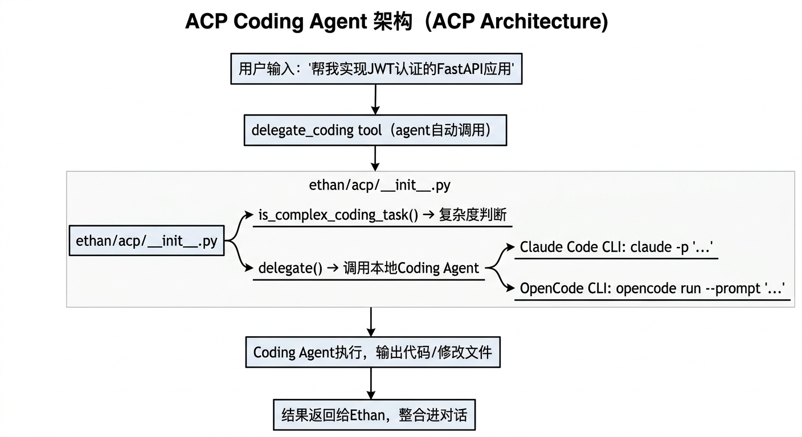

# ACP 集成设计文档

## 概述

ACP（Agent Communication Protocol）是 Ethan 委托复杂编码任务给专业 Coding Agent 的机制。

**设计原则**：Ethan 是通用个人 AI Agent，不专注于代码。遇到复杂编码任务时，自动检测并委托给本地 Coding Agent（Claude Code / OpenCode / Codex），把结果整合回对话，并支持多轮续接与过程可视化。

---

## 架构


<!-- diagram-source
```
用户输入 "帮我实现 JWT 认证的 FastAPI 应用"
    │
    ▼
delegate_coding tool (agent 自动调用)
    │
    ▼
ethan/acp/__init__.py
    ├── is_complex_coding_task() → 复杂度判断
    └── delegate() → 调用本地 Coding Agent
            ├── Claude Code CLI: claude -p --output-format stream-json --resume <session_id>
            ├── OpenCode CLI: opencode run --prompt "..."
            └── Codex CLI: codex exec "..."
    │
    ▼
Coding Agent 执行，输出代码/修改文件
    │  (stream-json 事件流：tool_use / tool_result / result)
    ▼
解析为 sub_steps + 最终结果，回传给 Ethan
    │
    ▼
ToolEvent 携带 sub_steps → Web UI 时间轴折叠展示
```
-->

---

## 复杂度判断（`is_complex_coding_task`）

启发式判断，两步过滤：

1. **简单问题优先排除**：
   - "什么是"、"解释"、"how does" → 直接回答，不委托

2. **复杂度信号 + 代码关键词**：
   - implement / refactor / create / 实现 / 重构 + code / python / api 等 → 委托

| 输入 | 判断 |
|------|------|
| "什么是 asyncio" | 简单 → 自己回答 |
| "implement REST API with JWT" | 复杂 → 委托 |
| "帮我重构这个文件里的代码" | 复杂 → 委托 |
| "explain how decorators work" | 简单 → 自己回答 |

---

## 支持的 Coding Agent

| Agent | 命令 | 多轮 | 子步骤解析 | 安装 |
|-------|------|------|-----------|------|
| Claude Code | `claude` | ✅ `--resume <session_id>` | ✅ stream-json | https://claude.ai/code |
| OpenCode | `opencode` | ❌ | ❌（纯文本） | https://opencode.ai |
| Codex | `codex` | ❌ | ❌（纯文本） | — |

优先级：Claude Code > OpenCode > Codex（按系统 PATH 检测）。可通过 `prefer` 参数指定（`claude` / `opencode` / `codex` / `auto`）。

---

## 多轮会话

Claude Code 支持 `--resume <session_id>` 续接上次会话。Ethan 按「**用户 × 工作目录**」持久化 session_id：

- 连续的 `delegate_coding` 调用若指向同一 `working_dir`，自动续接同一 Coding Agent 会话
- 持久化文件：`~/.ethan/<user>/acp_sessions.json`，key 为工作目录绝对路径
- `reset_session=true` 可清除该目录的会话记忆，从新会话开始（切换到无关任务时用）

```python
# 第一轮
delegate_coding(task="实现 JWT 认证", working_dir="/proj")
# → 创建 session A，持久化

# 第二轮（同目录，自动续接 session A）
delegate_coding(task="再加一个刷新 token 的接口", working_dir="/proj")

# 切换到无关任务，开新会话
delegate_coding(task="重构 utils", working_dir="/proj", reset_session=True)
```

---

## 结构化输出（sub_steps）

Claude Code 以 `--output-format stream-json` 输出 NDJSON 事件流，Ethan 解析为结构化的子步骤：

| 事件类型 | 解析结果 |
|---------|---------|
| `assistant` + `tool_use` | 新增 sub_step（state=running） |
| `user` + `tool_result` | 关闭 sub_step（state=done/error，填 duration_ms + result_preview） |
| `system/init` | 提取 session_id |
| `result` | 最终文本结果 + success/error |

`delegate()` 返回的 `ACPResult.sub_steps` 经 `ToolResult` → `ToolEvent` 流到 Web UI，在工具时间轴里折叠展示（见下）。

---

## DelegateCodingTool

文件：`ethan/tools/builtin/acp.py`

LLM 可以直接调用的 tool：

```python
delegate_coding(
    task="Implement a user authentication system with JWT tokens...",
    working_dir="/path/to/project",   # optional，默认当前目录
    reset_session=False,              # True 则不复用该目录的历史会话
)
```

- `cacheable=False`（有副作用，不可缓存）
- `fast_path=False`（只在 medium/full path 加载）
- timeout 默认 180 秒
- 输出超 12000 字符自动截断
- 返回 `[agent](session=xxxxxxxx) output` 格式，并携带 `sub_steps`

---

## Web UI 展示

`delegate_coding` 的工具调用在 Web UI 时间轴里有专门处理（`web/components/tool-timeline.tsx`）：

- **子步骤折叠**：点击「N/总 步」展开 Coding Agent 内部的每次工具调用（如 Bash / Edit / Write），显示工具名、参数摘要、耗时、结果预览
- **最终结果高亮**：`delegate_coding` 的 `result_preview` 用绿色高亮卡片展示，区别于普通工具的灰字预览
- 历史会话重载时，`sub_steps` 从 `tool_steps` 字段反序列化还原

REPL 模式下也会打印子步骤计数摘要：`↳ N 步工具调用（M 成功）`。

---

## 未来改进

- **更精准的复杂度判断**：通过 LLM 预判是否需要委托（替代启发式）
- **双向通信**：让 Coding Agent 在执行中回调 Ethan 澄清需求
- **上下文传递**：把 Ethan 的记忆（用户偏好、项目信息）传给 Coding Agent
- **结果审查**：Ethan 自动 review Coding Agent 的输出，提出改进建议
- **OpenCode/Codex 多轮**：两者目前是单轮纯文本，待各自支持会话续接
