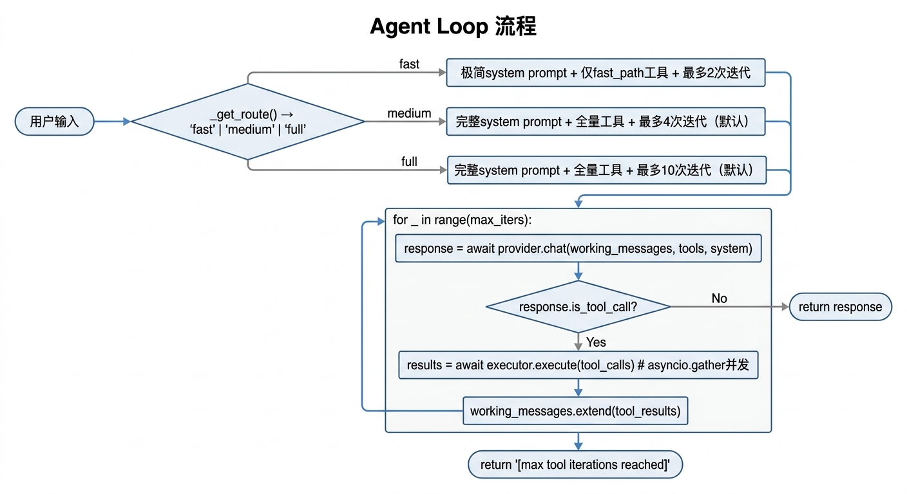
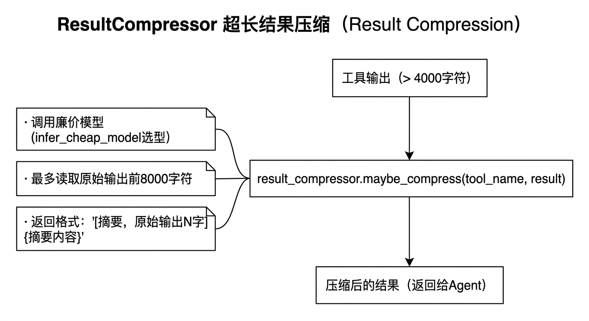

# Agent Loop 设计文档

当前 Agent Loop 融合了 ReAct 论文、OpenClaw 的分层结构和 nanobot 的极简风格，loop 本身保持精简，复杂性由 Provider / Tool / Memory / Skills 各子系统承担。

---

## 两种模式

| 方法 | 说明 |
|------|------|
| `Agent.chat(messages)` | 非流式，等待完整响应后返回 `Message` |
| `Agent.stream_chat(messages)` | 流式，逐 token yield 文本，tool call 前后推送 `ToolEvent` |

---

## Loop 流程

每次对话开始前，先由 `_get_route()` 决定走哪条轨道（见 [routing.md](routing.md)）：


<!-- diagram-source
```
用户输入
   │
   ▼
_get_route() → 'fast' | 'medium' | 'full'
   │
   ├─ fast   → 极简 system prompt + 仅 fast_path 工具 + 最多 2 次迭代
   ├─ medium → 完整 system prompt + 全量工具 + 最多 medium_max_iters 次迭代（默认 4）
   └─ full   → 完整 system prompt + 全量工具 + 最多 max_tool_iterations 次迭代（默认 10）
   │
   ▼
for _ in range(max_iters):
    response = await provider.chat(working_messages, tools, system)
    if not response.is_tool_call → return response
    results = await executor.execute(response.tool_calls)  # asyncio.gather 并发
    working_messages.extend(tool_results)

return "[max tool iterations reached]"
```
-->

---

## 系统提示词构建（`_build_system`）

Full / Medium Path 按以下顺序拼接，`Current time:` 是稳定层与动态层的分界点（用于 Prompt Caching）：

```
<identity>              ← system/identity.md（稳定，可缓存）
<operating_principles>  ← system/soul.md（稳定）
<tools_reference>       ← system/tools.md（稳定）
<available_skills>      ← 所有 Skill 名称列表（稳定）
─── Current time: ───   ← 缓存分割线
workspace 路径
定时任务摘要
<memory_context>        ← FactStore top-15 facts
<user_profile>          ← ~/.ethan/memory/user_profile.md（用户画像）
<behavioral_guidelines> ← ProcedureStore（行为规则）
<relevant_skills>       ← 关键词匹配的 Skill 正文
```

Fast Path 只保留：`identity + Current time: + top-5 facts + 匹配到的 Skill`。

---

## 工具执行（ToolExecutor）

### 轮次内去重缓存

同一轮 chat 内，相同工具 + 相同参数的调用结果会被缓存，避免重复执行。

```python
# 缓存键：tool_name + args_hash（MD5）
cache_key = f"{tc.name}:{hashlib.md5(json.dumps(tc.arguments, sort_keys=True)).hexdigest()}"
```

每次新的 `chat()` / `stream_chat()` 开始时调用 `executor.reset_cache()` 清空缓存，确保不同轮次之间互不干扰。

### 并发执行

LLM 有时在一次回复中请求多个 tool，`asyncio.gather()` 并发执行可显著减少延迟。

### 超长结果压缩（ResultCompressor）

工具结果超过 **4000 字符**时，`ToolExecutor` 自动调用 `maybe_compress()`，用廉价模型将原始输出提炼为不超过 **1200 字**的摘要，再喂给主模型。


<!-- diagram-source
```
工具输出 (>4000 字符)
    │
    ▼
result_compressor.maybe_compress(tool_name, result)
    │
    ├─ 调用廉价模型（infer_cheap_model 选型）
    ├─ 最多读取原始输出前 8000 字符
    └─ 返回 "[摘要，原始输出 N 字]\n{摘要内容}"
```
-->

压缩失败时退化为截断（保留前 4000 字符）。

---

## 消息格式

整个 loop 维护 `working_messages` 列表，格式同时兼容 Anthropic 和 OpenAI 协议（各 Provider 负责自己的转换）：

```
[user]       "帮我查一下当前时间"
[assistant]  tool_calls: [shell(command="date")]
[tool]       "Wed Jun 11 13:49:00 CST 2026"
[assistant]  "当前时间是 2026年6月11日 下午1点49分"  ← 最终返回
```

---

## 设计决策

**三档路由**：fast / medium / full 三档兼顾延迟与推理深度。medium 档用完整上下文但限制迭代次数，适合大多数短问答，避免为简单请求跑完整 10 轮 ReAct。

**并发 tool calls**：LLM 有时在一次回复中请求多个 tool，`asyncio.gather()` 并发执行可以显著减少延迟。

**轮次内工具缓存**：相同工具+参数在同一轮不重复执行，防止 LLM 循环调用相同工具浪费资源。

**超长输出压缩**：shell 或 web 工具有时返回数万字符，不经处理直接塞回主模型既昂贵又低效，廉价模型先摘要再注入。

**max_iterations 上限**：防止 LLM 陷入 tool call 死循环（工具持续报错时）。Fast 固定为 2，Medium 默认 4，Full 默认 10，可通过 config 调整。

**UsageStats**：`cache_tokens` 同时统计 `cache_read` 和 `cache_creation`，确保状态栏显示的缓存命中数准确。
