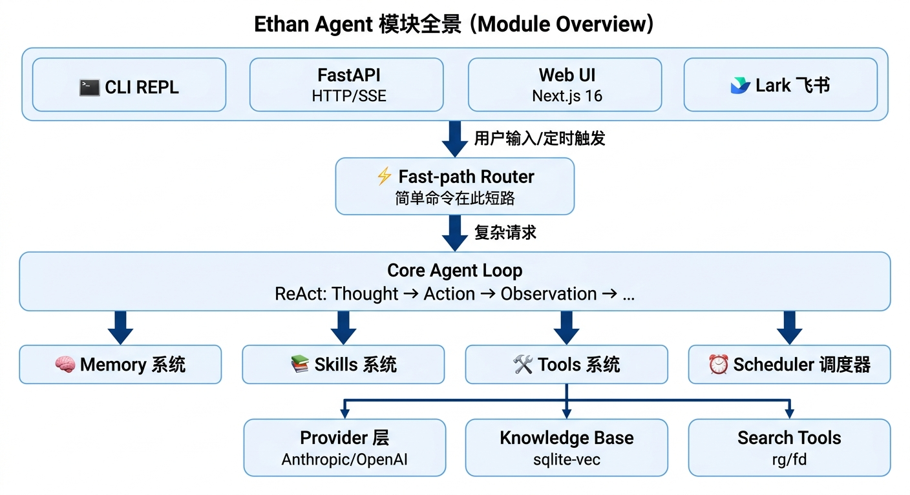
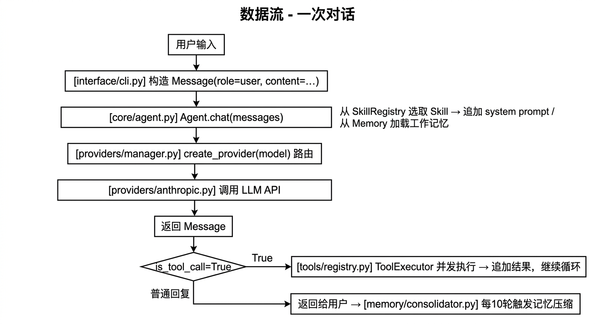

# 架构总览

## 设计目标

Ethan 是一个运行在 Mac mini 上的个人 AI Agent，全程异步（`asyncio` + `uvloop`），长期常驻。核心目标：

- **多模型**：同时支持 Claude（Anthropic 原生协议）和 GPT/本地模型（OpenAI 兼容协议）
- **记忆**：跨会话的持久记忆 + 自动压缩 + 结构化记忆管道
- **Skill**：可手写、可从经验自动生成的知识模块
- **调度**：定时任务、心跳机制
- **工具**：Shell、文件、Web、MCP 协议扩展
- **多端**：CLI / Web UI / 飞书 / 桌面端（Tauri，macOS + Windows）

---

## 模块全景


<!-- diagram-source
```
┌──────────────────────────────────────────────────────────────────┐
│                          Interface 层                             │
│ CLI (REPL) │ FastAPI (HTTP/SSE) │ Web UI (Next.js 16) │ Desktop │ Lark │
└───────────┴────────────────────┴─────────────────────┴─────────┴─────┘
                        │ 用户输入 / 定时触发
                        ▼
             ┌──────────────────────┐
             │   Fast-path Router   │  ← 简单命令在此短路，不进 Agent Loop
             └──────────┬───────────┘
                        │ 复杂请求
                        ▼
┌─────────────────────────────────────────────────────────┐
│                    Core Agent Loop                       │
│         ReAct：Thought → Action → Observation → …       │
└──┬─────────────┬──────────────┬──────────────┬──────────┘
   │             │              │              │
   ▼             ▼              ▼              ▼
┌──────┐   ┌─────────┐   ┌──────────┐   ┌──────────┐
│Memory│   │ Skills  │   │  Tools   │   │Scheduler │
│ 系统  │   │  系统   │   │   系统   │   │  调度器  │
└──────┘   └─────────┘   └────┬─────┘   └──────────┘
                               │
                ┌──────────────┼──────────────┐
                ▼              ▼              ▼
         ┌──────────┐  ┌────────────┐  ┌──────────────┐
         │ Provider │  │ Knowledge  │  │ Search Tools │
         │ 层       │  │ Base       │  │ (rg / fd)    │
         │Anthropic │  │(sqlite-vec)│  └──────────────┘
         │OpenAI    │  └────────────┘
         └──────────┘
```
-->

---

## 各模块职责

### Provider 层 (`ethan/providers/`)
负责与 LLM API 通信，屏蔽不同厂商协议的差异。对上层只暴露统一的 `BaseProvider` 接口。
→ 详见 [providers.md](./providers.md)

### Core Agent Loop (`ethan/core/agent.py`)
系统的心脏。接收消息列表，驱动 ReAct 循环，协调 Provider、Tools、Memory、Skills。
→ 详见 [agent-loop.md](./agent-loop.md)

### 工具系统 (`ethan/tools/`)
定义 `BaseTool` 抽象，通过 `ToolRegistry` 注册，由 `ToolExecutor` 并发执行。
→ 详见 [tools.md](./tools.md)

### 记忆系统 (`ethan/memory/`)
核心是结构化记忆管道（`memory.db` 是唯一事实源），周围保留 4 个卫星组件：Session / Working Memory / User Profile / Playbook。
 详见 [memory.md](./memory.md) 与新旧对比 [memory/unification.md](./memory/unification.md)

### Skill 系统 (`ethan/skills/`)
从 Markdown 文件加载 Skill，注入 system prompt。支持从经验自动生成新 Skill（Hermes 风格）。
→ 详见 [skills.md](./skills.md)

### 调度器 (`ethan/scheduler/`)
基于 APScheduler，支持 cron 表达式和 interval。Job 持久化到 SQLite，重启后自动恢复。
→ 详见 [scheduler.md](./scheduler.md)

### Web UI (`web/`)
Next.js 16 App Router 构建的浏览器界面，通过 FastAPI SSE 与后端通信。路由包括 `/chat`、`/chat/[id]`、`/memory`、`/knowledge`、`/schedule`、`/skills`、`/sessions`、`/settings`、`/channels`。消息气泡显示 TTFT 耗时，流式工具调用过程实时渲染。

### 桌面端 (`desktop/`)
基于 Tauri 2 的原生桌面应用，内嵌 Web UI（React 19 + Vite 构建），支持 macOS（aarch64 + x86_64）和 Windows。CI 在打 `v*` tag 时通过 `publish-desktop.yml` 自动构建并发布到 GitHub Release。详见 [interface.md](./interface.md)。

### 飞书 / Lark 集成 (`ethan/interface/lark_events.py`)
基于 **WebSocket 长连接**方案：`ethan serve` 启动时自动调用 `lark-cli event consume im.message.receive_v1` 建立长连接，无需公网 IP。收到消息后先加 THINKING 表情确认收到，随后流式回复——工具进度走 post 富文本气泡、最终回答走 interactive 卡片（流式编辑）；`ui_card` 工具产出的自定义卡片（对比/排行/统计/时间轴）作为增量额外补发一条 interactive 卡片。`chat_id` → `session_id` 映射持久化到 JSON 文件。实现按职责拆分到同目录子模块：`lark_render`（消息渲染）、`lark_send`（收发 IO）、`lark_stream`（消息处理 + Agent 流式回复），`lark_events` 仅保留事件消费循环与 start/stop 生命周期并 re-export 公共符号。
→ 详见 [interface.md](./interface.md)

### Fast-path Router
每轮对话开始时对用户输入做意图分类，决定走快轨（极简 prompt + 仅 fast_path 工具，最多 2 次迭代）还是慢轨（完整 prompt + 全量工具）。`fast_path: true` 的 Skill 的 trigger 关键词自动注入路由，无需手动配置。
→ 详见 [routing.md](./routing.md)

### 心跳系统 (`ethan/core/heartbeat.py`)
系统内部维护任务，启动时作为后台 asyncio 任务运行，每 N 分钟执行一次：画像分区压缩、执行 `~/.ethan/system/heartbeat.md` 中定义的周期性任务、决策模式抽取与需求挖掘。与用户管理的 Scheduler（APScheduler）独立运行。（长期记忆的去重与复评由结构化记忆管道的准入与夜间统一沉淀负责，见 memory.md）
→ 详见 [heartbeat.md](./heartbeat.md)

### 知识库 (`ethan/memory/knowledge.py`)
基于 `sqlite-vec` 的向量检索，文档写入时生成 embedding，查询时做余弦相似度检索。支持从 Web UI 上传、删除文档，Agent 可通过 `knowledge_search` 工具主动检索，也可通过 `/knowledge/search` HTTP 端点被外部服务调用。

### Prompt Caching (`ethan/providers/anthropic.py`)
Anthropic Provider 在发送 system prompt 前自动将其按 `Current time:` 分界点拆分为稳定层（identity/soul/tools_reference）和动态层（时间、记忆、Skill 匹配）。稳定层打上 `cache_control: ephemeral`，5 分钟内重复调用成本降至 0.1×。
→ 详见 [caching.md](./caching.md)

---

## 数据流（一次对话）


<!-- diagram-source
```
用户输入
   │
   ▼
[interface/cli.py] 构造 Message(role="user", content=...)
   │
   ▼
[core/agent.py] Agent.chat(messages)
   ├─ 从 SkillRegistry 选取相关 Skill → 追加到 system prompt
   ├─ 从 Memory 加载工作记忆
   │
   ▼
[providers/manager.py] create_provider(model) 路由到对应 Provider
   │
   ▼
[providers/anthropic.py 或 openai_compat.py] 调用 LLM API
   │
   ▼
返回 Message
   ├─ 如果 is_tool_call → [tools/registry.py] ToolExecutor 并发执行
   │       └─ tool 结果追加到 messages，继续循环
   └─ 如果是普通回复 → 返回给用户
                    └─ [memory/consolidator.py] 每5轮触发记忆压缩
```
-->

---

## 技术选型

| 用途 | 库 | 版本 | 理由 |
|------|----|------|------|
| 异步运行时 | `asyncio` + `uvloop` | 0.22+ | 性能，Mac aarch64 原生支持 |
| Claude API | `anthropic` | 0.109+ | 官方 SDK，streaming + tool_use |
| OpenAI 兼容 | `openai` | 2.41+ | base_url 可配置，覆盖 GPT/Ollama |
| 定时任务 | `APScheduler` | 3.x | 成熟，SQLite 持久化 |
| 数据持久化 | `SQLite` + `aiosqlite` | — | 零依赖，本地足够 |
| 配置管理 | `pydantic-settings` | 2.x | 类型安全，支持 `.env` 覆盖 |
| HTTP API | `FastAPI` + `uvicorn` | — | 异步，SSE/WebSocket streaming |
| 包管理 | `uv` | 0.11+ | 速度快，已安装 |

---

## 目录结构

```
ethan-ai/
├── ethan/
│   ├── core/
│   │   ├── agent.py          # 主 Agent Loop（含 fast/full path 路由）
│   │   ├── config.py         # 全局配置（Pydantic）
│   │   ├── heartbeat.py      # 系统心跳（facts 去重 + 画像压缩 + 决策抽取 + FDE 挖掘 + heartbeat.md 任务）
│   │   └── onboarding.py     # 新用户引导
│   ├── providers/
│   │   ├── base.py           # 抽象 Provider 接口
│   │   ├── anthropic.py      # Claude 原生 SDK（含 Prompt Caching）
│   │   ├── openai_compat.py  # OpenAI 兼容协议
│   │   └── manager.py        # Provider 路由
│   ├── memory/
│   │   ├── session.py        # Session 持久化（SQLite + 轮转归档）
│   │   ├── working.py        # 三层工作记忆（hot/warm/cold）
│   │   ├── consolidator.py   # 记忆压缩（廉价模型）
│   │   ├── store.py          # MemoryStore（结构化记忆唯一事实源，替代已退役的 FactStore）
│   │   ├── extractors.py     # StructuredMemoryExtractor（每 5 轮主模型增量提取 JSON 候选）
│   │   ├── admission.py      # AdmissionPolicy（确定性准入：explicit/observed/corrected 决策）
│   │   ├── recall.py         # build_structured_recall（FTS5 + BGE 向量混合召回，RRF 融合）
│   │   ├── records.py        # 维度注册表 + prompt 生成（声明式扩展，custom.* 兜底）
│   │   ├── dimensions.py     # 64 维度白名单与场景结构体
│   │   ├── nightly_consolidation.py  # 夜间统一沉淀（结构化复评 + 做梦合并为单一编排）
│   │   ├── structured_consolidation.py  # 结构化每日沉淀（重提取 / pending 复评 / TTL / 日摘要）
│   │   ├── daily_consolidation.py  # 做梦：信号精炼 → insight → embedding 去重 → 反写候选
│   │   ├── memory_vectors.py # memory 向量索引重建（自愈漂移）+ 准入语义配对
│   │   ├── legacy_migration.py # 旧 facts.json → memories 一次性幂等迁移
│   │   ├── procedures.py     # ProcedureStore（行为准则 + 成功路径 playbook）
│   │   ├── episodic.py       # EpisodicStore（历史 session 摘要）
│   │   ├── signals.py        # 信号检测 + 关键词提取
│   │   ├── persistent.py     # 持久化基类
│   │   ├── api_keys.py       # memory API 鉴权
│   │   ├── vector_store.py   # sqlite-vec 向量存储
│   │   ├── embeddings.py     # Embedding 生成（BGE-small-zh INT8 512-dim）
│   │   └── knowledge.py      # 知识库（sqlite-vec 向量检索）
│   ├── skills/
│   │   ├── loader.py         # 双来源加载（内置 + 用户）
│   │   ├── registry.py       # 关键词匹配 + 语义补召回 + 注入
│   │   ├── router.py         # 可选语义路由器（BGE INT8 + LR 头）
│   │   ├── generator.py      # 从经验自动生成 Skill
│   │   ├── channels/         # 内置 Skill：渠道管理
│   │   ├── lark-im/          # 内置 Skill：飞书 IM 操作
│   │   └── home-assistant/   # 内置 Skill：智能家居控制
│   ├── tools/
│   │   ├── base.py           # BaseTool 抽象
│   │   ├── registry.py       # ToolRegistry + ToolExecutor
│   │   └── builtin/
│   │       ├── shell.py      # Shell 命令执行
│   │       ├── file.py       # 文件读写列出
│   │       ├── web.py        # 网页抓取
│   │       ├── web_search.py # DuckDuckGo 搜索
│   │       ├── rg_search.py  # ripgrep 全文搜索
│   │       ├── fd_find.py    # fd 文件查找
│   │       ├── schedule.py   # 定时任务管理
│   │       ├── knowledge.py  # 知识库工具
│   │       └── acp.py        # 委托 Coding Agent
│   ├── scheduler/
│   │   └── cron.py           # APScheduler（SQLite 持久化）
│   ├── acp/
│   │   ├── __init__.py       # ACP 复杂度判断 + 委托执行（三套 Coding Agent JSON 流 + 多轮续接）
│   │   └── mirror.py         # 委派镜像会话（落 Ethan session + 注册 RunManager run 实时推送）
│   └── interface/
│       ├── cli.py            # Typer CLI（含延迟导入优化）
│       ├── repl.py           # 交互式 REPL（prompt_toolkit）
│       ├── api.py            # FastAPI HTTP + SSE
│       ├── lark.py           # 飞书 Bot（WebSocket 长连接）
│       └── commands/         # 子命令（model/provider/session/skill/schedule）
├── web/                      # Next.js 16 Web UI
├── desktop/                  # Tauri 2 桌面应用（React 19 + Vite + Rust）
│   ├── src/                  # 前端源码（复用 web/ 组件）
│   ├── src-tauri/            # Rust 后端 + tauri.conf.json + Cargo.toml
│   └── package.json
├── docs/                     # 本文档体系
├── .env                      # API Key 配置（不入 git）
└── PLAN.md                   # 开发计划
```
