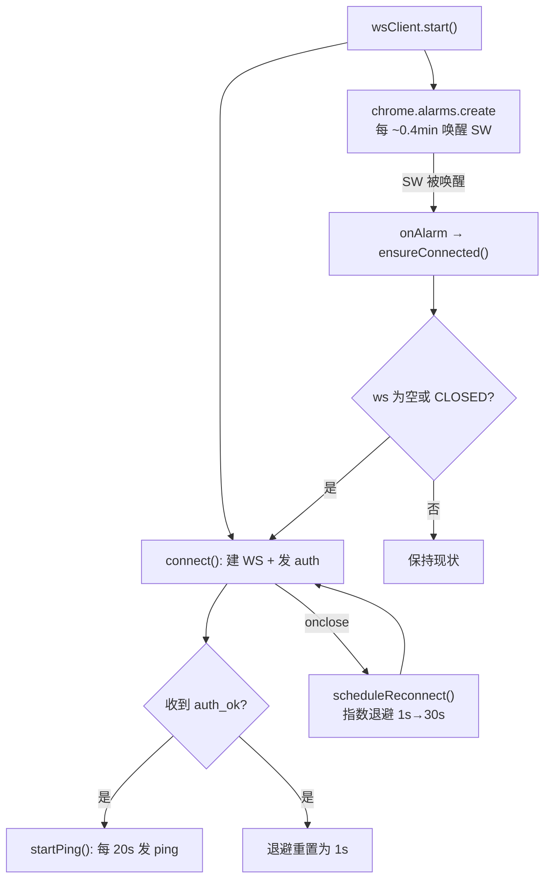
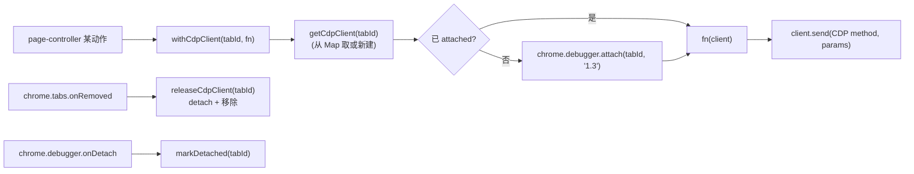
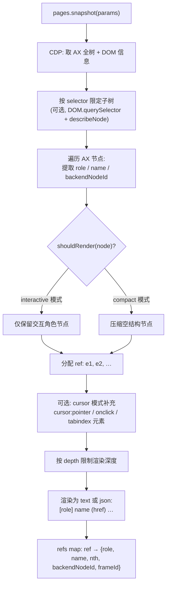
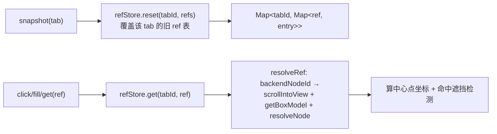

# 浏览器控制 · 扩展内核(CDP / AX)

本文聚焦 Chrome 扩展侧的内核实现:Service Worker 如何保活、CDP 连接如何按标签页缓存、可访问性树快照如何生成、ref 句柄的生命周期、以及 page-controller 各动作背后的 Chrome DevTools Protocol 调用。

相关代码:`browser-extension/src/background/` 下的 `ws-client.ts`、`cdp-client.ts`、`ax-snapshot.ts`、`ref-store.ts`、`page-controller.ts`、`session-store.ts`。

> 这些 CDP/AX/ref 内核逻辑整体复用自一套成熟实现,本方案只把传输层从 Native Messaging 换成 WebSocket。因此本文描述的是**被复用的既有内核**的工作原理,理解它有助于排障与扩展,但修改时应优先考虑是否会偏离上游实现。

---

## 1. MV3 Service Worker 保活(最高风险点)

Manifest V3 扩展的 background 是 **Service Worker**,Chrome 会在空闲时主动回收它。一旦 SW 被回收,持有的 WebSocket 连接随之失效。原桌面方案使用 `chrome.runtime.connectNative` 的 Native Messaging port,具有"port 存活即 SW 存活"的语义,**从未踩过 WS + MV3 这一坑**——所以这是本方案净新增的风险点。

`ws-client.ts` 采用三重保活:

三层防线各司其职:

1. **应用层心跳(20s)** —— 维持连接活跃,让对端能及时感知半开连接。
2. **`chrome.alarms`(~25s)** —— 即便 SW 已被回收,alarm 触发会重新拉起 SW 并执行 `onAlarm` 监听器,从而 `ensureConnected()` 补连。这是对抗 SW 回收的关键。
3. **指数退避重连(1s→30s)** —— `onclose` 后自动重连,`auth_ok` 成功后退避重置。

**验证建议**:实现/部署首日应把扩展挂一整晚,在 `chrome://extensions` 的 Service Worker 控制台观察是否出现长时间断连、或重连后 CDP attach 状态丢失。若 SW 频繁被回收且重连后页面操作失效,需评估退路(例如改用 `--remote-debugging-port` 直连,但那样会牺牲"用户无感"的体验)。

---

## 2. CDP 连接:按标签页缓存 attach

`cdp-client.ts` 用 `chrome.debugger` 作为 CDP 通道。每次页面操作都重新 `attach`/`detach` 会导致 Chrome 顶部反复闪烁"正在调试此浏览器"横幅,体验很差。因此采用**按 tabId 缓存 `CdpClient` 实例**:

要点:

- **CDP 协议版本固定 `'1.3'`**。
- **attach 去重**:`attach()` 用一个 `attaching: Promise` 字段防止并发重复 attach;若 Chrome 返回 `Another debugger is already attached`,视为已就绪。
- **send 异常感知**:`send()` 若遇 `Debugger is not attached`,标记 `markDetached()` 以便下次重新 attach。
- **生命周期联动**:`chrome.tabs.onRemoved` 触发 `releaseCdpClient(tabId)`(detach + 从 Map 移除);`chrome.debugger.onDetach`(如用户手动停止调试)触发 `markDetached`。
- 失败统一包装为 `BrowserExtensionRpcError(browserPageOperationFailed, message)`。

---

## 3. 可访问性树快照(AX Snapshot)

`ax-snapshot.ts` 是结构化页面理解的核心:把 Chrome 的可访问性树转成"带 ref 句柄的、可供模型阅读的精简结构"。这正是 `agent-browser` 风格操作的基础——模型不直接看 HTML,而是看一棵语义化的、每个可交互元素都带稳定 `ref` 的树。

### 生成流程

### 关键参数(由模型决定,工具层给出推荐默认)

| 参数 | 作用 |
|---|---|
| `interactive` | 只保留交互元素(按钮、链接、输入框等)。推荐默认开启,显著缩小输出 |
| `compact` | 压缩仅起结构作用的空节点 |
| `depth` | 限制渲染树深度;超过深度的子树不再展开 |
| `selector` | 用 CSS 选择器限定到某个 DOM 子树(`DOM.querySelector` → `describeNode` 取 backendNodeId 作为子树根) |
| `cursor` | 补充 `cursor:pointer` / 带 `onclick` / 带 `tabindex` 但 AX 角色不显著的可点击元素 |
| `urls` | 在链接节点上附带 `href` |
| `format` | `text`(适合模型阅读)或 `json`(适合程序解析) |

内部常量:节点名最长截断到 `MAX_NAME_LENGTH = 160` 字符;空页面返回 `(empty page)`,交互模式空结果返回 `(no interactive elements)`。

> **服务端兜底**:即便模型选了宽松参数导致输出过大,工具层仍有一道硬截断(超过 30k 字符截断并提示缩小范围),且 snapshot 类工具标记 `no_compress=True`——因为对结构化 ref 数据做摘要压缩会破坏 ref 与元素的对应关系。详见[会话/并发/安全](session-security.md)。

---

## 4. ref 句柄的生命周期

`ref-store.ts` 维护"每个 tab 的最近一次 snapshot 产出的 ref 表"。

生命周期规则:

- 每次 snapshot 用 `reset(tabId, refs)` **整表覆盖**该 tab 的旧 ref。ref 形如 `e1`、`e2`(查询时归一化:去前导 `@`、trim)。
- 每个 ref entry 记录 `role`、`name`、`nth`、`backendNodeId`、`frameId`。**`backendNodeId` 是真正用于 CDP 定位元素的稳定句柄**。
- **ref 仅对"最近一次该 tab 的 snapshot 上下文"可靠**。页面导航或刷新后,旧 `backendNodeId` 失效,`resolveRef` 会抛 `page_ref_not_found`(4109)。此时必须重新 snapshot。这是该子系统最重要的使用约束。

`resolveRef` 的解析过程(`page-controller.ts`):

1. 从 refStore 取 entry,校验 `backendNodeId` 存在,否则抛 4109。
2. `DOM.scrollIntoViewIfNeeded` 把元素滚入视口。
3. 并行 `DOM.getBoxModel`(取盒模型四角坐标)+ `DOM.resolveNode`(取 JS 对象句柄 `objectId`)。
4. 由盒模型算出元素中心点 `center` 与外接 `box`。
5. 交互类动作(如 click)额外做**遮挡检测** `assertClickPointNotCovered`:用 `Runtime.callFunctionOn` 在页面里 `document.elementFromPoint(x,y)`,确认中心点命中的就是目标元素(或其包含关系),避免点到覆盖在上面的遮罩/弹层。

---

## 5. page-controller:各动作的 CDP 实现

`page-controller.ts` 把每个 `pages.*` 动作落到具体 CDP 调用上。所有动作**默认作用于该 session 的 active tab**(`sessionStore.getActiveTab(sessionId)` 实时获取),并通过 `withCdpClient(activeTabId, …)` 拿到缓存的 CDP 连接。

| 动作 | 关键 CDP / 实现 |
|---|---|
| `snapshot` | `Accessibility.*` + `DOM.*` 构树,`refStore.reset` 后返回 `{snapshot, refs}` |
| `click` / `hover` | `resolveRef`(含遮挡检测) → `Input.dispatchMouseEvent`(move/press/release) |
| `fill` / `type` | `resolveRef` → 聚焦并设选区(`fill` 全选后替换、`type` 光标移末尾追加) → `Input.insertText` 经 CDP 注入文本。**走浏览器真实输入管线**,触发带 `inputType` 的 `beforeinput`/`input`(InputEvent),CodeMirror 6 / Lexical / ProseMirror / React 受控组件都能识别;不再用 `el.value=` / `el.textContent=` 直接改 DOM——那些框架自维护内部 model,直接改 DOM 会被下一次 render 覆盖或读不到,表现为「框里看着有字、内部为空、发送出去是空」。`fill('')` 清空走一次 `Input.dispatchKeyEvent`(Delete) |
| `select` | `resolveRef` → `Runtime.callFunctionOn` 设置 `<select>` 的 value 并派发 change |
| `scroll_into_view` | `resolveRef`(内部已 `DOM.scrollIntoViewIfNeeded`) |
| `press` | `Input.dispatchKeyEvent`(keyDown + keyUp),按 `key` 字段 |
| `scroll` | 按 `direction` + `pixels` 派发滚轮/滚动 |
| `mouse` | 坐标级:`move` / `down` / `up` / `wheel` → `Input.dispatchMouseEvent`(viewport CSS 像素,非屏幕绝对坐标) |
| `get` | `title`/`url` 取页面信息;`text`/`value`/`html`/`box` 经 `resolveRef` + `Runtime.callFunctionOn` 读取 |
| `screenshot` | `Page.captureScreenshot`,`fromSurface:true`;默认 PNG,`jpeg` 时可带 `quality`;返回 `{data(base64), format, mimeType}` |
| `wait` | 按 `ms` 定时,或 `waitForLoadState` 等待 `domcontentloaded` 等加载状态 |
| `eval` | `Runtime.evaluate` 执行任意页面 JS,`returnByValue` 取结果(高权限,见安全文档) |

坐标系约定:所有鼠标坐标是 **viewport CSS 像素**,不是屏幕绝对坐标。这与 snapshot 返回的 box/center 一致。

---

## 6. session-store:浏览器状态的唯一真源

`session-store.ts` 是整个子系统里**唯一持有权威浏览器状态**的地方。它把抽象的"session"落到具体的 **Chrome TabGroup** 上:

- **session = 一个 Chrome TabGroup**。`createSession` 把目标 tab 用 `chrome.tabGroups` 归组,组标题由 session 标题或 sessionId 前缀生成。
- 维护 `sessionId → {groupId, title, tabs[]}` 的映射;每个 tab 记录 `tabId`、`windowId`、`groupId`、`url`、`title`、`active`。
- `attachCurrent` 接管当前 active tab 并归入新 session;`attach` 把已有 tab 纳入指定 session。
- `getActiveTab(sessionId)` 返回该 session 当前活动 tab——page-controller 的所有页面操作都以它为目标。
- `handleTabRemoved(tabId)`(由 `chrome.tabs.onRemoved` 触发)清理 session 内被关闭的 tab。

> 因为状态真源在扩展,ethan 服务端不做镜像;服务端只维护"ethan 会话 ↔ browser session"的归属映射(见[会话/并发/安全](session-security.md))。这一职责切分让服务端无状态、可随时重启,而浏览器状态始终以 Chrome 实际的 TabGroup 为准。
