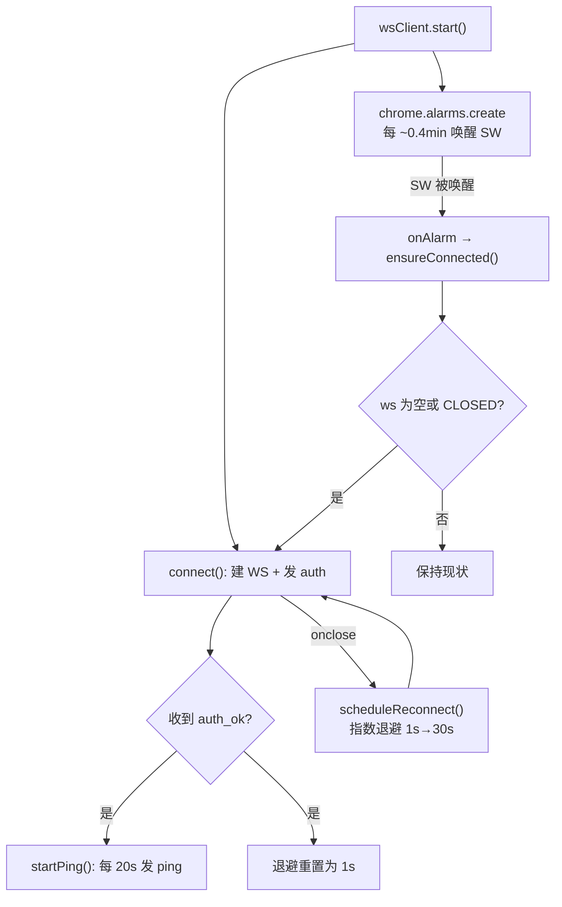
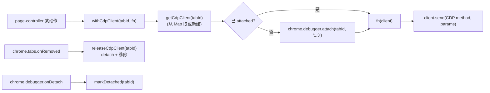
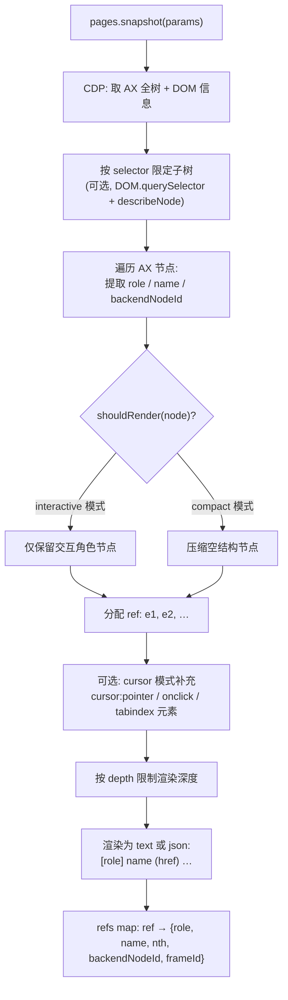
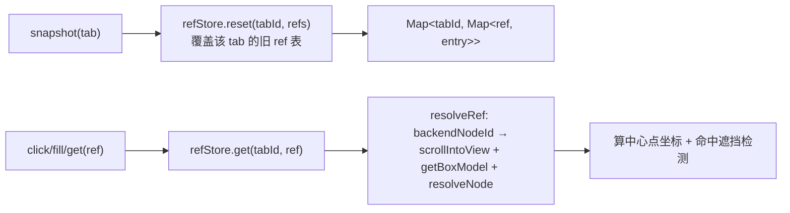

# 浏览器控制 · 扩展内核(CDP / AX)

本文聚焦 Chrome 扩展侧的内核实现:Service Worker 如何保活、CDP 连接如何按标签页缓存、可访问性树快照如何生成、ref 句柄的生命周期、以及 page-controller 各动作背后的 Chrome DevTools Protocol 调用。

相关代码:`browser-extension/src/background/` 下的 `ws-client.ts`、`cdp-client.ts`、`ax-snapshot.ts`、`ref-store.ts`、`page-controller.ts`、`session-store.ts`。

> 这些 CDP/AX/ref 内核逻辑整体复用自一套成熟实现,本方案只把传输层从 Native Messaging 换成 WebSocket。因此本文描述的是**被复用的既有内核**的工作原理,理解它有助于排障与扩展,但修改时应优先考虑是否会偏离上游实现。

---

## 1. MV3 Service Worker 保活(最高风险点)

Manifest V3 扩展的 background 是 **Service Worker**,Chrome 会在空闲时主动回收它。一旦 SW 被回收,持有的 WebSocket 连接随之失效。原桌面方案使用 `chrome.runtime.connectNative` 的 Native Messaging port,具有"port 存活即 SW 存活"的语义,**从未踩过 WS + MV3 这一坑**——所以这是本方案净新增的风险点。

`ws-client.ts` 采用三重保活:

```mermaid
flowchart TD
    Start["wsClient.start()"] --> Connect["connect(): 建 WS + 发 auth"]
    Start --> Alarm["chrome.alarms.create<br/>每 ~0.4min 唤醒 SW"]
    Connect --> AuthOK{"收到 auth_ok?"}
    AuthOK -->|是| Ping["startPing(): 每 20s 发 ping"]
    AuthOK -->|是| ResetBackoff["退避重置为 1s"]
    Alarm -->|SW 被唤醒| Ensure["onAlarm → ensureConnected()"]
    Ensure --> Closed{"ws 为空或 CLOSED?"}
    Closed -->|是| Connect
    Closed -->|否| Idle["保持现状"]
    Connect -->|onclose| Reconnect["scheduleReconnect()<br/>指数退避 1s→30s"]
    Reconnect --> Connect
```

三层防线各司其职:

1. **应用层心跳(20s)** —— 维持连接活跃,让对端能及时感知半开连接。
2. **`chrome.alarms`(~25s)** —— 即便 SW 已被回收,alarm 触发会重新拉起 SW 并执行 `onAlarm` 监听器,从而 `ensureConnected()` 补连。这是对抗 SW 回收的关键。
3. **指数退避重连(1s→30s)** —— `onclose` 后自动重连,`auth_ok` 成功后退避重置。

**验证建议**:实现/部署首日应把扩展挂一整晚,在 `chrome://extensions` 的 Service Worker 控制台观察是否出现长时间断连、或重连后 CDP attach 状态丢失。若 SW 频繁被回收且重连后页面操作失效,需评估退路(例如改用 `--remote-debugging-port` 直连,但那样会牺牲"用户无感"的体验)。

---

## 2. CDP 连接:按标签页缓存 attach

`cdp-client.ts` 用 `chrome.debugger` 作为 CDP 通道。每次页面操作都重新 `attach`/`detach` 会导致 Chrome 顶部反复闪烁"正在调试此浏览器"横幅,体验很差。因此采用**按 tabId 缓存 `CdpClient` 实例**:

```mermaid
flowchart LR
    Op["page-controller 某动作"] --> With["withCdpClient(tabId, fn)"]
    With --> Get["getCdpClient(tabId)<br/>(从 Map 取或新建)"]
    Get --> Att{"已 attached?"}
    Att -->|是| Run["fn(client)"]
    Att -->|否| Attach["chrome.debugger.attach(tabId, '1.3')"]
    Attach --> Run
    Run --> Send["client.send(CDP method, params)"]

    TabClosed["chrome.tabs.onRemoved"] --> Release["releaseCdpClient(tabId)<br/>detach + 移除"]
    Detached["chrome.debugger.onDetach"] --> Mark["markDetached(tabId)"]
```

要点:

- **CDP 协议版本固定 `'1.3'`**。
- **attach 去重**:`attach()` 用一个 `attaching: Promise` 字段防止并发重复 attach;若 Chrome 返回 `Another debugger is already attached`,视为已就绪。
- **send 异常感知**:`send()` 若遇 `Debugger is not attached`,标记 `markDetached()` 以便下次重新 attach。
- **生命周期联动**:`chrome.tabs.onRemoved` 触发 `releaseCdpClient(tabId)`(detach + 从 Map 移除);`chrome.debugger.onDetach`(如用户手动停止调试)触发 `markDetached`。
- 失败统一包装为 `BrowserExtensionRpcError(browserPageOperationFailed, message)`。

---

## 3. 可访问性树快照(AX Snapshot)

`ax-snapshot.ts` 是结构化页面理解的核心:把 Chrome 的可访问性树转成"带 ref 句柄的、可供模型阅读的精简结构"。这正是 `agent-browser` 风格操作的基础——模型不直接看 HTML,而是看一棵语义化的、每个可交互元素都带稳定 `ref` 的树。

### 生成流程

```mermaid
flowchart TD
    A["pages.snapshot(params)"] --> B["CDP: 取 AX 全树 + DOM 信息"]
    B --> C["按 selector 限定子树<br/>(可选, DOM.querySelector + describeNode)"]
    C --> D["遍历 AX 节点:<br/>提取 role / name / backendNodeId"]
    D --> E{"shouldRender(node)?"}
    E -->|interactive 模式| F["仅保留交互角色节点"]
    E -->|compact 模式| G["压缩空结构节点"]
    F --> H["分配 ref: e1, e2, …"]
    G --> H
    H --> I["可选: cursor 模式补充<br/>cursor:pointer / onclick / tabindex 元素"]
    I --> J["按 depth 限制渲染深度"]
    J --> K["渲染为 text 或 json:<br/>[role] name (href) …"]
    K --> L["refs map: ref → {role, name, nth, backendNodeId, frameId}"]
```

### 关键参数(由模型决定,工具层给出推荐默认)

| 参数 | 作用 |
|---|---|
| `interactive` | 只保留交互元素(按钮、链接、输入框等)。推荐默认开启,显著缩小输出 |
| `compact` | 压缩仅起结构作用的空节点 |
| `depth` | 限制渲染树深度;超过深度的子树不再展开 |
| `selector` | 用 CSS 选择器限定到某个 DOM 子树(`DOM.querySelector` → `describeNode` 取 backendNodeId 作为子树根) |
| `cursor` | 补充 `cursor:pointer` / 带 `onclick` / 带 `tabindex` 但 AX 角色不显著的可点击元素 |
| `urls` | 在链接节点上附带 `href` |
| `format` | `text`(适合模型阅读)或 `json`(适合程序解析) |

内部常量:节点名最长截断到 `MAX_NAME_LENGTH = 160` 字符;空页面返回 `(empty page)`,交互模式空结果返回 `(no interactive elements)`。

> **服务端兜底**:即便模型选了宽松参数导致输出过大,工具层仍有一道硬截断(超过 30k 字符截断并提示缩小范围),且 snapshot 类工具标记 `no_compress=True`——因为对结构化 ref 数据做摘要压缩会破坏 ref 与元素的对应关系。详见[会话/并发/安全](session-security.md)。

---

## 4. ref 句柄的生命周期

`ref-store.ts` 维护"每个 tab 的最近一次 snapshot 产出的 ref 表"。

```mermaid
flowchart LR
    Snap["snapshot(tab)"] --> Reset["refStore.reset(tabId, refs)<br/>覆盖该 tab 的旧 ref 表"]
    Reset --> Map["Map&lt;tabId, Map&lt;ref, entry&gt;&gt;"]
    Action["click/fill/get(ref)"] --> GetRef["refStore.get(tabId, ref)"]
    GetRef --> Resolve["resolveRef: backendNodeId →<br/>scrollIntoView + getBoxModel + resolveNode"]
    Resolve --> Center["算中心点坐标 + 命中遮挡检测"]
```

生命周期规则:

- 每次 snapshot 用 `reset(tabId, refs)` **整表覆盖**该 tab 的旧 ref。ref 形如 `e1`、`e2`(查询时归一化:去前导 `@`、trim)。
- 每个 ref entry 记录 `role`、`name`、`nth`、`backendNodeId`、`frameId`。**`backendNodeId` 是真正用于 CDP 定位元素的稳定句柄**。
- **ref 仅对"最近一次该 tab 的 snapshot 上下文"可靠**。页面导航或刷新后,旧 `backendNodeId` 失效,`resolveRef` 会抛 `page_ref_not_found`(4109)。此时必须重新 snapshot。这是该子系统最重要的使用约束。

`resolveRef` 的解析过程(`page-controller.ts`):

1. 从 refStore 取 entry,校验 `backendNodeId` 存在,否则抛 4109。
2. `DOM.scrollIntoViewIfNeeded` 把元素滚入视口。
3. 并行 `DOM.getBoxModel`(取盒模型四角坐标)+ `DOM.resolveNode`(取 JS 对象句柄 `objectId`)。
4. 由盒模型算出元素中心点 `center` 与外接 `box`。
5. 交互类动作(如 click)额外做**遮挡检测** `assertClickPointNotCovered`:用 `Runtime.callFunctionOn` 在页面里 `document.elementFromPoint(x,y)`,确认中心点命中的就是目标元素(或其包含关系),避免点到覆盖在上面的遮罩/弹层。

---

## 5. page-controller:各动作的 CDP 实现

`page-controller.ts` 把每个 `pages.*` 动作落到具体 CDP 调用上。所有动作**默认作用于该 session 的 active tab**(`sessionStore.getActiveTab(sessionId)` 实时获取),并通过 `withCdpClient(activeTabId, …)` 拿到缓存的 CDP 连接。

| 动作 | 关键 CDP / 实现 |
|---|---|
| `snapshot` | `Accessibility.*` + `DOM.*` 构树,`refStore.reset` 后返回 `{snapshot, refs}` |
| `click` / `hover` | `resolveRef`(含遮挡检测) → `Input.dispatchMouseEvent`(move/press/release) |
| `fill` / `type` | `resolveRef` → 聚焦并设选区(`fill` 全选后替换、`type` 光标移末尾追加) → `Input.insertText` 经 CDP 注入文本。**走浏览器真实输入管线**,触发带 `inputType` 的 `beforeinput`/`input`(InputEvent),CodeMirror 6 / Lexical / ProseMirror / React 受控组件都能识别;不再用 `el.value=` / `el.textContent=` 直接改 DOM——那些框架自维护内部 model,直接改 DOM 会被下一次 render 覆盖或读不到,表现为「框里看着有字、内部为空、发送出去是空」。`fill('')` 清空走一次 `Input.dispatchKeyEvent`(Delete) |
| `select` | `resolveRef` → `Runtime.callFunctionOn` 设置 `<select>` 的 value 并派发 change |
| `scroll_into_view` | `resolveRef`(内部已 `DOM.scrollIntoViewIfNeeded`) |
| `press` | `Input.dispatchKeyEvent`(keyDown + keyUp),按 `key` 字段 |
| `scroll` | 按 `direction` + `pixels` 派发滚轮/滚动 |
| `mouse` | 坐标级:`move` / `down` / `up` / `wheel` → `Input.dispatchMouseEvent`(viewport CSS 像素,非屏幕绝对坐标) |
| `get` | `title`/`url` 取页面信息;`text`/`value`/`html`/`box` 经 `resolveRef` + `Runtime.callFunctionOn` 读取 |
| `screenshot` | `Page.captureScreenshot`,`fromSurface:true`;默认 PNG,`jpeg` 时可带 `quality`;返回 `{data(base64), format, mimeType}` |
| `wait` | 按 `ms` 定时,或 `waitForLoadState` 等待 `domcontentloaded` 等加载状态 |
| `eval` | `Runtime.evaluate` 执行任意页面 JS,`returnByValue` 取结果(高权限,见安全文档) |

坐标系约定:所有鼠标坐标是 **viewport CSS 像素**,不是屏幕绝对坐标。这与 snapshot 返回的 box/center 一致。

---

## 6. session-store:浏览器状态的唯一真源

`session-store.ts` 是整个子系统里**唯一持有权威浏览器状态**的地方。它把抽象的"session"落到具体的 **Chrome TabGroup** 上:

- **session = 一个 Chrome TabGroup**。`createSession` 把目标 tab 用 `chrome.tabGroups` 归组,组标题由 session 标题或 sessionId 前缀生成。
- 维护 `sessionId → {groupId, title, tabs[]}` 的映射;每个 tab 记录 `tabId`、`windowId`、`groupId`、`url`、`title`、`active`。
- `attachCurrent` 接管当前 active tab 并归入新 session;`attach` 把已有 tab 纳入指定 session。
- `getActiveTab(sessionId)` 返回该 session 当前活动 tab——page-controller 的所有页面操作都以它为目标。
- `handleTabRemoved(tabId)`(由 `chrome.tabs.onRemoved` 触发)清理 session 内被关闭的 tab。

> 因为状态真源在扩展,ethan 服务端不做镜像;服务端只维护"ethan 会话 ↔ browser session"的归属映射(见[会话/并发/安全](session-security.md))。这一职责切分让服务端无状态、可随时重启,而浏览器状态始终以 Chrome 实际的 TabGroup 为准。

### 6.1 `tabs.organize`:与 session 解耦的 tab 整理

`sessions.*` 管的是「一个 session 一个 TabGroup」,而日常整理 tab(关掉一批、把若干 tab 分进命名组、解散组)跟 session 无关。`tabs.organize` 专做后者,并且**完全不带 session 参数**——它只碰调用方在 `ops` 里点名的 tab:

| op | 语义 |
|---|---|
| `close` | 关掉 `tabs`;已消失的 tab 记入 `skipped`,不报错(已是目标状态) |
| `group` | 把 `tabs` 收进 `title` 指定的组;`groupId` 有就直接用,否则按 title 复用已有组,都没有则新建 |
| `ungroup` | 把 `tabs` 移出所在组 |
| `ungroup_all` | 按 `groupId` 或 `title` 整组解散 |
| `rest` | 让 `tabs` 休息(见 6.2);显式点名,不受「今天打开的」限制 |
| `rest_group` | 按 `groupId` 或 `title` 整组休息;同样是显式点名 |
| `rest_auto` | 整组里「按时间该休息的」才休息,受 `restMode` 与 popup 开关约束 |

`organize` 建的组**不加** `Ethan · ` 前缀(那是 session 管的组),也不写进 session 账本;关掉 tab 后调 `handleTabRemoved` 让 session 账本自愈。

**整理后自动折叠(默认)**:`params.collapse` 控制本次涉及的 TabGroup 是否折叠。

- `'auto'`(默认,不传即此值):折叠所有本次涉及的组,但**跳过包含当前活跃 tab 的组**——折叠用户正在用的那一组会把它当场收起来,打断操作。跳过的组 id 记入 `applied.collapseSkipped`。
- `'none'` / `false`:完全不折叠。
- `true`:强制全折,包括活跃组。
- `'true'` / `'false'`(带引号的字符串):等价于布尔 —— 工具的 schema 同时声明了 `string` 类型,按 schema 去掉引号的客户端可能发字符串形式,这里归一成布尔而不是报非法参数。

`applied.collapsed` 是实际折叠成功的组 id 列表。折叠用 `chrome.tabGroups.update(groupId, {collapsed: true})`;组在此期间被用户删掉时静默跳过(既不记 collapsed 也不记 failed)。`chrome.tabGroups.query` 整体失败(API 不可用)时,本次涉及的组全部记入 `applied.collapseFailed`,避免调用方误以为「都折好了」。

### 6.2 tab「休息」(discard):不占内存但留在标签栏

「休息」= `chrome.tabs.discard(tabId)`(Chrome 54+)。渲染进程被卸载、内存释放,但 tab **仍在标签栏里,标题和分组都保留**;用户点开时 Chrome 按原 URL 重新加载。不需要新权限(`tabs` 已声明),也不会 discard 活跃 tab 或已 discard 的 tab。

代价是**页面状态会丢**:填到一半的表单、滚动位置、SPA 的登录态、暂停中的视频。因为代价不可逆而收益只是省内存,`tab-rest.ts` 里所有判据都朝「更保守」偏——拿不准就不动。判据写成纯函数便于单测钉住(判错一次就是用户丢数据)。

**保护名单**(`decideRest`,`tab-rest.ts`)按顺序判定,命中即不休息并记入 `applied.rest.restSkipped`:

| 原因码 | 含义 |
|---|---|
| `already-discarded` | 已经在休息状态 |
| `active-tab` | 用户正在看的那个(会当场触发重新加载) |
| `audible` | 正在出声(可能在放视频或开会) |
| `pinned` | 用户手动固定了 |
| `auto-discard-disabled` | tab 自己的 `autoDiscardable === false` |
| `live-session-tab` | 正被 Ethan session 账本或 CDP 占用(会被打断) |

`live-session-tab` 取 session 的 tab 时要**同时按 `groupId` 和 `windowId`** 查(和 `store-core.ts` 里 `findSessionByGroup` 的键一致)。Chrome 允许两个窗口各有一个同 id 的组,只按 `groupId` 查会把另一个窗口里用户的普通组也算进来,那个组就永远休息不了、还报「正被会话使用」。
| `protected-url` | `chrome://`/`about:`/`devtools://` 等内部页、`file://`、localhost |
| `opened-today` | 时间判据(仅自动模式) |

`protected-url` 里判 localhost 用的是 `URL().hostname` 精确比对而不是前缀匹配 —— 前缀匹配会把 `https://localhost.example.com` 这种正常公网域名也算进去(方向虽然保守,但会让一个正常网站永远不休息)。

**时间判据**:Chrome **不暴露** tab 的打开时间(`tab.lastAccessed` 是「最近一次被访问」,一个昨天开、今天点过一下的 tab 会被它报成今天),所以扩展自己维护一份账本(`tab-open-times.ts`,`chrome.storage.local` 的 `tabOpenTimes` 键):

- `chrome.tabs.onCreated` 记下打开时间,`onRemoved` 清掉;
- 记完**立刻 flush** 落盘,不等那 500ms 防抖 —— SW 空闲后会被回收,定时器跟着消失,这条记录就丢了。丢一条 `onCreated` 记录的后果不只是少一条数据:那个 tab 之后再也轮不到自动休息;
- tab id 只在浏览器会话内唯一,重启后会重置 —— 所以 service worker 每次启动都调 `reconcileOpenTimes(当前真实 tab)` 裁一遍账本(只删已消失的 id);
- **不给没记录的存量 tab 补时间**。补出来的只能是「现在」,而「没记录」不代表刚打开(可能记录还没落盘 SW 就被回收,也可能只是这一版装上之前就开着)。补成「现在」会让这个 tab 每次 SW 重启都重新变成「今天打开的」,于是永远轮不到自动休息;
- **不用 `tab.lastAccessed` 兜底**。它是「最近访问」,而且拿不到用户交互的后台 tab 长时间不刷新,所以它**偏旧** —— 昨天开着、正在填表的 tab 报的仍是昨天,会被判成「昨天的」而 discard,草稿就没了。方向正好相反,不能当打开时间用。没有记录就留空,判据按「今天」处理(不动);
- 读账本失败**不缓存空表**:一次瞬时失败把 cache 钉成空的,本次会话后续查询都会报「没有记录」(安全),但此时若有写操作就会把空表覆盖回 storage,把真实记录冲掉。所以失败只让这一次调用拿到空表。

**时间判据只在自动模式生效**,用独立的 `enforceRecency` 布尔量控制,而不是把 `startOfToday` 压成哨兵值:那种写法会被 `openedAt === undefined` 那条早退绕过(没有记录时照样判成「今天」),显式点名就失效了。所以 `rest`/`rest_group`(用户说了算)传 `enforceRecency: false`,今天打开的也能休息;`rest_auto` 传 `true`。

**开关**:按时间自动休息默认开启,popup 里「旧标签自动休息」可关(`chrome.storage.local` 的 `autoRestTabs`,默认 `true`,显式 `false` 才关)。`organizeTabs` 的 dispatch 在调用方没传 `restMode` 时读这个开关,注入 `'yesterday'`(开)或 `'off'`(关);工具侧显式传的 `rest_mode` 优先,可逐次覆盖。`restMode: 'off'` 只拦 `rest_auto`,`rest`/`rest_group` 是显式指令,不受开关影响。

结果按 `applied.rest.rested` / `restSkipped`(带中文原因) / `restFailed` 三桶上报。另外一个坑:进 `restTabs` 时要先拿到 CDP 占用集合,拿不到就**整批放弃**并把所有 tab 记入 `restFailed` —— 不能猜一个空集合继续动手,那可能把挂着调试器的 tab 给 discard 了。

## 7. Tab 搜索命令面板(不依赖 ethan)

页面里按快捷键弹出的 tab 搜索浮层。**关键性质:这条链路完全不经过 ethan 的 WebSocket** —— 只要扩展装着,无论 ethan 是否在运行、端口是否改动、系统代理是否拦了 `ws://localhost`,tab 搜索都能用。tab 数据和匹配都在扩展侧。

**为什么匹配不在 Python 侧**:早期 `browser_tab(action='find_tab')` 是把 `tabs.userList` 的全量 tab 拉回 Python,再在那边做 `target in url` 的子串匹配。那是把**数据搬到计算处**,而不是把计算搬到数据处:用户开几百个 tab 时每次搜索都要传一遍全量列表,而插件本来就有 `chrome.tabs` / `chrome.tabGroups`。现在 Python 只发关键词、只收命中的几条。

**两层快捷键**(Chrome 的限制决定的,不是设计选择):

- **扩展层**:`chrome.commands` 的 `open-tab-palette`(默认 `Cmd/Ctrl+Shift+K`)。它**不能**被改成任意按键 —— `chrome.commands` 只接受「修饰键 + 主键」的形式,且键位由浏览器统一管理;这一层的价值是页面**没有焦点时也能开**(比如焦点在地址栏),以及 `chrome://` 页面上仍可用。
- **页面内层**(`content/tab-palette.ts`):content script 自己监听 keydown。这一层**可以**是任意组合,也是 popup 里给用户配的那一个(`chrome.storage.local` 的 `tabPaletteShortcut`,默认 `mod+shift+k`)。`mod` 是平台无关写法(mac=Cmd / 其它=Ctrl),存成 `mod` 让同一份配置跨平台可读。默认值定义在 `shared/tab-palette-config.ts`,**popup / background / content script 三处必须共用同一个默认**:content script 编译成经典脚本不能 import,靠构建时内联,曾经因为漏了兜底导致「全新安装时 popup 显示 ⌘⇧K 但快捷键不生效」。

popup 里用 `keydown` 直接录按键(不是让用户手打组合串),并强制要求至少一个真修饰键(`Cmd`/`Ctrl`/`Alt`)——**只按 Shift 或裸键会和页面自身的输入/快捷键冲突**。`Backspace`/`Delete` 清空 = 停用页面内那一层(此时只剩扩展层生效)。录到 `Cmd/Ctrl+T/N/W/Q`、`Ctrl+Tab` 这类会被浏览器/系统**先**吃掉的组合时给警告,因为扩展根本收不到。

**注入方式是按需注入**,不是声明式 `content_scripts`:页面加载不为它付出任何成本,只在用户真按快捷键时 `chrome.scripting.executeScript` 注入一次(记在 `injectedTabs`,导航后失效重注)。`chrome://`、扩展页、应用商店等特权页无法注入 —— 这种情况**发系统通知说明原因**,而不是静默无反应。过去 popup 也会「转圈没反馈」,这类「不知道在等什么」的问题比慢本身更糟。

**匹配语义**(`session-store/tab-search.ts`,纯函数、有单测):空格切词、**任一命中即匹配(OR)**、大小写不敏感、`title` 权重高于 `url`、词边界区分「完全/前缀/子串」匹配(`hub.docker.com` 搜 `hub` 优于 `github.com`),按「命中词数 → 分数 → 活动优先」排序。

一个易踩的坑:`scoreField` 返回 **`null`** 而不是 `0` 表示未命中 —— 子串命中的加成本来就是 0 分,若用 `0` 兼作「未命中」哨兵,`github.com` 里搜 `hub` 会被当成没命中而漏掉候选。命中与否必须和得分高低分开表达。

### 7.1 历史(已关闭的 tab)

面板顶部有个**默认关**的「含已关闭」开关:关着只搜还开着的 tab(默认行为,和以前一致),打开才把「已关闭的」并进候选。理由是快捷键按下去时最常见的心智是「找我现在开着的那个」,历史是少数场景;默认关也意味着默认路径不碰历史权限。

**数据源选 `chrome.sessions` 而不是 `chrome.history`**:用户说的「历史」是**已经被关掉的 tab**,而 `sessions.getRecentlyClosed()` 就是为这个语义设计的 —— 它返回的正是最近关闭的 tab/窗口,还带 `sessionId` 可直接恢复。`chrome.history` 是「访问过的 URL」(包含根本没开成 tab 的页面),而且要 `history` 权限,安装时会多一条吓人的警告(「在所有已登录设备上读取和更改浏览历史」)。`sessions` 权限的警告轻得多。代价是**浏览器硬限制最多 25 条**(`MAX_SESSION_RESULTS`),无法调大 —— 对我们够用。

其余约束(都在 `session-store/tab-history.ts`,纯函数、有单测):

- **只含今天**:按 `sessions.Session.lastModified` 与本地当天 00:00 比较。跨零点时结果自然清空,不需要额外清理任务。这个字段的**单位有分歧**——Chrome 官方文档写「seconds since the epoch」,而 `@types/chrome` 的类型注释写 milliseconds。猜错的后果是「只搜今天」静默失效(按秒当毫秒算成 1970 年,一条都留不下;按毫秒当秒溢出到未来,昨天的也算今天),而且不报错、只是搜不到,极难发现。所以 `normalizeClosedAt` 不赌单位,用**量级判断**(秒级 ≈1.7e9 / 毫秒级 ≈1.7e12,分界取 1e11)。
- **截断在合并之后**:两批各自 `searchTabs` 会各自截到 limit 条,直接并起来等于把上限**翻倍**(面板一次列出 2×limit 行)。所以合并排序后再按 `clampLimit(params.limit)` 统一切一次,`truncated` 也只看合并后的总数。
- **与开着的去重**:按 URL 去重(`dedupeKey`,忽略 hash,根路径的末尾斜杠也归一)。同一个 URL 现在还开着就不算「历史」 —— 用户要的是「刚才关掉了、现在能找回来的」。历史内部同 URL 重复也只留最近一次。
- **归并排序**:两批各自算分后合并,按「命中词数 → 分数 → 还开着的优先」排。所以不会出现「先一堆开着的、再一堆关掉的」,而是整体按相关度;同分时开着的在前。渲染上历史条目排在最后并单独加「今天已关闭」小标题,行右侧标 `已关闭 HH:MM`。
- **窗口归属**:历史条目没有窗口,所以「窗口 N」小标题只出现在前面那批还开着的行上,不会串到历史段。

- **不能用 `toSessionTab` 转历史条目**。它内部走 `getTabId`,而 `id` 缺失时直接 throw。`sessions` 返回的是**已经不存在的** tab —— `id` 基本取不到,`windowId`/`groupId` 也没有意义(实测就是 `Missing Chrome tab id`)。这个异常会被降级逻辑吞掉,表现成「开关点了完全没反应、且毫无线索」。所以历史走独立的 `closedToSessionTab`:id 用负数序号兜底(只求唯一键),`windowId` 置 -1,只保留 URL/标题/图标这些真正有用的字段。

**取不到历史不能拖垮搜索**:`getRecentlyClosed` 包了一层 —— 失败(缺权限、API 不可用)返回空数组,已打开的 tab 结果照常返回。开关关着时**根本不会调用** `sessions`,所以默认路径不依赖该权限。

但**降级可以静默,错误不可以**:失败原因会随 `closedError` 回到面板并显示出来(「历史读取失败:…」)。这条正是被上面那个 `toSessionTab` 的 bug 逼出来的 —— 当时异常被静默吞掉,用户只看到「点了没反应」,从现象完全推不出原因。开关开着却一条历史都没有时,一定要说清是「今天确实没关过」还是「取不到」。

键盘上不用去点开关:`Alt+H` 切换(和 `Enter`/`↑↓` 一样在输入框里也能按)。开关状态**不持久化**,每次打开面板都回到默认关。
