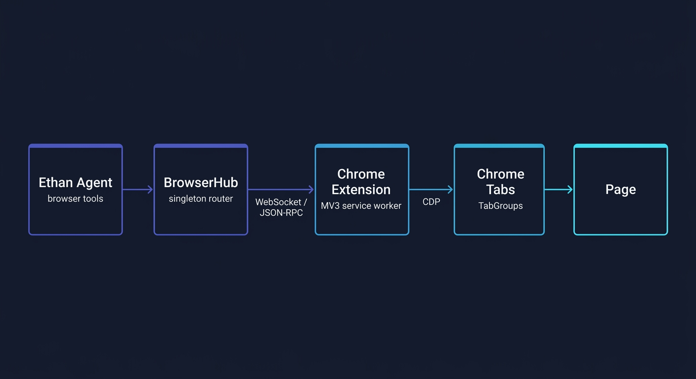
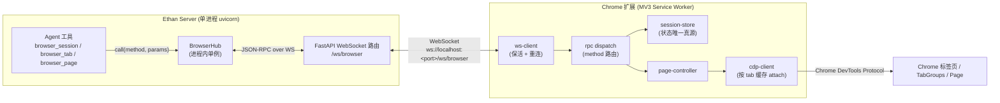
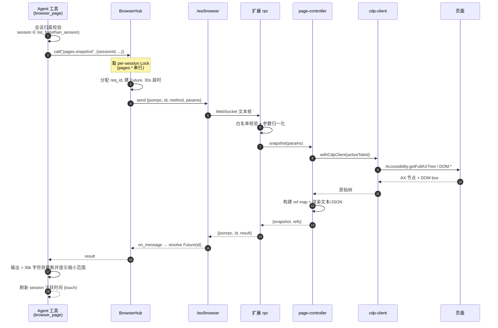

# 浏览器控制 · 总览与架构

> 让 Ethan 在任意对话渠道(Web / 飞书 / CLI)中,操作 **ethan server 所在机器**上的真实 Chrome —— 创建隔离的浏览器会话、管理标签页、读取页面可访问性树、点击/输入、截图、执行页面脚本。

本组文档面向需要理解、维护或扩展该子系统的工程师,按"总览 → 传输与协议 → 扩展内核 → 会话/并发/安全"四层组织。设计决策的来龙去脉见 [设计决策记录](../browser-control-plan.md)。

---

## 1. 设计目标与边界

### 在做什么

Ethan 自身是一个常驻的异步 HTTP 服务(单进程 `uvicorn`)。浏览器控制子系统在此之上增加一条能力:Agent 调用工具 → 服务端把指令经 WebSocket 下发给浏览器扩展 → 扩展通过 Chrome DevTools Protocol(CDP)操作真实页面 → 结果原路返回。

整套能力对齐 `browser_use` / `agent-browser` 的交互范式:以**可访问性树(Accessibility Tree)+ ref 句柄**为主的结构化页面操作,辅以坐标级鼠标事件作为兜底。

### 不在本阶段范围

- **跨公网远程控制**:当前假设 ethan 与浏览器在同一台机器(本机裸跑或本机 Docker),传输层只面向 `localhost`。
- **多浏览器连接池**:同一时刻只维护一条扩展连接(后文 last-wins 策略)。
- **完整跨域 iframe 操作**:仅做基础处理。
- **完整的 turn/lease/overlay 运行时**:RPC id 仅用于请求追踪。

---

## 2. 调用链总览



调用链共三段(相比同类桌面方案省去了 Native Messaging Host 与独立 RPC server 两层):



### 三段链路的职责切分

| 层 | 位置 | 职责 | 是否持有状态 |
|---|---|---|---|
| **Agent 工具** | `ethan/tools/builtin/browser.py` | 把模型的 action 参数映射为 JSON-RPC method;做会话归属门禁、snapshot 截断、截图落盘 | 否 |
| **BrowserHub** | `ethan/browser/hub.py` | 持有唯一 WS 连接;请求/响应按 id 配对;30s 超时;per-session 串行锁;断连即 fail | 仅连接运行态,不镜像浏览器状态 |
| **WS 路由** | `ethan/browser/ws_route.py` | `/ws/browser` 端点;首帧 token 鉴权;ping/pong;把连接交给 Hub | 否 |
| **扩展 ws-client** | `browser-extension/.../ws-client.ts` | WS 客户端;心跳 ping;`chrome.alarms` 保活;指数退避重连 | 连接态 |
| **扩展 rpc** | `browser-extension/.../rpc.ts` | method 白名单 + 参数校验 + 分发到 session-store / page-controller | 否 |
| **session-store** | `browser-extension/.../session-store.ts` | session ↔ Chrome TabGroup 映射,标签归属,**浏览器状态的唯一真源** | 是(权威) |
| **page-controller** | `browser-extension/.../page-controller.ts` | 经 CDP 执行 snapshot / 交互 / 截图 / eval | 否(每次实时取 active tab) |
| **cdp-client** | `browser-extension/.../cdp-client.ts` | 按 tabId 缓存 `chrome.debugger` attach,避免反复 attach/detach | 是(attach 缓存) |

> **状态归属原则**:浏览器的"真相"只在扩展侧。ethan 服务端不保存 session/tab/page 的状态镜像,只保留一张"ethan 会话 ↔ browser session"的轻量映射用于隔离与生命周期管理(见[会话/并发/安全](session-security.md))。

---

## 3. 一次 `page.snapshot` 的端到端时序



关键不变量:

- **req_id 配对**:Hub 用单调递增的整型 id 关联请求与响应;扩展原样回填 id。响应到达时按 id 找到挂起的 `Future` 并 resolve。
- **pages.\* 串行**:同一 `browser_session_id` 的页面操作在 Hub 侧用 `asyncio.Lock` 排队,避免两个并发对话对同一 active tab 发出交错的 CDP 命令。不同 session 之间并行。
- **ref 时效**:`refs` 仅对"最近一次该 tab 的 snapshot"可靠。页面发生导航或刷新后,旧 ref 失效,必须重新 snapshot(见[扩展内核](extension-internals.md))。

---

## 4. 代码地图

```text
ethan/browser/
├── __init__.py        子系统说明
├── protocol.py        JSON-RPC method 表 / error code / 超时常量
├── hub.py             BrowserHub 单例:连接管理 / req-id 配对 / 锁 / 超时
├── ws_route.py        FastAPI WS 端点 /ws/browser:鉴权 / ping-pong
├── session_map.py     ethan 会话 ↔ browser session 映射 + idle release 扫描
├── screenshot.py      截图 base64 落盘 + 定时按龄清理
├── auth.py            会话级一次性授权状态
└── http_route.py      /api/browser/shot/{name} 截图文件路由

ethan/tools/builtin/browser.py   browser_session / browser_tab / browser_page 三工具

browser-extension/
├── src/manifest.json            MV3 manifest(无 nativeMessaging,改 host_permissions)
├── src/background/
│   ├── index.ts                 SW 入口:装配 dispatch + ws-client + 事件监听
│   ├── ws-client.ts             WS 连接 / 保活 / 重连(本方案新增)
│   ├── rpc.ts                   method 白名单 + 分发(复用,改传输)
│   ├── session-store.ts         session/TabGroup 状态真源(复用)
│   ├── page-controller.ts       CDP 页面操作(复用)
│   ├── cdp-client.ts            按 tab 缓存 CDP attach(复用)
│   ├── ax-snapshot.ts           AX 树 → ref map(复用)
│   ├── ref-store.ts             ref 生命周期(复用)
│   └── page-runtime.ts          页面运行时辅助(复用)
├── src/shared/                  本地 vendored 协议常量与类型
└── src/popup/                   弹窗设置页(地址 / token / 连接状态)
```

> 扩展侧的 CDP / AX / session 内核逻辑整体复用自一套成熟实现,仅把传输层从 Native Messaging 改为 WebSocket。复用与重写的精确边界见[设计决策记录](../browser-control-plan.md)。

---

## 5. 各专题文档导航

- **[传输层与协议](transport-protocol.md)** —— WebSocket 选型、JSON-RPC 信封、method/error 表、req-id 配对、超时与断连语义、last-wins 连接策略。
- **[扩展内核(CDP/AX)](extension-internals.md)** —— Service Worker 保活、CDP attach 缓存、可访问性树快照算法、ref 句柄生命周期、page-controller 各动作的 CDP 实现。
- **[会话/并发/安全](session-security.md)** —— 会话绑定模型、per-session 锁、idle release、token 鉴权、会话级授权门禁、会话归属隔离、截图隐私与清理、`eval` 权限边界。
