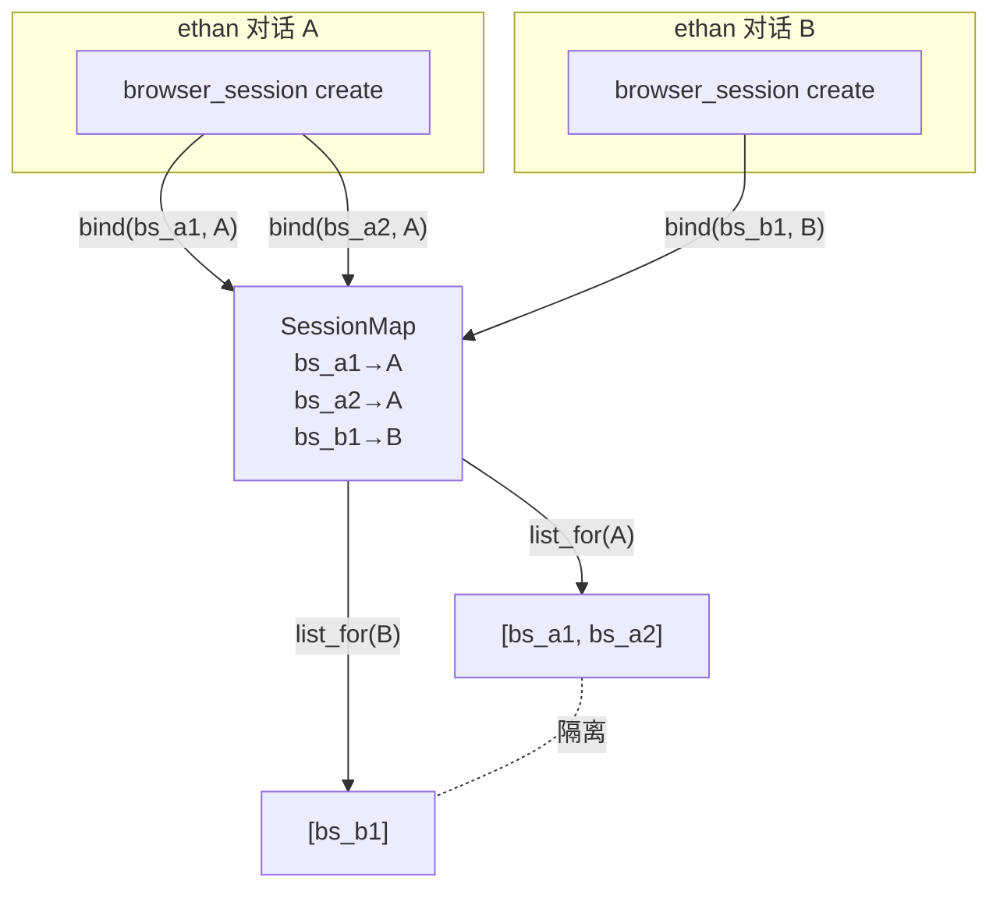
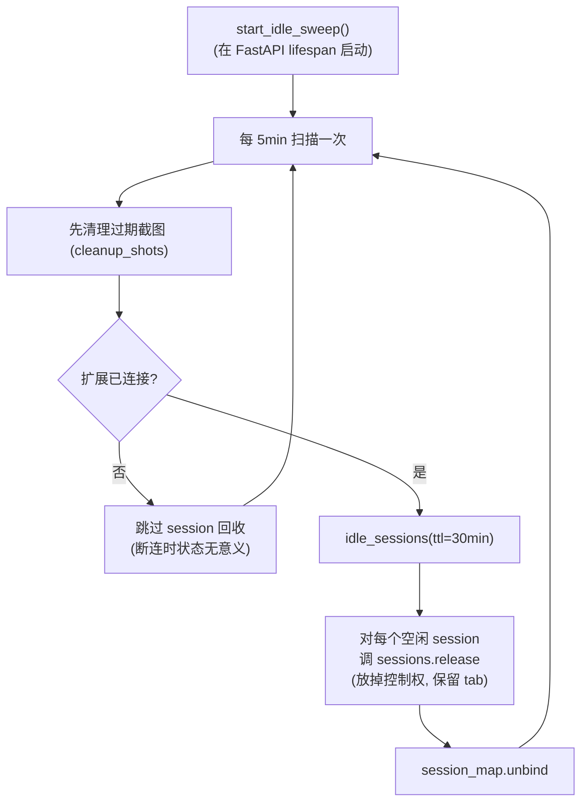
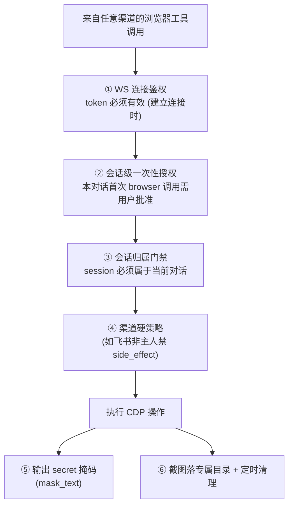
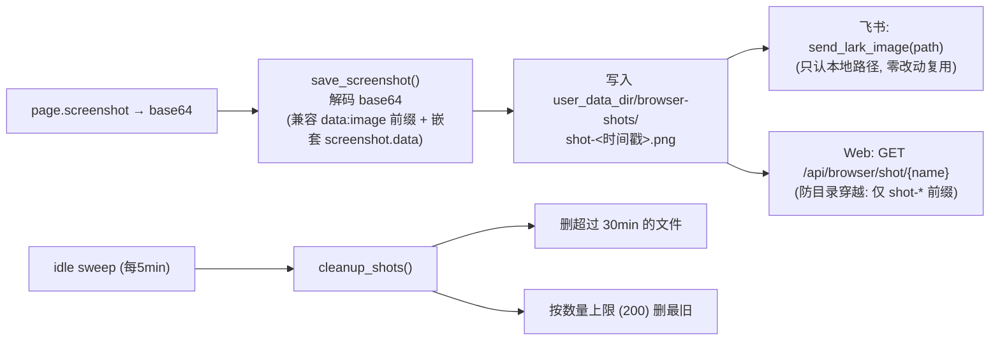

# 浏览器控制 · 会话、并发与安全

本文说明四件相互关联的事:浏览器会话如何绑定到对话(隔离模型)、并发请求如何串行化、会话如何随空闲被回收、以及围绕鉴权/授权/归属/截图/`eval` 的安全边界。

相关代码:`ethan/browser/session_map.py`、`ethan/browser/auth.py`、`ethan/browser/screenshot.py`、`ethan/browser/http_route.py`、`ethan/tools/builtin/browser.py`、`ethan/browser/hub.py`。

---

## 1. 会话绑定模型:每个对话隔离自己的浏览器会话

Ethan 是长驻、多渠道的:同一时刻可能有飞书里的多个用户、Web 端的多个标签页在对话。如果所有对话共享同一批浏览器标签,A 的操作就会踩到 B 正在看的页面。因此采用**会话绑定(per-conversation)**模型:

- 每个 ethan 对话(`session_id`)维护**自己的一组 browser session**。
- `session_map.py` 维护 `browser_session_id → {ethan_session_id, last_active}` 的映射。
- 对话的 `session_id` 通过 `ContextVar`(`ethan/core/context.py` 的 `ETHAN_SESSION_ID`)注入到工具运行上下文;Web 的 `/chat` 路由与飞书事件处理在创建 Agent 前调用 `set_session_id(...)`。



`SessionMap` 提供:`bind`(create/attach 后登记归属)、`touch`(每次操作刷新活跃时间)、`unbind`(release/close 后移除)、`list_for(ethan_session_id)`(列出某对话拥有的 browser session,用于归属门禁与过滤)、`idle_sessions(ttl)`(列出超过空闲时长的 session)。

---

## 2. 并发控制:单进程 + per-session 串行锁

### 为什么是单进程

整个子系统建立在 ethan 以**单进程 `uvicorn`** 运行这一前提上。原因不是性能,而是正确性:

- **BrowserHub 是进程内单例**,持有唯一一条扩展 WebSocket。多 worker 下扩展只能连上其中一个 worker 的 socket,其余 worker 调用浏览器工具时根本找不到连接。
- 同样地,基于内存 `Future` 的 consent 授权流、APScheduler、飞书监听、心跳等也都依赖单进程共享内存。

浏览器是**单一物理资源**——开多少个 worker 也还是那一个 Chrome。多 worker 解决不了"两个对话争用同一浏览器"的问题,只会让"谁持有连接"变得更乱。完整论证见[设计决策记录](../browser-control-plan.md)第 11 节 Q2。

### 并发靠协程,串行靠锁

单进程下,`asyncio` 事件循环天然并发处理多个请求。真正需要约束的是"同一个浏览器 session 内的页面操作不能交错":

- Hub 对 `pages.*` 且带 `browser_session_id` 的调用,按 `browser_session_id` 取 `asyncio.Lock` 串行执行(见[传输层与协议](transport-protocol.md)第 6 节)。
- **同一 session 内**页面操作排队,避免 CDP 命令交错踩页面状态。
- **不同 session 之间**并行,互不阻塞。
- session 管理类调用(`sessions.*` / `tabs.*`)不加锁。

---

## 3. 生命周期:空闲 release(保留标签,不杀页面)

ethan 对话是长驻的,没有明确的"结束"信号。若不回收,Chrome 里的 TabGroup 会越积越多。`session_map.py` 用一个后台扫描任务处理:



- **空闲阈值** `IDLE_TTL_SECONDS = 30 * 60`(30 分钟),**扫描间隔** `_SWEEP_INTERVAL = 5 * 60`(5 分钟)。
- 空闲后执行的是 **release(放掉控制权但保留用户标签)**,**不是 close(杀标签)**。理由:用户可能还在看那个页面,直接关闭是破坏性操作。真正的 close 只在 Agent/用户显式调用 `browser_session(action="close")` 时发生。
- 用户回头继续对话时,Agent 重新 `create` 一个 session 即可。
- 截图清理与扩展是否连接无关,总是执行(见第 6 节)。

---

## 4. 安全边界总览



五道关卡逐一说明如下。

---

## 5. 鉴权、授权与归属隔离

### ① WS 连接鉴权

扩展建立连接时首帧必须携带合法 token(复用 ethan web token 体系)。失败直接 `close(4001)`。详见[传输层与协议](transport-protocol.md)第 2 节。

### ② 会话级一次性授权(consent)

`auth.py` 实现"一个对话内首次调用任意 browser 工具时请求一次授权,批准后该对话后续所有 browser 操作(含 `eval`)放行,不再追问"。

- 工具基类 `consent_check()` 调用 `_consent_desc()`:若当前对话 `is_authorized(get_session_id())` 为真则返回 `None`(放行),否则返回授权说明字符串,触发 ethan 既有的 consent 流程(Web 弹窗 / 渠道交互)。
- consent 通过后,工具 `run()` 开头调用 `mark_authorized(get_session_id())` 记下该对话已授权。
- 这样设计是为了平衡安全与可用:既不至于"每点一下都要批一次",也不会因为某个对话授权了而污染其他对话——授权状态按 `session_id` 隔离。无 `session_id` 的场景(如无会话的本地调用)不施加会话级门禁,交由渠道硬策略处理。

### ③ 会话归属门禁(防跨对话操控)

授权解决的是"能不能用浏览器",归属解决的是"能不能用**这个** session"。`browser.py` 的 `_call()` 在把任何带 `browser_session_id` 的调用下发到 Hub **之前**,先做归属校验:

```python
# 伪代码,见 ethan/tools/builtin/browser.py
def _require_owned(browser_session_id):
    owned = get_session_map().list_for(get_session_id())
    if browser_session_id not in owned:
        raise BrowserError("该 browser session 不属于当前对话,拒绝操作",
                           code=ERROR_CODE["session_not_found"])
```

- 这道门禁在 `_call()` 入口**统一收口**,一处覆盖 `rename` / `release` / `close` 以及全部 `tab.*` / `page.*` 操作。
- `create` / `attach_current` 不带既有 `browser_session_id`(新建后才 `bind`),天然绕开门禁。
- `session_list` 的返回也按当前对话过滤(`_filter_owned_sessions`),不向某对话泄漏其他对话/用户的 session id。
- 效果:即便对话 B 已通过自己的 consent 授权,也无法操作对话 A 创建的 session——跨对话操控在触达 Hub 之前就被拒绝。

> `tab_user_list` 列出的是用户**未被任何 session 接管的原生标签**(供挑选可接管对象),不属于"别人对话的 managed session"。由于 `attach` 只能把标签纳入当前对话自己拥有的 session,跨对话**操控**这条路已被堵死;`user_list` 仅是标签可见性,对任意已授权 Agent 一致。

### ④ 渠道硬策略

ethan 既有的渠道守卫仍然叠加。例如飞书在认主人后,非主人对 `side_effect=True` 工具一律直接拒绝。三个 browser 工具均声明 `side_effect = True`,因此自动受此策略约束。

### ⑤ secret 掩码

工具输出经过 ethan 既有的 `mask_text` 安全网,把上下文中出现的已知 secret 真值替换为掩码,防止页面内容/`eval` 结果把密钥回流进模型上下文。

---

## 6. 截图:落盘、回传与清理

CDP 截图返回 base64。为了让"任意渠道都能拿到图",采用**落盘 + 路径**而非内联 base64:



设计要点:

- **为什么不内联 base64**:飞书图片通道 `send_lark_image(chat_id, image_path)` 只接受**本地文件路径**,这是硬约束;落盘后飞书零改动复用,Web 侧加一个文件路由即可,从而"渠道无关"真正成立。
- **为什么不用 `/tmp`**:macOS 默认不自动清理 `/tmp`,Docker 容器内更没有任何自动清理。因此落到 ethan 数据目录下的 `browser-shots/` 专属目录,**自管清理**。
- **为什么不"用完即删"**:文件需要存活到飞书上传完成(数秒级)。因此用"按龄清理 + 总量上限"而非即时删除:保留 `30min`(`_MAX_AGE_SECONDS`),总量上限 `200`(`_MAX_FILES`)个,由 idle sweep 顺带清理。
- **Web 文件路由防穿越**:`http_route.py` 的 `/api/browser/shot/{name}` 拒绝含路径分隔符、且强制 `shot-` 前缀,只允许读取截图目录内的文件。
- **隐私**:截图可能含敏感页面,只回传路径/由渠道渲染,不进模型上下文;配合定时清理与总量上限限制留存。

---

## 7. `eval` 的权限边界

`page_eval` 可在页面执行任意 JavaScript,是权限最高的能力:

- 它**不单独**逐次弹窗授权(否则与会话级授权设计冲突),而是被**会话级一次性授权**覆盖——本对话首次任意 browser 操作授权后,`eval` 随之放行。这是有意的折中:既然用户已授权该对话操作浏览器,逐次 gate `eval` 会让 Agent 寸步难行。
- 但它仍受**渠道硬策略**(飞书非主人禁)与 **secret 掩码**约束。
- 使用准则(写入技能文档):仅在任务确需时使用,不要对不可信页面执行无关脚本。

---

## 8. Snapshot 优化（v0.4.0+）

扩展侧 `ax-snapshot.ts` 做了多项优化减小 snapshot 体积、提升 agent 可操作性：

| 优化 | 效果 |
|------|------|
| **不可见节点过滤** | `offsetParent===null` 且非 fixed 的元素跳过，省 10-20% 节点 |
| **导航容器摘要** | `role=navigation` 子树不展开，摘要成 `[navigation: N items]`，避免导航菜单撑爆预算 |
| **浮层优先排序** | `position:fixed/sticky` 的浮层节点排到 snapshot 最前面，优先操作 |
| **bbox 坐标补充** | refable 元素附带 `bbox=[x,y,wxh]`，agent 可判断元素位置 |
| **密码字段遮蔽** | `type=password` 和 `autocomplete=off` 的输入框 value 替换为 `***` |
| **名称长度缩短** | `MAX_NAME_LENGTH` 从 160 缩到 100，减少冗长文本 |
| **截图 webp** | 默认格式从 png 改为 webp，体积小 60-70%，CDP 原生支持 |

---

## 9. 关键常量速查

| 常量 | 值 | 位置 | 含义 |
|---|---|---|---|
| `DEFAULT_REQUEST_TIMEOUT` | 30s | `protocol.py` | 单次 RPC 超时 |
| `SESSION_SCOPED_PREFIX` | `"pages."` | `protocol.py` | 需要 per-session 锁的 method 前缀 |
| `RPC_VERSION` | 1 | `protocol.py` | 协议版本(`auth_ok` 携带) |
| `IDLE_TTL_SECONDS` | 1800s (30min) | `session_map.py` | session 空闲回收阈值 |
| `_SWEEP_INTERVAL` | 300s (5min) | `session_map.py` | 空闲扫描间隔 |
| `_SNAPSHOT_CHUNK_CHARS` | 10000 | `browser.py` | snapshot 分段返回的每段目标字符数 |
| `_SNAPSHOT_DIR` | `/tmp/ethan-snapshots` | `browser.py` | snapshot 完整内容落盘目录 |
| `MAX_NAME_LENGTH` | 100 | `ax-snapshot.ts` | 元素名称最大长度（原 160，缩短省空间） |
| `DEFAULT_SCREENSHOT_FORMAT` | `webp` | `page-controller.ts` | 截图默认格式（原 png，webp 省 60-70%） |
| `_MAX_AGE_SECONDS` | 1800s (30min) | `screenshot.py` | 截图文件保留时长 |
| `_MAX_FILES` | 200 | `screenshot.py` | 截图文件数量上限 |
| 心跳间隔 | 20s | `ws-client.ts` | 扩展 ping 周期 |
| alarms 周期 | ~25s | `ws-client.ts` | SW 保活唤醒 |
| 退避区间 | 1s→30s | `ws-client.ts` | 重连指数退避 |
