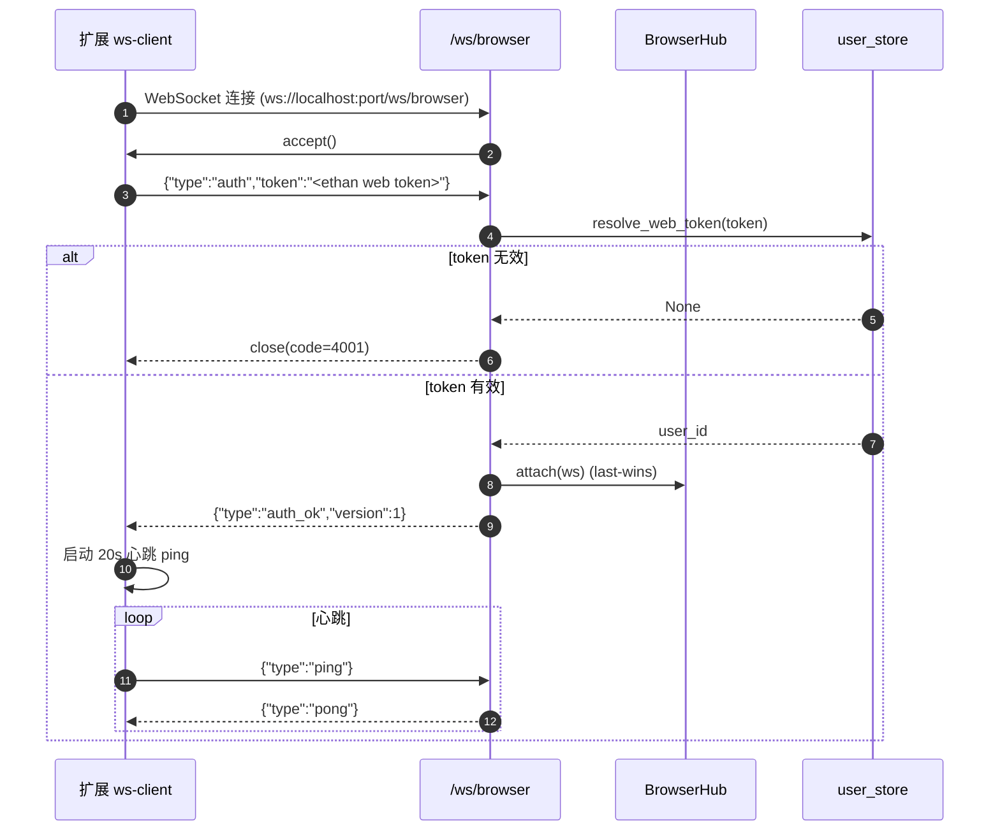
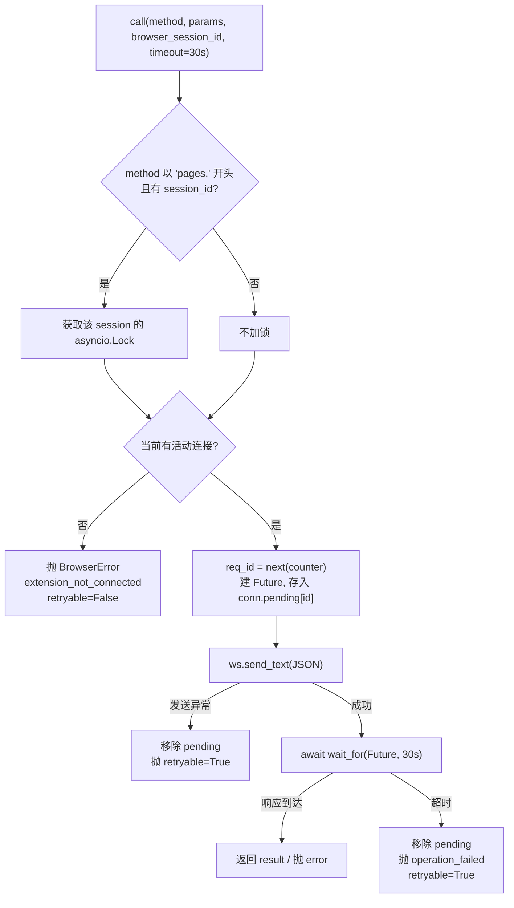
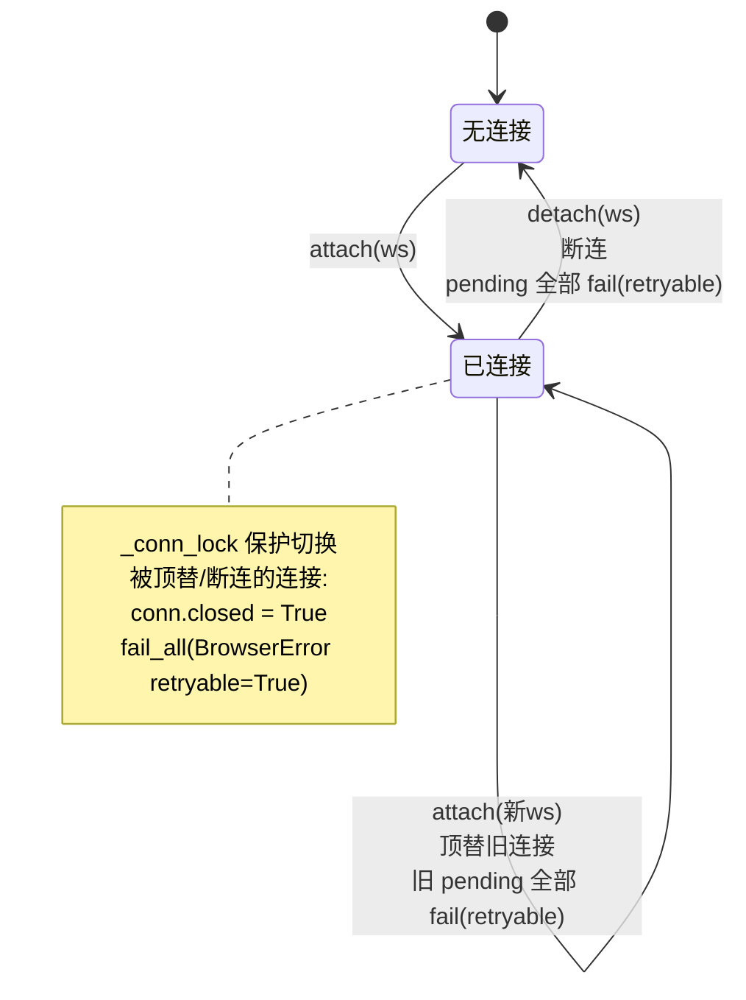

# 浏览器控制 · 传输层与协议

本文说明 Ethan 服务端与 Chrome 扩展之间的通信:为什么选 WebSocket、JSON-RPC 信封长什么样、method/error 怎么定义、请求如何与响应配对、超时与断连如何处理、以及同一时刻只允许一条连接的 last-wins 策略。

相关代码:`ethan/browser/hub.py`、`ethan/browser/ws_route.py`、`ethan/browser/protocol.py`、`browser-extension/src/background/ws-client.ts`。

---

## 1. 为什么是 WebSocket

浏览器扩展运行在 Chrome 内,**无法作为服务端监听端口**,只能主动向外发起连接。Ethan 本身已经是一个 `uvicorn`/Starlette HTTP 服务,天然支持 WebSocket 升级。因此方向是确定的:

- **扩展 = WS 客户端**,**ethan = WS 服务端**。
- 端点复用 ethan 现有 HTTP 端口:`ws://localhost:<port>/ws/browser`。
- 同机部署(裸跑或 Docker)下 `localhost` 始终可达;Docker 只需把该 HTTP 端口 publish 到宿主机,无需额外通道。

相比"桌面 App + Native Messaging Host + 本地 socket"的多段链路,WebSocket 直连省去了 native host 安装、stdio 帧封装、本地 socket 文件管理等环节,部署面更小。代价是引入了 MV3 Service Worker 下的长连接保活问题(见[扩展内核](extension-internals.md)的保活小节)。

---

## 2. 帧类型与握手

WS 通道上承载两类帧,均为 JSON 文本帧:

1. **控制帧**:`{"type": "auth" | "auth_ok" | "ping" | "pong"}`,用于鉴权握手与心跳保活。
2. **JSON-RPC 帧**:标准 JSON-RPC 2.0 请求/响应,用于业务调用。

### 握手时序



握手要点:

- **首帧必须是 `auth`**。服务端 `accept()` 之后第一条消息若不是合法 `auth` 帧、或 token 解析失败,直接 `close(4001)`。
- **token 复用 ethan 的 web token 体系**:`get_user_store().resolve_web_token(token)`,与 Web/HTTP 接口同源,不另设凭据。token 在扩展弹窗中配置。
- 鉴权通过后服务端回 `auth_ok` 并携带协议版本 `version`(`RPC_VERSION = 1`),扩展据此开始心跳。

---

## 3. JSON-RPC 信封

请求(ethan → 扩展):

```json
{
  "jsonrpc": "2.0",
  "id": 42,
  "method": "pages.snapshot",
  "params": { "sessionId": "", "interactive": true, "compact": true, "depth": 3 }
}
```

成功响应(扩展 → ethan):

```json
{ "jsonrpc": "2.0", "id": 42, "result": { "snapshot": "…", "refs": { "e1": { "ref": "e1", "role": "button", "name": "登录" } } } }
```

错误响应:

```json
{ "jsonrpc": "2.0", "id": 42, "error": { "code": 4109, "message": "page ref not found" } }
```

- `id` 是 Hub 侧单调递增的整型(`itertools.count(1)`),用于把响应 resolve 回正确的挂起请求。
- 控制帧(ping/pong/auth)**不带 `id`**,不参与 RPC 配对;Hub 收到无 `id` 的消息直接忽略。

---

## 4. method 命名空间

method 命名空间对齐扩展侧 dispatch 字符串,这样移植过来的扩展路由逻辑无需改动。ethan 侧 `protocol.py` 维护一张 Python 友好键名 → 线上 method 字符串的映射表 `METHODS`:

| 工具动作(Python 键) | 线上 method | 说明 |
|---|---|---|
| `session_create` | `sessions.create` | 新建 session(= 一个 Chrome TabGroup) |
| `session_attach_current` | `sessions.attachCurrent` | 接管当前 active tab |
| `session_list` | `sessions.list` | 列出 session |
| `session_rename` | `sessions.rename` | 重命名 |
| `session_release` | `sessions.release` | 放掉控制权(保留 tab) |
| `session_close` | `sessions.close` | 关闭整个 TabGroup |
| `tab_open` | `tabs.open` | 在 session 内开新 tab |
| `tab_list` | `tabs.list` | 列出 session 内 tab |
| `tab_user_list` | `tabs.userList` | 列出用户全部 tab |
| `tab_attach` | `tabs.attach` | 把已有 tab 纳入 session |
| `tab_active` | `tabs.active` | 取当前活动 tab |
| `tab_activate` | `tabs.activate` | 切换活动 tab |
| `tab_close` | `tabs.close` | 关闭 tab |
| `page_snapshot` | `pages.snapshot` | AX 树 + ref map |
| `page_click` / `page_hover` / `page_fill` / `page_type` / `page_select` / `page_scroll_into_view` | `pages.*` | 基于 ref 的交互 |
| `page_press` | `pages.press` | 键盘按键 |
| `page_scroll` | `pages.scroll` | 方向滚动 |
| `page_mouse` | `pages.mouse` | 坐标级鼠标事件 |
| `page_get` | `pages.get` | 读 title/url/text/value/html/box |
| `page_screenshot` | `pages.screenshot` | 截图(返回 base64) |
| `page_wait` | `pages.wait` | 等待 ms / 加载状态 |
| `page_eval` | `pages.eval` | 执行页面 JS(高权限) |

---

## 5. 错误码

`protocol.py` 的 `ERROR_CODE` 与扩展侧保持一致。标准 JSON-RPC 段用负值,业务段用 4xxx:

| 名称 | 码 | 含义 |
|---|---|---|
| `invalid_request` | -32600 | 非法请求 |
| `method_not_found` | -32601 | 未知 method(不在白名单) |
| `invalid_params` | -32602 | 参数校验失败 |
| `internal_error` | -32603 | 内部错误 |
| `unauthorized` | 4001 | 鉴权失败(WS close 也用此码) |
| `extension_not_connected` | 4101 | 扩展未连接 / 连接被顶替 / 断连 |
| `operation_failed` | 4102 | 通用操作失败 / 超时 |
| `session_required` | 4103 | 缺少 session |
| `tab_not_found` | 4104 | tab 不存在 |
| `session_not_found` | 4107 | session 不存在 / 不属于当前对话 |
| `page_ref_not_found` | 4109 | ref 失效(通常因导航/刷新) |
| `page_operation_failed` | 4110 | CDP 页面操作失败 |

服务端把扩展返回的 `error` 包装成 `BrowserError(message, code, retryable)` 抛给工具层。工具层据 `retryable` 决定是否在结果里提示"可重新 snapshot 后重试"。

---

## 6. 请求生命周期:配对、超时、锁

核心逻辑在 `BrowserHub.call()` / `_call_unlocked()`:



- **超时**:`DEFAULT_REQUEST_TIMEOUT = 30.0` 秒。超时后从 `pending` 移除该 Future,抛可重试错误。即使扩展事后回了响应,也因 id 已不在 `pending` 而被忽略。
- **per-session 锁**:仅 `pages.*`(`SESSION_SCOPED_PREFIX = "pages."`)且带 `browser_session_id` 时加锁。锁按 `browser_session_id` 建立(惰性创建,存于 `_session_locks` 字典)。session 管理类(`sessions.*` / `tabs.*`)不加锁,可与页面操作并发。
- **响应分发**:`on_message()` 解析 JSON,取 `id`,从 `conn.pending` 弹出对应 Future。有 `error` 字段则 `set_exception(BrowserError)`,否则 `set_result(result)`。

---

## 7. last-wins 连接策略与断连语义

同机单浏览器场景下,扩展 Service Worker 被回收后重启、或用户重载扩展,都会产生"新连接进来时旧连接可能还在"的情况。策略是 **last-wins**:



- **attach(新连接)**:若已有未关闭连接,先把旧连接标记 `closed`、`fail_all` 其全部挂起请求(`extension_not_connected`, `retryable=True`)、并尝试 `ws.close()`,再装入新连接。`_conn_lock` 保证切换原子。
- **detach(断连)**:把该连接 `fail_all`;若它仍是当前连接则清空 `_conn`。
- **fail 的请求都是 `retryable=True`**:配合工具层的"重新 snapshot 后重试"提示,Agent 可自行重试,而不是整体卡死。

> Hub 是**进程内单例**(`get_hub()`),这在单进程 `uvicorn` 下安全。这也是为什么本子系统依赖"保持单进程"这一架构前提——多 worker 会让扩展 WS 只连得上其中一个 worker,其余 worker 调用浏览器工具时找不到连接。该前提的完整论证见[设计决策记录](../browser-control-plan.md)第 11 节 Q2。

---

## 8. 扩展侧客户端要点

`ws-client.ts` 实现了对端逻辑,关键常量与行为:

- **心跳**:每 `20s` 发 `{"type":"ping"}`;`auth_ok` 后才开始心跳。
- **保活**:`chrome.alarms` 每 ~`0.4` 分钟(约 25s)唤醒 Service Worker,防止 MV3 SW 被回收导致连接静默失效。
- **重连**:断线后指数退避(基准 `1s`,上限 `30s`),`auth_ok` 成功后退避重置。
- **配置热更新**:扩展弹窗修改地址/token 后,`chrome.storage.onChanged` 触发 `stop()` + `start()` 立即重连。
- **状态查询**:弹窗通过 `chrome.runtime.sendMessage({type:'getStatus'})` 查询 `isConnected`(WS open 且 `auth_ok`),并可发 `{type:'reconnect'}` 手动重连。

MV3 Service Worker 保活是本方案**风险最高的一环**(原桌面方案用的是 Native Messaging port,不存在 WS 长连接被 SW 回收的问题)。详细机理与验证建议见[扩展内核](extension-internals.md)。
