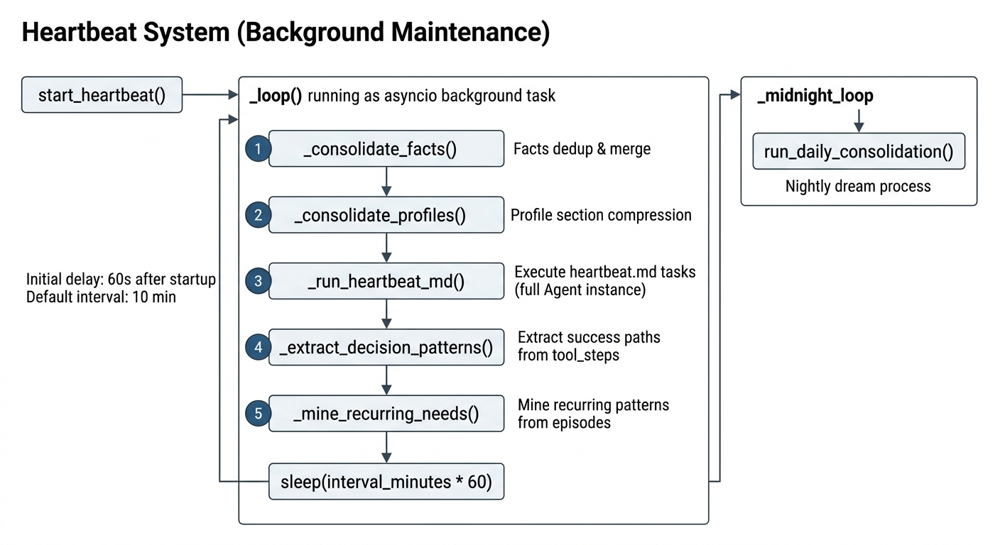
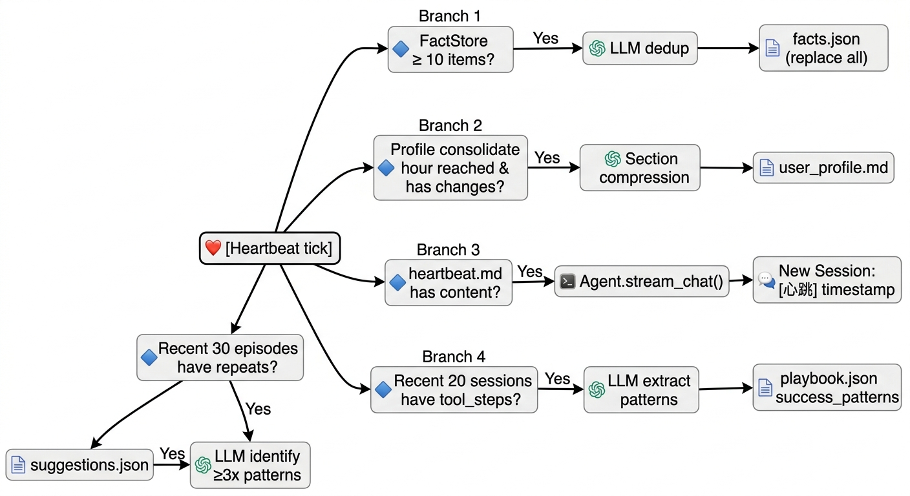

# 心跳系统设计文档

系统内部定期执行的维护任务：对长期记忆（facts）做去重合并，运行用户定义的周期性指令（heartbeat.md），并执行决策模式抽取和需求挖掘。

---

## 与 Scheduler 的区别

| 维度 | Scheduler (APScheduler) | Heartbeat |
|------|------------------------|-----------|
| 创建方式 | 用户通过对话或 CLI 主动创建 | 系统自动运行，不暴露给用户管理 |
| 任务内容 | 任意用户业务任务（提醒、报告等） | 系统维护：facts 去重 + heartbeat.md + 决策抽取 + 需求挖掘 |
| 配置项 | job_id / cron / interval_minutes | config.defaults.heartbeat |
| 持久化 | `~/.ethan/scheduler.db` | 不持久化，每次随服务启动 |
| 可见性 | Web UI `/schedule` 页面可见 | 不在调度器页面显示 |

简单说：Scheduler 是给用户用的，Heartbeat 是系统自己的看门狗。

---

## 架构

文件：`ethan/core/heartbeat.py`


<!-- diagram-source
```
start_heartbeat()
   │ (asyncio background task)
   ▼
_loop():
   ├── 延迟 60 秒（避免服务刚启动时立即触发）
   └── while True:
       ├── _consolidate_facts()              # facts 去重合并
       ├── _consolidate_profiles()           # 画像分区压缩
       ├── _run_heartbeat_md()               # 执行 heartbeat.md 任务
       ├── _extract_decision_patterns()      # 抽取成功路径 → success_patterns
       ├── _mine_recurring_needs()           # 挖掘重复模式 → suggestions.json
       └── sleep(interval_minutes * 60)
```
-->

---

## 五个维护动作

### 1. Facts 去重（`_consolidate_facts`）

活跃 fact ≥ 10 条时，用 lite 模型合并去重 → 旧 fact 标 `superseded` → 写入新 facts。
→ 详见 [memory.md · 冷区 Facts](./memory.md#冷区-factsfactstore)

### 2. 画像分区压缩（`_consolidate_profiles`）

每日一次（`profile_consolidate_hour` 后），按 identity / emotion / agreement 三组分别压缩 `user_profile.md`。跳过条件：未到钟点 / 今天已压 / 无改动 / bullet < 4。
→ 详见 [memory.md · Profile](./memory.md#第三层用户画像user-profile)

### 3. heartbeat.md 任务（`_run_heartbeat_md`）

触发条件：`~/.ethan/system/heartbeat.md` 文件存在且内容非空。

流程：
1. 读取 heartbeat.md 完整内容作为 prompt（前缀 `[Heartbeat] 正在执行系统心跳任务：heartbeat.md`）
2. 启动一个完整 Agent 实例（加载全量工具和 Skills）
3. 用 `stream_chat()` 执行，完整记录工具步骤 / 思考过程 / token usage
4. **每次心跳创建一个独立的 `[心跳] <时间戳>` Session**（如 `[心跳] 2026-06-21 12:33`），便于在 Web 会话列表里独立查看每次心跳的执行过程
5. 仅当 heartbeat.md 有实质内容时才执行（空文件不产生无意义 Session）

heartbeat.md 是一个普通 Markdown 文件，所有内容都作为 prompt 发给 Agent，包括标题行。示例：

```markdown
## 每次心跳任务

检查今天的待办事项是否有到期的，如果有，向知识库添加一条提醒记录。
```

### 4. 决策模式抽取（`_extract_decision_patterns`）

从近 20 个 session 的 tool_steps 抽取高频成功路径（≥2 次）→ `playbook.json` 的 `success_patterns`。
→ 详见 [memory.md · 过程记忆](./memory.md#过程记忆procedurestore)

### 5. FDE 需求挖掘（`_mine_recurring_needs`）

从近 30 个 episodes 识别 ≥3 次重复模式 → `suggestions.json` → 下次对话首轮注入 `<proactive_suggestion>`。用户拒绝后不再重复。
→ 详见 [memory.md · Episode](./memory.md#第四层情节记忆episodic-memory)

---

## 配置

在 `~/.ethan/config.yaml` 中：

```yaml
defaults:
  heartbeat:
    enabled: true
    interval_minutes: 10   # 每 10 分钟执行一次
    profile_consolidate_hour: 3  # 画像压缩在凌晨 3 点后触发
```

也可在 Web UI 的「设置」页面修改。

---

## 启动与停止

心跳在 `ethan serve`（FastAPI 服务）启动时通过 `start_heartbeat()` 创建后台 asyncio task。服务关闭时调用 `stop_heartbeat()` 取消 task。

CLI 模式下不启动心跳（心跳更适合长期运行的服务端场景）。

---

## 数据流


<!-- diagram-source
```
[Heartbeat tick]
   │
   ├─ FactStore.get_active() ≥ 10 条？
   │   └─ 是 → LLM 去重 → FactStore 全量替换
   │
   ├─ 到达 profile_consolidate_hour 且画像有改动？
   │   └─ 是 → 分区压缩（identity/emotion/agreement）→ user_profile.md
   │
   ├─ heartbeat.md 有实质内容？
   │   └─ 是 → Agent.stream_chat(heartbeat.md)
   │          → 收集 tool_steps / thought / usage
   │          → 写入新 Session：[心跳] <时间戳>
   │
   ├─ 近 20 个 session 有 tool_steps？
   │   └─ 是 → lite 模型归纳 (场景 → 工具序列)
   │          → ≥2 次的写入 success_patterns
   │
   └─ 近 30 个 episodes 有重复模式？
       └─ 是 → lite 模型识别 ≥3 次的模式
              → 写入 suggestions.json（未拒绝的）
```
-->
