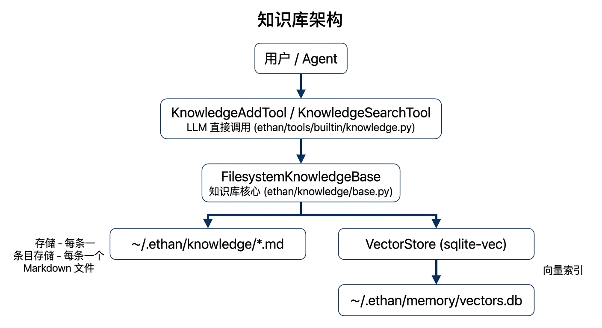

# 知识库设计文档

## 概述

知识库让 Agent 能够存储和检索用户积累的笔记、参考资料、决策记录等信息。与短期的工作记忆不同，知识库条目由用户或 Agent 主动写入，永久保留，支持关键词和语义两种检索方式。

---

## 架构


<!-- diagram-source
```
用户 / Agent
    │
    ▼
KnowledgeAddTool / KnowledgeSearchTool    ← LLM 直接调用
    │                                     （ethan/tools/builtin/knowledge.py）
    ▼
FilesystemKnowledgeBase                  ← 知识库核心
    │                                     （ethan/knowledge/base.py）
    ├─ ~/.ethan/knowledge/*.md            ← 条目存储（每条一个 Markdown 文件）
    └─ VectorStore（sqlite-vec）         ← 向量索引
           ~/.ethan/memory/vectors.db
```
-->

---

## 存储格式

每个条目存为一个 Markdown 文件，文件名由标题自动 slugify 生成：

```markdown
# 笔记标题
tags: python, async, 备忘

正文内容，支持完整 Markdown 格式。
```

文件命名示例：`python-asyncio-备忘.md`，遇到同名自动加 `-1`、`-2` 后缀。

---

## 两种检索模式

### 关键词检索（keyword）

对标题、内容、tags 做词频打分，按命中词数排序。无需预先生成 embedding，速度快。

```python
kb.search("Python asyncio", limit=5)
```

### 语义检索（semantic）

基于 `sqlite-vec` 向量相似度（余弦距离）。写入时自动生成 384 维 embedding，查询时向量化后做 ANN 检索。

```python
await kb.semantic_search("异步编程最佳实践", limit=5)
```

**Embedding 策略**：
- 优先使用 `sentence-transformers`（`all-MiniLM-L6-v2`，384 维，质量高）
- 未安装时自动退化到内置 n-gram 特征哈希 embedding（同为 384 维，schema 不变）

---

## LLM 工具

### `knowledge_search`

文件：`ethan/tools/builtin/knowledge.py`

在知识库中搜索相关条目。Agent 会在使用 `web_search` 之前先查知识库，优先使用用户已记录的信息。

```python
knowledge_search(query="HA REST API 地址", limit=3)
```

### `knowledge_add`

文件：`ethan/tools/builtin/knowledge.py`

将笔记、参考资料保存到知识库。同时写入 Markdown 文件和向量索引。

```python
knowledge_add(
    title="HA REST API 地址",
    content="Home Assistant 的 REST API 地址是 http://192.168.1.x:8123，token 在长效 token 管理页生成。",
    tags=["home-assistant", "api", "地址"]
)
```

---

## HTTP API

| 方法 | 路径 | 说明 |
|------|------|------|
| GET | `/knowledge` | 列出所有条目，支持 `q` 参数关键词过滤，`mode=keyword\|semantic` |
| POST | `/knowledge` | 新增条目（`title`、`content`、`tags`） |
| PUT | `/knowledge/{source}` | 更新指定条目（按文件路径） |
| DELETE | `/knowledge/{source}` | 删除指定条目（同时清理向量索引） |
| GET | `/knowledge/search` | 语义检索，参数 `q`、`limit`、`semantic=true\|false` |

### 新增条目

```bash
curl -X POST http://localhost:8900/knowledge \
  -H "Content-Type: application/json" \
  -d '{"title": "部署 checklist", "content": "1. 运行测试\n2. 检查 diff\n3. 更新文档", "tags": ["deploy"]}'
```

### 语义检索

```bash
curl "http://localhost:8900/knowledge/search?q=部署流程&limit=5&semantic=true"
```

---

## Web UI

知识库页面（`/knowledge`）提供：

- 全部条目列表，支持关键词搜索
- 点击条目查看完整内容（Markdown 渲染）
- 编辑、删除现有条目
- 手动新增条目

---

## 与记忆系统的区别

| 维度 | 知识库 | 工作记忆（Facts） |
|------|--------|-----------------|
| 写入方式 | 用户/Agent 主动调用工具 | 后台压缩自动提炼 |
| 内容类型 | 任意长度笔记、参考资料、文档 | 简短的事实条目（一句话） |
| 检索方式 | 关键词 + 语义向量检索 | 置信度排序后注入 prompt |
| 存储位置 | `~/.ethan/knowledge/*.md` | `~/.ethan/memory/facts.json` |
| 是否注入 prompt | 不自动注入，由 Agent 主动检索 | 自动注入 top-15 |

---

## 文件索引

| 文件 | 说明 |
|------|------|
| `ethan/knowledge/base.py` | FilesystemKnowledgeBase 核心逻辑 |
| `ethan/tools/builtin/knowledge.py` | LLM 工具（search / add） |
| `ethan/memory/vector_store.py` | sqlite-vec 向量存储 |
| `ethan/memory/embeddings.py` | Embedding 生成（sentence-transformers / n-gram 回退） |
| `~/.ethan/knowledge/` | 条目 Markdown 文件 |
| `~/.ethan/memory/vectors.db` | 向量索引（SQLite） |
