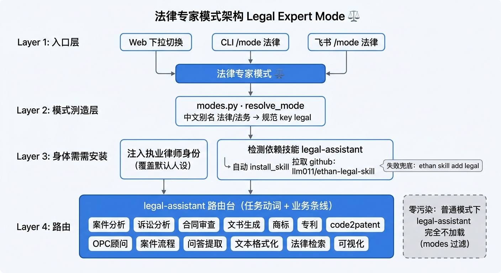

# 法律专家模式 · legal-assistant

面向法律从业者的垂类能力。切到「法律专家」模式后，单个可路由的 `legal-assistant` 技能即覆盖法律全流程；正常工作模式下完全不加载，零污染。



## 设计目标

把分散的法律子能力**收敛为单一可路由技能**，而不是堆几十个子 agent / 子 skill：

- **一个技能、按需路由**：`legal-assistant` 是统一入口，按「任务动词 + 业务条线」分诊到对应 playbook，再执行。
- **零污染**：技能用 `modes: [法律]` 标记，仅在法律模式生效；普通模式完全不进上下文。
- **不绑死主仓库**：法律内容（改写整合自上游 CC-BY-NC 项目）托管在独立公开仓库 [`llm011/ethan-legal-skill`](https://github.com/llm011/ethan-legal-skill)，按需安装，不随主仓库分发。

## 能力范围（13 个 playbook）

| 业务条线 | playbook | 能力 |
|---------|---------|------|
| 通用法律分析 | `case-analysis.md` | 要件式九步法、事实/证据抽取、问题树、论证与风险分级、报告深度控制 |
| 诉讼 | `litigation.md` | 起诉状评估 / 判决书深度抽取 / 庭审复盘，内部·研究·客户三层输出 |
| 合同 | `contract-review.md` | 三层 + 四步审查框架，风险清单（P0/P1/P2）、修改建议、审查意见书；起草骨架 |
| 文书 | `document-generation.md` | 诉讼方案/咨询报告/非诉方案/建议书/结案汇报等，模块化匹配 |
| 知产·商标 | `trademark.md` | 尼斯类别规划 + 可注册性初筛 + 申请材料，风险分级 |
| 知产·专利 | `patent.md` | 7 场景：技术要点/比对/侵权/稳定性/FTO/规避/价值评估，权利要求解读法 |
| 知产·专利 | `code2patent.md` | 输入成熟度分流 → 代码证据映射 → 技术交底书 → 权利要求布局 → 发明专利初稿 |
| 顾问 | `opc-counsel.md` | 一人公司/小微企业多领域路由，结论 + 缺口 + 红线 + 动作 + 升级边界 |
| 流程 | `case-intake.md` | new-case 标准化目录（诉讼/咨询/商标/专利）+ 法院短信解析归档 |
| 内容 | `qa-extraction.md` | 从沟通记录提脱敏法律问答对、建知识库 |
| 内容 | `text-format.md` | 法条/案例文本规范化 Markdown，去推广 |
| 检索 | `legal-research.md` | 何时必须检索、检索任务结构、元典/智合衔接、无 key 降级到 `web_search`、旧法误用检查 |
| 可视化 | `visualization.md` | 受众路由 → VizSpec → drawio/svg/png，案件关系/证据链/诉讼流程图 |

另含 8 个交付模板（`templates/`）与 2 个脚本（`scripts/court_sms_parse.py`、`validate_drawio.py`）。

## 工作流（架构链路）

1. **入口**：Web 模式下拉 / CLI `/mode 法律` / 飞书 `/mode 法律` 切到「⚖️ 法律专家」模式。
2. **模式解析**：`resolve_mode` 把中文别名（法律/法务/法律专家）归一化为规范 key `legal`（见 [对话模式](./modes.md)）。
3. **身份覆盖**：注入「执业律师助手」身份，问「你是谁」答专业身份而非默认人设；声明「输出为专业参考，不替代正式律师意见」。
4. **按需安装**：首次进入若未装 `legal-assistant`，Agent 自动 `install_skill` 从仓库拉取（先告知「正在安装」，不静默联网；失败则提示手动 `ethan skill add legal`）。
5. **路由执行**：技能 SKILL.md 是路由台，按任务动词 + 业务条线读取对应 playbook 后执行。
6. **零污染**：`SkillRegistry.match` 按 mode 过滤，普通模式下该技能不进上下文。

## 安装

```bash
# 命令行一键装（别名 → llm011/ethan-legal-skill/skills/legal-assistant）
ethan skill add legal
```

或切到法律模式时由 Agent 自动安装。docker 部署可设 `ETHAN_INSTALL_SKILLS=legal` 在 `docker compose up` 时自动 provision。

## 总硬约束（任何场景）

- 材料未提及的信息标注「未提及/待补充」，绝不自行补全；单方陈述不写成已认定事实。
- 先整理事实、区分证据与陈述，再适用法律下结论。
- 引用法条/案例前先检索，AI 不确定时生成检索任务，禁止虚构条号。
- 结论用「初步倾向认为……仍取决于……」，禁用「一定胜诉/必然支持/没有任何风险」。
- 不替代正式律师意见、不承诺成功率、不做事实核验；复杂争议建议升级人工。

## 来源与许可

方法论**改写整合**自 [cat-xierluo/legal-skills](https://github.com/cat-xierluo/legal-skills)（作者：杨卫薪律师，微信 ywxlaw），沿用 **CC-BY-NC**（署名—非商业性使用）。详见技能内 `ATTRIBUTION.md`。尼斯分类仅保留 45 类精简索引，全量语料请另装上游 `trademark-assistant`。
