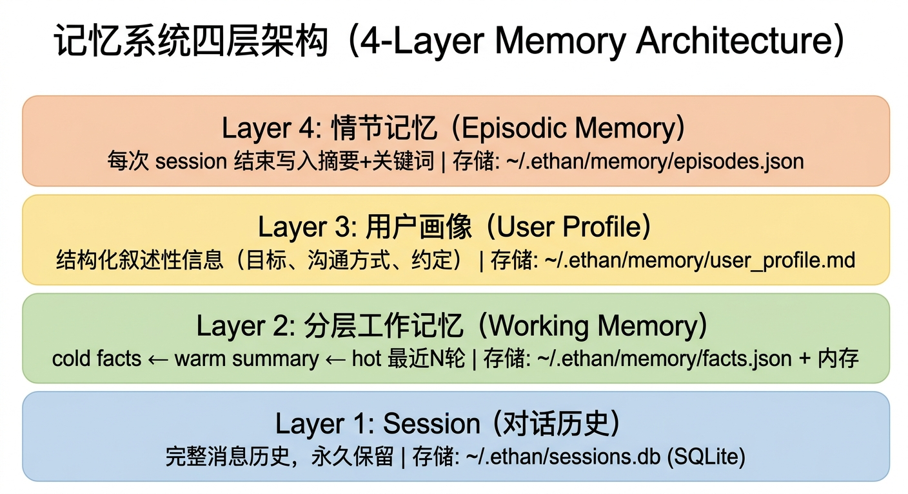
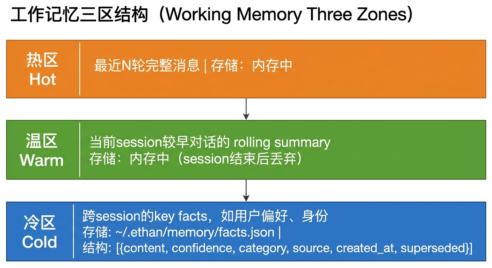
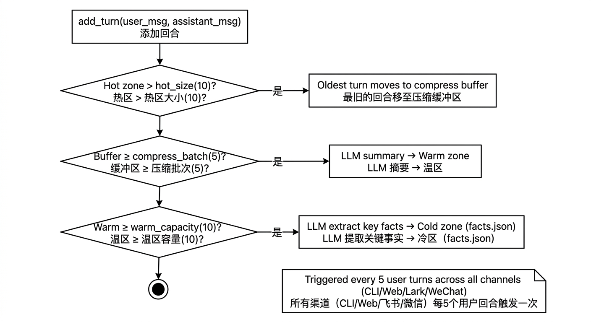
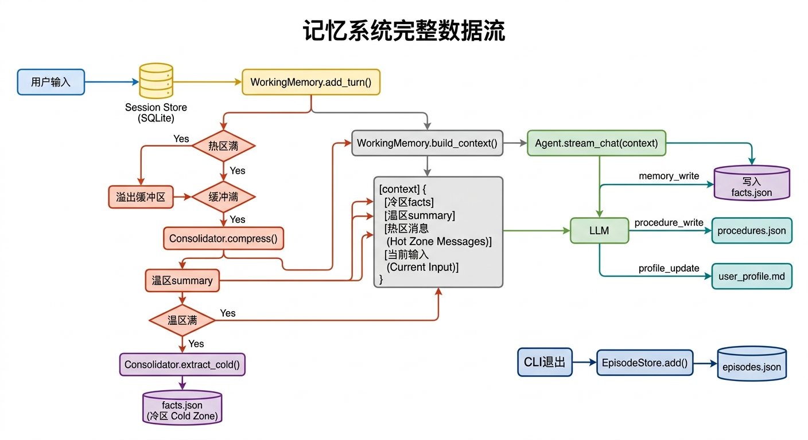

# 记忆系统设计文档

## 概述

Ethan 的记忆系统由四个独立层次构成，覆盖「短期上下文」到「长期知识」。系统遵循**确定性与概率性分离**原则（借鉴 Palantir AIP）：记忆的写入触发和召回由系统规则确定性保证，LLM 只在"记什么内容"上做概率性判断。


<!-- diagram-source
```
┌──────────────────────────────────────────────────────────┐
│  第四层：情节记忆（Episodic Memory）                      │
│  每轮对话结束（user_turns ≥ 2）写入一条摘要 + 关键词      │
│  心跳任务定期扫描，挖掘 ≥3 次的重复模式 → 主动建议        │
│  存储：per-user memory/episodes.json                     │
├──────────────────────────────────────────────────────────┤
│  第三层：用户画像（User Profile）                         │
│  结构化叙述性信息（目标、沟通方式、约定等）               │
│  存储：per-user memory/user_profile.md                   │
├──────────────────────────────────────────────────────────┤
│  第二层：分层工作记忆（Working Memory）                   │
│  cold facts ← warm summary ← hot 最近 N 轮               │
│  冷区 facts 带 tags，支持按当前对话关键词语义召回          │
│  存储：per-user memory/facts.json（冷区）+ 内存           │
├──────────────────────────────────────────────────────────┤
│  第一层：Session（对话历史）                              │
│  完整消息历史，永久保留                                   │
│  存储：per-user sessions.db（SQLite）                    │
└──────────────────────────────────────────────────────────┘
-->

---

## 信号检测与主动召回

这是记忆系统的"神经系统"，解决"用户不说'记住'就不记忆"的问题。

### 设计哲学

| 层面 | 职责 | 实现方式 |
|------|------|----------|
| 确定性层 | **何时**写入/召回记忆 | 规则驱动，100% 命中 |
| 概率性层 | **记什么**内容 | LLM 判断 |

### 信号检测器（Signal Detector）

文件：`ethan/memory/signals.py`

`detect_memory_signal(text)` 用确定性规则检测用户消息中的记忆信号，命中时注入 `<memory_signal>` hint 并激活 `memory_write` 工具——不再依赖 LLM 自觉调用。

```
用户消息
    │
    ▼
detect_memory_signal(text)
    │
    ├─ preference  (喜欢/偏好/习惯/always/never...)
    ├─ correction  (不对/错了/应该是...)
    ├─ decision    (决定/打算/计划...)
    └─ fact        (我叫/我在/我是...)
    │
    ▼
命中 → 注入 <memory_signal> hint + 激活 memory_write 工具
未命中 → 不注入，LLM 正常处理
```

优先级：`preference > correction > decision > fact`（偏好和纠正最重要）

### 关键词提取与语义召回

`extract_keywords(text)` 按标点/空格切分 + 去停用字（CJK 粗粒度切分），用于：
- Fact 写入时自动提取 `tags`（系统确定性保证，不依赖调用方）
- 召回时提取当前对话关键词，与 fact tags 做相关性匹配

`score_relevance(query_keywords, tags)` 计算交集分数，用于 fact 召回排序。

### 召回流程

```
当前用户消息
    │
    ▼
extract_keywords(query) → query_keywords
    │
    ▼
FactStore.build_context_with_recall(query, max_facts)
    │
    ├─ 有 tag 交集的 fact → relevance × 0.6 + confidence × 0.4 排序
    └─ 无交集的 fact → 按 confidence 降序补齐
    │
    ▼
注入 <memory_context>（命中的 fact 更新 last_accessed）
```

---

## 第一层：Session（对话持久化）

文件：`ethan/memory/session.py`  
数据库：per-user `sessions.db`（default: `~/.ethan/sessions.db`）

### 数据结构

两张 SQLite 表：

```sql
sessions  (id, title, model, created_at, updated_at)
messages  (session_id, role, content, tool_calls, tool_call_id)
```

- `id`：格式 `s_YYYYMMDD_HHMM_xxxx`，启动时生成
- `title`：自动从第一条用户消息前 40 字提取
- 消息在用户发出第一条后才真正写入 DB（避免空 session 污染）

### 关键行为

- **延迟持久化**：CLI 启动时只在内存中构造 session 对象，发送第一条消息后才写入 DB
- **自动清理**：CLI 退出时调用 `cleanup_empty()` 删除没有消息的历史空 session
- **全文搜索**：`search(query)` 同时匹配 session 标题和消息内容（SQLite LIKE）

### 操作命令

```bash
ethan -r last                    # 恢复最近的 session
ethan -r s_20260611_1753_d139    # 恢复指定 ID（支持尾部短 ID）
ethan session list               # 列出最近 20 条
ethan session show <id>          # 查看消息摘要
ethan session delete <id>        # 删除
```

CLI 斜杠命令：
```
/sessions          列出最近会话
/resume <id>       恢复指定会话
/new               新建会话
```

---

## 第二层：分层工作记忆（Working Memory）

文件：`ethan/memory/working.py`，`ethan/memory/consolidator.py`，`ethan/memory/facts.py`

### 三层架构


<!-- diagram-source
```
┌─────────────────────────────────────────────┐
│ 冷区 (cold)                                 │
│ 跨 session 的 key facts，如用户偏好、身份    │
│ 每个 fact 带 tags，支持按关键词语义召回      │
│ 存储：per-user memory/facts.json           │
│ 结构：[{content, confidence, category,      │
│          source, created_at, superseded,    │
│          tags}]                             │
├─────────────────────────────────────────────┤
│ 温区 (warm)                                 │
│ 当前 session 较早对话的 rolling summary      │
│ 存储：内存中（session 结束后丢弃）           │
├─────────────────────────────────────────────┤
│ 热区 (hot)                                  │
│ 最近 N 轮完整消息                            │
│ 存储：内存中                                 │
└─────────────────────────────────────────────┘
```
-->

### 滑动窗口机制


<!-- diagram-source
```
每轮对话结束 → add_turn(user_msg, assistant_msg)
    │
    ├─ 热区超过 hot_size？
    │   └─ 是 → 最老一轮移入压缩缓冲区
    │
    ├─ 缓冲区攒够 compress_batch 轮？
    │   └─ 是 → 小模型生成 summary → 合并进温区
    │
    └─ 温区累积够 warm_capacity 轮？
        └─ 是 → 小模型提取 key facts → 写入冷区（facts.json）
                                      → 温区精简
```
-->

### 发给 LLM 的 context 结构

```python
memory.build_context() 返回:
[
    Message(user,      "[长期记忆]\n用户是开发者，偏好中文..."),
    Message(assistant, "好的。"),
    Message(user,      "[对话摘要]\n之前讨论了 X，决定了 Y..."),
    Message(assistant, "好的。"),
    # 热区：最近 N 轮完整消息
    Message(user,      "..."),
    Message(assistant, "..."),
    # 当前输入
]
```

### 三路接口对齐

CLI、Web API (`/chat`)、Lark、WeChat 四路接口均使用相同的 `WorkingMemory(hot_size=10)` 配置，且都在对话结束后触发后台记忆抽取（`_maybe_consolidate`），不再存在截断策略不一致的问题。

### 配置

```python
MemoryConfig(
    hot_size=10,         # 热区保留轮数（CLI / API / Lark / WeChat 统一）
    compress_batch=5,    # 攒够多少轮再压缩一次
    warm_capacity=10,    # 温区累积多少轮后提取冷区（原值 20，已降低以减少短对话记忆丢失）
)
```

### 后台抽取触发条件

所有渠道统一：每轮对话结束后调用 `_maybe_consolidate(session_id, model, user_id)`。

| 阶段 | 触发条件 | 是否调模型 |
|------|----------|-----------|
| Episode 写入 | `user_turns ≥ 2`（每轮都记） | 否（规则提取关键词 + 字符串拼接 summary） |
| Working Memory 压缩/抽取 | `user_turns % 5 == 0` | 是（Consolidator 调 lite 模型） |
| 跨 session 信号采集 | `user_turns % 10 == 0` | 是（lite 模型分析模式） |

### 压缩模型路由（Consolidator）

| 主模型 | 压缩用模型 |
|--------|-----------|
| claude-opus-* | claude-haiku-4-5 |
| claude-sonnet-* | claude-haiku-4-5 |
| gemini-*-pro | gemini-*-flash-lite |
| gemini-*-flash | gemini-*-flash-lite |
| gpt-4o / gpt-5* | gpt-4o-mini |

---

## 冷区 Facts（FactStore）

文件：`ethan/memory/facts.py`
数据文件：per-user `memory/facts.json`

### 数据结构

```python
@dataclass
class Fact:
    content: str           # 内容
    confidence: float      # 置信度 (0.0-1.0)
    source: str            # 来源 session ID
    category: str          # preference | decision | knowledge | correction
    created_at: float      # 创建时间
    last_accessed: float   # 最后访问时间
    superseded: bool       # 是否被新 fact 取代
    tags: list[str]        # 关键词标签，用于语义召回
```

### 写入

- **自动提取 tags**：`add()` 时若未传 `tags`，自动调 `extract_keywords(content)` 提取
- **矛盾检测**：新 fact 与已有 fact 矛盾时，旧 fact 标记为 `superseded`
- **相似合并**：与已有 fact 相似度 > 80% 时，合并 tags、取更高 confidence

### 召回

`build_context_with_recall(query, max_facts)` 按当前对话关键词召回相关 facts：
1. 提取 query 关键词
2. 有 tags 交集的 fact 按 `relevance × 0.6 + confidence × 0.4` 排序
3. 不足时用 confidence 降序补齐
4. 命中的 fact 更新 `last_accessed`

---

## 第三层：用户画像（User Profile）

文件：`ethan/core/profile.py`（共享读写）、`ethan/tools/builtin/profile_update.py`（工具）
数据文件：per-user `memory/user_profile.md`

### 作用

存储无法压缩为单条 fact 的叙述性信息：个人目标、沟通风格、激励语、与 agent 的约定，以及用户的基础特征与心理情绪特征。全量注入 system prompt（仅 full 路径），不参与置信度排名。

### 章节结构

| 章节 | 用途 |
|------|------|
| `基础特征` | 名字、年龄、性格、兴趣等稳定身份信息（建议用户在「我的画像」设置页填写，避免后台抽错） |
| `身份与背景` | 职业、地区、角色等 |
| `目标与方向` | 长期目标、当前专注 |
| `工作与沟通方式` | 偏好的沟通风格、工作节奏 |
| `心理与情绪` | 情绪模式、压力源、什么能安抚 ta、重要内心感受、价值观 |
| `个人语言与激励` | 用户自创词汇、激励短语 |
| `与 Agent 的约定` | 特定场景下的行为约定 |

### 写入方式

Agent 通过 `profile_update` 工具主动更新，支持三种模式：

- `append`（默认）：在对应章节下追加一条 bullet
- `overwrite`：替换整个章节内容
- `merge`：与已有 bullet 相似/矛盾则替换该条（UPDATE），否则追加（ADD）——后台自动抽取用此模式，避免堆砌重复

### 后台自动抽取（心理画像）

`consolidator.extract_cold()` 除了抽取 `key_facts`，还会在**苏念·陪伴倾听模式**下额外抽取 `[PROFILE_PSYCH]`——用户的情绪/困扰/压力源/安抚方式/内心感受/价值观，经 `profile.apply_extraction()` 以 merge 方式写入「心理与情绪」章节。工作助手模式不抽取心理画像。基础特征不靠后台推断，由用户在设置页填写或对话中明确告知后由 agent 写入。

---

## 第四层：情节记忆（Episodic Memory）

文件：`ethan/memory/episodic.py`
数据文件：per-user `memory/episodes.json`

### 作用

每轮对话结束后（`_maybe_consolidate` 中 `user_turns ≥ 2` 时），自动将本次 session 的关键词 + 摘要写成一条 Episode，独立于 Working Memory 的滚动压缩保留下来。所有渠道（CLI/Web/Lark/WeChat）统一生效。

### 数据结构

```json
{
  "session_id": "s_20260612_0151_b18c",
  "summary": "你好，我是张三，今天是来测试 多轮记忆能力...",
  "timestamp": 1749744812.3,
  "model": "gemini-2.5-flash-lite",
  "turn_count": 18,
  "keywords": ["张三", "测试", "记忆", "科幻", "苹果"]
}
```

### FDE 需求挖掘

心跳任务 `_mine_recurring_needs()` 定期扫描近 30 个 episodes，用 lite 模型识别 ≥3 次的重复模式，写入 per-user 的 `memory/suggestions.json`。下次对话首轮注入 `<proactive_suggestion>` 提醒 Agent 自然提起。用户拒绝后标记 `rejected`，不再重复。

---

## 过程记忆（ProcedureStore）

文件：`ethan/memory/procedures.py`
数据文件：per-user `memory/procedures.json`

### 作用

存储 Agent 从用户纠正中学习的行为准则，以及从历史会话中抽取的成功路径，注入 `<behavioral_guidelines>` 作为正反馈。

### 两类内容

**纠正准则**（Procedures）：用户纠正 Agent 时写入，记"不要做什么"。

**成功路径**（Success Patterns）：心跳任务从历史 session 的 tool_steps 中抽取高频成功路径，记"这么做效果好"。

```python
@dataclass
class SuccessPattern:
    scenario: str           # 场景描述（如"查京东订单"）
    tool_sequence: list[str]  # 工具调用序列
    success_count: int      # 成功次数（相同 scenario 累加）
    last_used: float        # 最后使用时间
```

### 注入格式

```
Behavioral guidelines (learned from past corrections):
- 不要用浏览器模拟登录

Success patterns (similar scenarios worked well before):
- 查京东订单: shell:jd_query → file_write:save (2/2 成功)
```

### 旧格式兼容

`_load()` 兼容两种格式：
- 旧格式：纯 `list[dict]` → 加载为 procedures，success_patterns 为空
- 新格式：`{"procedures": [...], "success_patterns": [...]}`

---

## 主动写入记忆工具（Proactive Memory Write）

以上各层都依赖后台压缩提炼。三个工具让 Agent **即时、主动**将信息持久化，无需等待滑动窗口触发：

### `memory_write`

文件：`ethan/tools/builtin/memory_write.py`

将一条用户事实写入冷区（`facts.json`），置信度固定为 `0.95`，来源标记为 `agent_proactive`。写入时自动提取 tags。

```python
# 触发场景：信号检测器命中 preference/decision/fact，或 LLM 主动判断
await memory_write.run(
    content="用户在 Acme Corp 担任后端工程师",
    category="knowledge",  # preference | decision | knowledge | correction
)
```

### `procedure_write`

文件：`ethan/tools/builtin/procedure_write.py`

将一条行为规则写入 `ProcedureStore`（`procedures.json`），通过 `<behavioral_guidelines>` 注入 system prompt，每轮对话都生效。

```python
# 触发场景：信号检测器命中 correction，或 LLM 主动判断
await procedure_write.run(
    rule="Always reply in Chinese",
    context="用户明确要求",
)
```

### `profile_update`

文件：`ethan/tools/builtin/profile_update.py`

更新 `user_profile.md` 中的指定章节（见 [用户画像](#第三层用户画像user-profile)）。

---

## 置信度与记忆注入（Confidence & Injection）

### 置信度机制（Confidence）

每个保存在冷区（`facts.json`）的 Fact 都带有一个 `confidence` 分数（0.0 ~ 1.0）。

- **默认提炼（80%）**：日常闲聊中由后台自动提炼出的信息，默认置信度通常为 `0.8`。
- **主动写入（95%）**：通过 `memory_write` 工具直接写入的 fact，置信度固定为 `0.95`。
- **强信号加权（90%~95%）**：用户使用强烈指令（"记住"、"纠正"、"偏好"）时，Consolidator 赋予更高重要性评分。
- **动态更新与淘汰**：相同 fact 被反复命中则叠加置信度；低置信度且长期未访问的 fact 在存储空间不足时优先清理。

### 记忆注入机制（Injection）

`Agent._build_system()` 在每次 LLM 调用前执行：

1. 提取当前用户消息，用 `detect_memory_signal()` 检测记忆信号
2. 用 `build_context_with_recall(query=当前消息)` 召回相关 facts（按 relevance + confidence 排序）
3. 取 top-15 注入 `<memory_context>`（fast 路径取 top-5）
4. `user_profile.md` 全量注入 `<user_profile>`（仅 full 路径）
5. `procedures.json` 注入 `<behavioral_guidelines>`（含纠正准则 + 成功路径）
6. 信号命中时注入 `<memory_signal>` hint + 激活 memory_write 工具
7. 有未拒绝的 FDE 建议时，首轮注入 `<proactive_suggestion>`

---

## 完整数据流


<!-- diagram-source
```
用户输入
    │
    ▼
Session Store (SQLite) ←─── 第一条消息时才真正写入 DB
    │
    ▼
Agent._build_system()
    │
    ├─ detect_memory_signal(last_user_text) → 信号检测
    │   └─ 命中 → 注入 <memory_signal> + 激活 memory_write
    │
    ├─ FactStore.build_context_with_recall(query=当前消息)
    │   └─ 按 tags 相关性召回 facts → <memory_context>
    │
    ├─ ProcedureStore.build_context()
    │   └─ 纠正准则 + 成功路径 → <behavioral_guidelines>
    │
    ├─ _build_suggestion_hint()
    │   └─ 未拒绝的 FDE 建议 → <proactive_suggestion>（首轮）
    │
    └─ user_profile.md → <user_profile>
    │
    ▼
WorkingMemory.add_turn()
    │
    ├─ 热区满 → 溢出缓冲区
    │               │
    │               └─ 缓冲满 → Consolidator.compress() ──→ 温区 summary
    │                                                           │
    │                                                           └─ 温区满 → Consolidator.extract_cold()
    │                                                                           │
    │                                                                           └─ facts.json（冷区，自动提取 tags）
    │
    ▼
Agent.stream_chat(context) → LLM
    │
    │  LLM 调用工具（信号命中或主动判断）：
    │   ├─ memory_write    → 立即写入 facts.json（带 tags）
    │   ├─ procedure_write → 立即写入 procedures.json
    │   └─ profile_update  → 立即写入 user_profile.md
    ▼
每轮对话结束 → _maybe_consolidate()（所有渠道触发）
    │
    ├─ user_turns ≥ 2 → EpisodeStore.add() → episodes.json（纯本地，无模型调用）
    │
    └─ user_turns % 5 == 0 → Consolidator 压缩/抽取（会调 LLM）

CLI 退出 → SessionStore.cleanup_empty()

心跳任务（定期）：
  ├─ _consolidate_facts()              # facts 去重合并
  ├─ _consolidate_profiles()           # 画像分区压缩
  ├─ _extract_decision_patterns()      # 从 tool_steps 抽取成功路径 → success_patterns
  └─ _mine_recurring_needs()           # 从 episodes 挖掘重复模式 → suggestions.json

每 10 轮用户消息（跨 session 信号采集）：
  collect_signals()
    ├─ 读最近 5 个 session 的 user 消息
    ├─ lite 模型一次分析（重复/错误/成功）
    └─ 有效信号 → daily/<YYYYMMDD>.jsonl

每晚 0 点（_midnight_loop）：
  run_daily_consolidation()
    ├─ 读当日 JSONL
    ├─ LLM 精炼去重（≤10 条）
    ├─ embedding 去重（L2 < 1.1 跳过）
    └─ 写入 memory.db（永久）
```
-->

---

## 第五层：跨 Session 信号采集 + 每日记忆沉淀

文件：`ethan/memory/daily_signals.py`、`ethan/memory/daily_consolidation.py`
数据文件：per-user `memory/daily/<YYYYMMDD>.jsonl`（信号）、`memory/memory.db`（永久记忆）

### 设计目标

从多个 session 的对话模式中提取有价值的长期洞察：
- **重复模式**：用户反复提出相似需求（≥3 次），可能值得固化为快捷方式
- **错误总结**：对话中出现的失败/用户不满，总结错误原因和改进方式
- **成功路径**：用户明确表示满意的场景，记录成功方法

### 核心原则

- **宁缺勿滥**：大部分情况下不应有输出，只记录非常确定的模式
- **跨 session**：至少需要 2 个 session 才有分析意义
- **lite 模型**：所有分析调用使用廉价模型（haiku-4.5/flash-lite/4o-mini）

### 两级流程

```
第一级：实时信号采集（每 10 轮用户消息触发）
    │
    ├─ 读取最近 5 个 session 的 user 消息
    ├─ 一次 lite 模型调用分析模式
    └─ 有效信号追加写入 daily/<YYYYMMDD>.jsonl
    │
第二级：每晚 0 点记忆沉淀
    │
    ├─ 读取当日 JSONL 信号
    ├─ LLM 整理去重（合并相似、排除噪音、限 ≤10 条）
    ├─ embedding 去重：在 memory.db 中查 L2 < 1.1 的跳过
    └─ 通过去重的条目永久写入 memory.db
```

### 信号采集 (daily_signals.py)

**触发条件**：`_maybe_consolidate()` 中，当 `user_turns % 10 == 0` 时调用 `collect_signals()`

**流程**：
1. 从 `sessions.db` 读取最近 5 个 session
2. 提取每个 session 最后 8 条 user 消息（截取前 200 字）
3. 构造 prompt 让 lite 模型分析跨 session 模式
4. 有效信号（带 `type` 字段）追加到 `daily/<YYYYMMDD>.jsonl`

**信号格式**：

```json
{"type": "repetition", "pattern": "模式描述", "count": 3, "suggestion": "可执行建议", "ts": 1720000000}
{"type": "error", "context": "错误场景", "resolution": "改进建议", "ts": 1720000000}
{"type": "success_path", "scenario": "成功场景", "method": "方法描述", "ts": 1720000000}
```

### 每日沉淀 (daily_consolidation.py)

**触发**：heartbeat 的 `_midnight_loop()` 每晚 0 点执行 `run_daily_consolidation()`

**流程**：

1. **读取信号**：加载当日 `daily/<YYYYMMDD>.jsonl`
2. **LLM 精炼**：lite 模型整理去重，合并相似条目，排除噪音，输出 ≤10 条
3. **Embedding 去重**：
   - 对每条精炼结果生成 384-dim embedding（已归一化）
   - 在 `memory.db` (sqlite-vec) 中做 ANN 查询
   - sqlite-vec 返回 L2 距离；L2 < 1.1 视为重复，跳过
   - 实测：同义不同措辞的句子 L2 通常在 0.8~1.08，完全无关的 > 1.3
4. **写入 memory.db**：通过去重的条目永久存储

**memory.db 结构**（基于 sqlite-vec）：

```sql
-- vec_items 表
id        TEXT PRIMARY KEY    -- "insight_20260714_a1b2c3d4"
text      TEXT               -- 精炼后的记忆描述
embedding FLOAT[384]         -- 384 维向量
metadata  TEXT (JSON)        -- {"type": "repetition", "date": "2026-07-14", "created_at": ...}
```

**去重阈值**：`L2_DEDUP_THRESHOLD = 1.1`（L2 距离，对归一化向量）。实测该值能准确拦截同义重复，同时放行真正的新洞察。

### API 端点

| 端点 | 方法 | 说明 |
|------|------|------|
| `/memory/insights` | GET | 分页获取所有永久记忆（支持 limit/offset） |
| `/memory/insights/date/{YYYY-MM-DD}` | GET | 按日期查询沉淀记忆 |
| `/memory/signals/today` | GET | 获取今日采集的原始信号 |
| `/memory/signals/date/{YYYY-MM-DD}` | GET | 按日期查询原始信号 |
| `/memory/consolidate` | POST | 手动触发今日记忆沉淀（测试用） |

### 测试验证

手动触发完整沉淀流程（不必等到 0 点）：

```bash
# 1. 写入模拟信号（模拟 collect_signals 的输出）
mkdir -p ~/.ethan/memory/daily
DATE=$(date +%Y%m%d)
cat >> ~/.ethan/memory/daily/${DATE}.jsonl << 'EOF'
{"type":"repetition","pattern":"用户经常要求以表格形式对比方案","count":4,"suggestion":"默认用表格对比","ts":1720000000}
{"type":"success_path","scenario":"代码审查","method":"先给结论再展开细节","ts":1720000001}
EOF

# 2. 通过 API 触发沉淀（需要先启动 web 服务）
curl -X POST http://127.0.0.1:8900/api/memory/consolidate \
  -H "Authorization: Bearer <token>"
# 返回 {"ok": true, "added": 2}

# 3. 再次触发，验证去重生效
curl -X POST http://127.0.0.1:8900/api/memory/consolidate \
  -H "Authorization: Bearer <token>"
# 返回 {"ok": true, "added": 0}  ← 同义内容被 L2 去重拦截

# 4. 查看已沉淀的记忆
curl http://127.0.0.1:8900/api/memory/insights \
  -H "Authorization: Bearer <token>"
```

**关键验证点**：第二次 `added: 0` 证明 embedding 去重生效。如果 `added` 不为 0，说明阈值过低或 embedding 模型输出未归一化。

### 与心跳系统的集成

```python
# heartbeat.py 新增 _midnight_loop()
async def _midnight_loop():
    while True:
        # 计算到下一个 0 点的等待时间
        now = datetime.now()
        tomorrow = (now + timedelta(days=1)).replace(hour=0, minute=0, second=0)
        await asyncio.sleep((tomorrow - now).total_seconds())
        await run_daily_consolidation()
```

`start_heartbeat()` 同时启动常规心跳循环和 midnight 循环。

### 关键词提取优化

`extract_keywords_llm()`（`signals.py`）使用 lite 模型提取 3-6 个高质量关键词，质量远优于规则切分：
- 每个关键词 2-6 字，有独立语义
- 失败时 fallback 到 `extract_keywords()`（按标点/空格切分 + 去停用字）

---

## 文件索引

> **per-user 隔离**：所有记忆数据按 profile 隔离。default profile（空 user_id）落在 `~/.ethan/memory/`，命名 profile 落在 `~/.ethan/profiles/<name>/memory/`。下表以 default profile 为例。

| 文件 | 路径（default profile） | 说明 |
|------|------|------|
| Session DB | `~/.ethan/sessions.db` | 所有对话历史（SQLite，per-user） |
| Cold Facts | `~/.ethan/memory/facts.json` | 结构化长期 facts（含 tags） |
| Procedures | `~/.ethan/memory/procedures.json` | 行为准则 + 成功路径 |
| User Profile | `~/.ethan/memory/user_profile.md` | 用户画像（叙述性） |
| Episodes | `~/.ethan/memory/episodes.json` | 历次 session 情节摘要 |
| Suggestions | `~/.ethan/memory/suggestions.json` | FDE 主动建议（per-user，心跳写入） |
| Daily Signals | `~/.ethan/memory/daily/<YYYYMMDD>.jsonl` | 每日采集的原始信号 |
| Memory DB | `~/.ethan/memory/memory.db` | 永久记忆（sqlite-vec 向量库） |
| Vectors DB | `~/.ethan/memory/vectors.db` | 向量存储（sqlite-vec，per-user） |
| Signals | `ethan/memory/signals.py` | 信号检测器 + 关键词提取 + 相关性评分 |
| Daily Signals | `ethan/memory/daily_signals.py` | 跨 session 信号采集 |
| Daily Consolidation | `ethan/memory/daily_consolidation.py` | 每日记忆沉淀逻辑 |
| Config | `~/.ethan/config.yaml` | 全局配置（非 per-user） |
