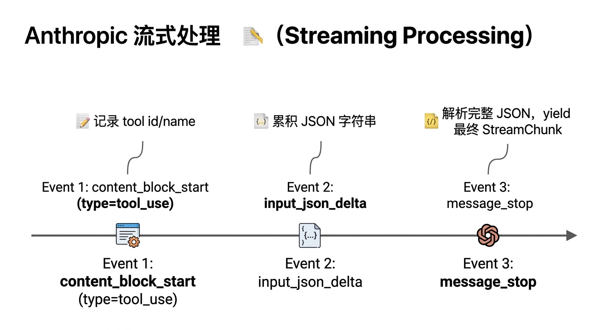

# Provider 层设计文档

## 职责

Provider 层是 Ethan 与 LLM API 之间的适配层，负责：
1. 屏蔽不同厂商的协议差异（Anthropic vs OpenAI）
2. 统一消息格式转换（内部 `Message` ↔ 各厂商格式）
3. 支持同步调用和流式输出两种模式
4. 根据 model 名称自动路由到正确的 Provider

---

## 接口设计（`ethan/providers/base.py`）

### 核心数据结构

```python
# 工具定义（传给 LLM 用）
ToolDefinition(name, description, parameters)   # parameters 是 JSON Schema

# 一次 tool call 请求
ToolCall(id, name, arguments)                   # arguments 是 dict

# 统一消息格式
Message(role, content, tool_calls=[], tool_call_id=None)

# 流式输出的一个 chunk
StreamChunk(content, tool_calls=[], is_final=False, usage=None)
```

### BaseProvider 抽象接口

```python
class BaseProvider(ABC):
    model: str  # 当前使用的模型名

    async def chat(
        self,
        messages: list[Message],
        tools: list[ToolDefinition] | None = None,
        system: str | None = None,
    ) -> Message: ...

    async def stream_chat(
        self,
        messages: list[Message],
        tools: list[ToolDefinition] | None = None,
        system: str | None = None,
    ) -> AsyncIterator[StreamChunk]: ...
```

上层（Agent Loop）只依赖这个接口，不关心底层是 Claude 还是 Gemini。

---

## Anthropic Provider（`ethan/providers/anthropic.py`）

### 协议特点

Anthropic 的 tool_use 格式与 OpenAI 不同，主要区别：

| 项目 | Anthropic | OpenAI |
|------|-----------|--------|
| tool result 的 role | `user`（包在 content 数组里） | `tool` |
| tool call 的字段名 | `tool_use`，input 是 dict | `function`，arguments 是 JSON 字符串 |
| 流式 tool call | `input_json_delta` 事件 | `delta.tool_calls` |
| system prompt | 独立字段，支持 `cache_control` 分块 | 作为 `role: system` 消息 |

### 消息转换逻辑

内部 `Message` → Anthropic 格式：

```python
# tool result
{"role": "user", "content": [{"type": "tool_result", "tool_use_id": "...", "content": "..."}]}

# assistant with tool calls
{"role": "assistant", "content": [
    {"type": "text", "text": "..."},
    {"type": "tool_use", "id": "...", "name": "shell", "input": {...}}
]}
```

### 流式处理事件序列



### Prompt Caching

在 system prompt 中按 `Current time:` 分界，将稳定层打上 `cache_control: ephemeral`：

```python
blocks = [
    {"type": "text", "text": stable_part, "cache_control": {"type": "ephemeral"}},
    {"type": "text", "text": dynamic_part},
]
```

5 分钟内重复调用稳定层只收 0.1× 费用。详见 [caching.md](./caching.md)。

---

## OpenAI 兼容 Provider（`ethan/providers/openai_compat.py`）

### 支持的模型/服务

通过配置 `base_url` 可接入任何 OpenAI 兼容 API：

| 服务 | base_url | 说明 |
|------|----------|------|
| OpenAI 官方 | （不填，默认） | GPT-4o、o3 等 |
| Gemini（Google AI Studio） | `https://generativelanguage.googleapis.com/v1beta/openai/` | gemini-2.5-flash 等 |
| Ollama（本地） | `http://localhost:11434/v1` | llama3、qwen 等 |
| LM Studio | `http://localhost:1234/v1` | 本地模型 |
| OpenRouter | `https://openrouter.ai/api/v1` | 聚合多家模型 |

配置示例（`~/.ethan/config.yaml`）：

```yaml
providers:
  openai_compat:
    api_key: "AIza-xxx"    # Gemini API Key
    base_url: "https://generativelanguage.googleapis.com/v1beta/openai/"

models:
  - id: gemini-2.5-flash
    provider: openai_compat
    description: Gemini 2.5 Flash
    alias: [flash, gemini]
  - id: gemini-2.5-pro
    provider: openai_compat
    description: Gemini 2.5 Pro
    alias: [pro]
```

### 协议特点

- tool call 的 `arguments` 是 JSON **字符串**（需要 `json.loads()`）
- 流式结束条件：`finish_reason == "tool_calls"` 或 `"stop"`
- tool result 的 role 就是 `"tool"`，不需要包在 user 消息里

---

## Provider Manager（`ethan/providers/manager.py`）

### 路由规则

`create_provider(model_id)` 根据 model 名前缀自动选择 Provider：

```
claude-*               → AnthropicProvider
gpt-*, o1-*, o3-*     → OpenAICompatProvider
gemini-*              → OpenAICompatProvider（需配置 base_url）
其他                   → 根据 config 中该 model 对应的 provider 字段决定
```

实际路由逻辑：先在 `config.models` 中查找 `model_id`（支持 alias），找到后按其 `provider` 字段选 Provider；找不到时按名称前缀猜测。

### 配置示例

```yaml
# ~/.ethan/config.yaml
providers:
  anthropic:
    api_key: "sk-ant-xxx"
  openai_compat:
    api_key: "AIza-xxx"
    base_url: "https://generativelanguage.googleapis.com/v1beta/openai/"

models:
  - id: claude-sonnet-4-6
    provider: anthropic
    alias: [sonnet, claude]
  - id: gemini-2.5-flash
    provider: openai_compat
    alias: [flash, gemini]

defaults:
  model: gemini-2.5-flash
```

### 环境变量覆盖

`.env` 文件中的变量在启动时自动覆盖 config：

```bash
ANTHROPIC_API_KEY=sk-ant-xxx
ANTHROPIC_BASE_URL=https://api.anthropic.com   # 可选，自定义端点

OPENAI_API_KEY=AIza-xxx
OPENAI_BASE_URL=https://generativelanguage.googleapis.com/v1beta/openai/

AGENT_DEFAULT_MODEL=gemini-2.5-flash

ETHAN_PROXY=http://127.0.0.1:7890    # 全局代理
```

---

## 扩展：新增 Provider

继承 `BaseProvider` 并实现两个方法：

```python
# ethan/providers/my_provider.py
from ethan.providers.base import BaseProvider, Message, ToolDefinition, StreamChunk

class MyProvider(BaseProvider):
    def __init__(self, model: str):
        self.model = model
        # 初始化 SDK client

    async def chat(self, messages, tools=None, system=None) -> Message:
        # 转换 messages → 厂商格式
        # 调用 API
        # 转换响应 → Message
        ...

    async def stream_chat(self, messages, tools=None, system=None):
        # 逐 chunk yield StreamChunk
        # 最后一个 chunk 设 is_final=True，附上 usage
        ...
```

然后在 `manager.py` 的路由逻辑里加一个 `elif model.startswith("my-")` 分支即可。

---

## 代理配置

支持三级代理（优先级从高到低）：

1. **Provider 级**：`config.providers.anthropic.proxy` — 只影响该 Provider
2. **全局**：`config.network.proxy` — 影响所有 Provider
3. **环境变量**：`ETHAN_PROXY` — 覆盖 config 中的全局代理

```yaml
network:
  proxy: "http://127.0.0.1:7890"

providers:
  anthropic:
    proxy: "http://127.0.0.1:7891"   # 覆盖全局，只对 Anthropic 生效
```
