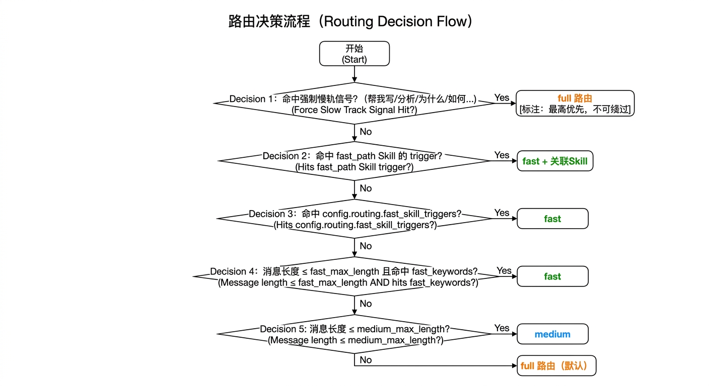

# 三档推理引擎（Three-Track Inference Engine）

## 核心洞察

并非所有请求都需要相同的计算资源。

向助手发出的指令天然分为三类：一类是高频、模式固定的执行性指令（"关客厅灯"、"发消息给 Alice"）；一类是中等复杂度的短问答；另一类是开放性的认知任务（"帮我分析这段代码"、"总结今天的会议"）。Ethan 受认知科学中**双进程理论**启发，将推理过程拆分为三条独立的轨道：

- **快轨（fast）**：低延迟、轻量上下文、仅加载必要工具
- **中轨（medium）**：完整上下文 + 全量工具，但迭代次数受限（适合短对话、问答）
- **慢轨（full）**：完整 ReAct 循环、全量工具、深度记忆注入

> **术语区分**：本文的"路由（routing）"指的是**三档推理引擎**——决定一条请求走快/中/慢哪条轨。它与 [Skill 系统](skills.md) 里的**语义路由器（EmbeddingRouter）**是两回事：后者决定该**注入哪个 Skill**（关键词之上的语义补召回），不决定走哪档轨。两者独立工作、互不影响。

---

## 路由决策

每轮对话开始时，`_get_route()` 对用户输入做实时分类，决定走哪条轨道。路由优先级如下：


<!-- diagram-source
```
输入文本
   │
   ▼
[1] 是否命中强制慢轨信号？
    （"帮我写"、"分析"、"为什么"、"如何"…）
    → Yes → full（最高优先，不可绕过）
   │
   ▼
[2] 是否命中 fast_path Skill 的 trigger？（Skill frontmatter fast_path: true，自动注册）
    → Yes → fast + 关联 Skill
   │
   ▼
[3] 是否命中某条 fast_rule 的关键字？（config.routing.fast_rules，纯关键字驱动，不看字数）
    → Yes → fast + 该规则声明的工具/技能
   │
   ▼
[4] 消息长度 ≤ medium_max_length？
    → Yes → medium
   │
   ▼
[5] 默认 → full
```
-->

**为什么不再按字数判定 fast**：早期版本用「命中 `fast_keywords` 且长度 ≤ `fast_max_length`(12 字)」判 fast，字数阈值误杀严重——稍微完整一点的指令（如"客厅的灯帮我关一下"）就掉到 medium。现在 fast 完全由 `fast_rules` 的关键字驱动，不看字数；命中规则即视为用户意图明确，直接走快轨并按规则按需挂载工具/技能。

---

## fast 轨

**目标延迟：≤ 2 秒 TTFT（首字延迟）**

| 维度 | 配置 |
|------|------|
| 系统提示词 | soul + identity + 当前时间 + top-5 facts + user_profile + behavioral_guidelines + 匹配到的 Skill |
| 工具集 | 基础系统工具(`fast_base_tools`：file_read/file_write/skill_read/skill_list/find_tools) + 命中规则声明的额外工具 |
| 记忆注入 | 轻量（高置信度 facts，top-5） |
| Skill 注入 | 仅注入匹配的相关 Skill |
| 推理轮次 | 最多 `fast_max_iters`（默认 10） |
| Prompt Caching | 稳定层命中率更高，边际成本极低 |

**典型场景**：智能家居控制、快速发送飞书消息、读取配置文件、简单状态查询。

### Skill 确定性管道

当 Skill 的 frontmatter 包含 `fast_path: true` 时，快轨与该 Skill 深度绑定。Agent 在极简上下文下，精确按照 Skill 中定义的操作流程执行，几乎不存在歧义和"幻觉"风险。这是最接近**确定性管道（Deterministic Pipeline）**的运行模式。

```yaml
# ~/.ethan/skills/home-assistant/SKILL.md
---
name: home-assistant
fast_path: true
trigger: "开灯|关灯|开空调|关空调|关*灯|开*灯"
---
```

---

## medium 轨

**目标延迟：略高于 fast，明显低于 full**

| 维度 | 配置 |
|------|------|
| 系统提示词 | 完整版（与 full 相同） |
| 工具集 | 全量工具 |
| 记忆注入 | 深度（与 full 相同） |
| 推理轮次 | 最多 `medium_max_iters`（默认 30） |

**适用场景**：消息长度超过 fast 阈值、但不触发强制 full 信号的短问答、轻量任务。通过限制迭代次数，比 full 路径更快结束，避免为简单问题跑完整个 10 轮 ReAct 循环。

> **注意**：即使消息长度很短（如"帮我搜索最新 AI 新闻"），若未命中 fast 规则也不会走 fast，而是 medium。这类短文本但搜索密集的任务可能会多次调用工具，默认 30 次上限已经对大多数情况足够。

---

## full 轨

**目标延迟：完整推理，不设硬性上限**

| 维度 | 配置 |
|------|------|
| 系统提示词 | 完整版：identity + soul + tools_reference + 全量 Skill 列表 + 所有记忆层 |
| 工具集 | 全量工具 |
| 记忆注入 | 深度：最多 15 条 facts + procedures + user_profile + 相关 Skill 完整内容 |
| 推理轮次 | 最多 `max_tool_iterations`（默认 10） |

**典型场景**：代码编写、调试、重构、长文档分析、多步骤任务规划、定时任务创建。

---

## Prompt Caching 与三轨的协同

系统提示词按内容变化频率分为两段：
- **稳定层**（identity + soul + tools_reference）：几乎不变，打上 `cache_control: ephemeral`，5 分钟内重复使用按 **0.1x** 价格计费
- **动态层**（当前时间 + 记忆 + Skill 匹配结果）：每轮更新，按正常价格计费

在高频使用场景下，每轮对话的有效输入 token 本可降低 **70-80%**。

---

## 配置

### 通过 Web 设置页

设置 → 快捷路由：管理「关键字 → 工具/技能」规则。每条规则可填触发关键字（支持通配 *）、勾选额外挂载的工具、勾选命中时强制注入的技能；顶部统一管理 Fast 档始终挂载的基础系统工具。

### 通过 config.yaml

```yaml
defaults:
  routing:
    medium_max_length: 80        # 未命中 fast_rule 时：≤ 此字数走 medium，更长走 full
    medium_max_iters: 30         # medium 轨最多迭代次数（可按需调大）
    fast_max_iters: 10           # fast 轨最多迭代次数
    fast_use_lite_model: true    # fast 轨用 lite 模型（省钱提速）
    fast_base_tools:             # fast 档始终挂载的基础系统工具
      - file_read
      - file_write
      - skill_read
      - skill_list
      - find_tools
    fast_rules:                  # 关键字 → 工具/技能；命中任一关键字即走 fast（不看字数）
      - name: 智能家居控制
        keywords: ["关*灯", "开*灯", "播放音乐"]
        tools: ["shell"]                    # 在 fast_base_tools 之上额外挂载
        skills: ["home-assistant-control"]  # 命中即强制注入 prompt
```

> 规则未命中时，模型仍可在 fast 档内调 `find_tools` 激活全部进阶工具兜底——所以规则配置只需覆盖高频确定性场景，不必穷举。

### Skill 层配置

在任意 Skill 的 `SKILL.md` frontmatter 中加入 `fast_path: true`，该 Skill 的所有 trigger 关键词同时成为快轨入口。

---

## 设计原则

1. **路由透明**：用户不需要感知走了哪条轨道，结果决定体验
2. **保守升级**：不确定时走 full；宁可慢也不能错
3. **可观测**：快轨的 TTFT 明显低于慢轨，用户可通过消息气泡底部的耗时数据感知差异
4. **渐进增强**：添加 Skill 并标记 `fast_path: true` 即可把更多场景纳入快轨，无需修改代码
