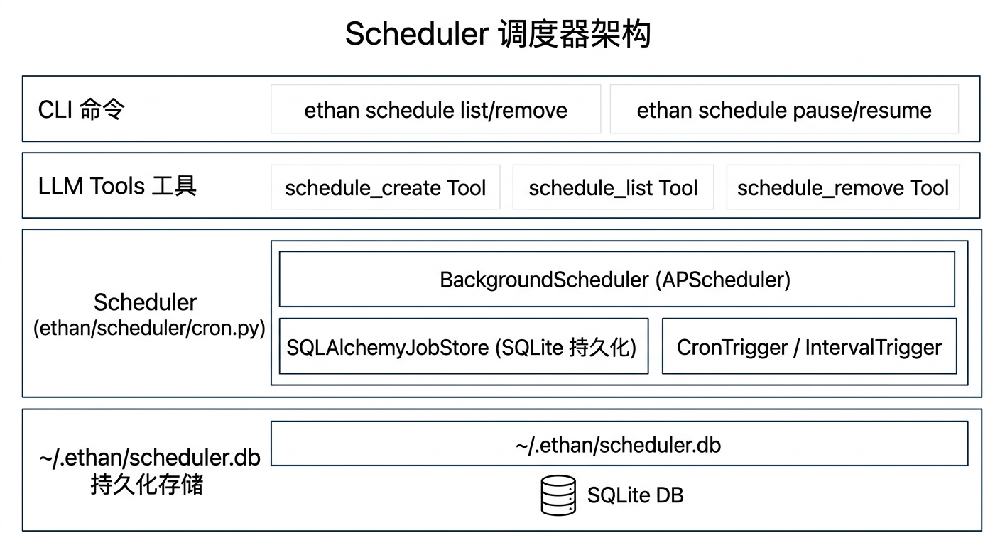

# 调度器设计文档

用户管理的定时任务系统，让 Agent 能按计划执行周期性任务。基于 APScheduler 实现，Job 持久化到 SQLite，重启后自动恢复。

> 注意：与系统内部的心跳机制（`heartbeat.py`）不同，Scheduler 管理的是用户主动创建的业务任务（定时提醒、定期汇报等）。两者独立运行，互不干扰。→ 详见 [heartbeat.md](./heartbeat.md)

---

## 架构


<!-- diagram-source
```
┌──────────────────────────────────────────┐
│ ethan schedule list/remove/pause/resume  │  CLI 命令
├──────────────────────────────────────────┤
│ schedule_create / list / remove Tools    │  LLM 可直接调用
├──────────────────────────────────────────┤
│ Scheduler                                │  ethan/scheduler/cron.py
│   ├── BackgroundScheduler (APScheduler)  │
│   ├── SQLAlchemyJobStore (SQLite 持久化) │
│   └── CronTrigger / IntervalTrigger      │
├──────────────────────────────────────────┤
│ ~/.ethan/scheduler.db                    │  持久化存储
└──────────────────────────────────────────┘
```
-->

---

## 两种调度模式

### Cron（定时）

标准 5 段 cron 表达式：`分 时 日 月 周`

```
# 常用示例
0 9 * * *       每天 9:00
0 9 * * 1-5     工作日 9:00
30 8,20 * * *   每天 8:30 和 20:30
0 */4 * * *     每 4 小时整点
0 10 * * 1      每周一 10:00
0 0 1 * *       每月 1 日 0:00
```

### Interval（间隔）

```
interval_minutes=30    每 30 分钟
interval_minutes=60    每小时
interval_minutes=1440  每天（24×60）
```

---

## Agent 自主创建任务

用户直接描述需求，LLM 通过 `schedule_create` 工具自动创建：

```
用户："每天早上 9 点提醒我查看今日任务"

LLM 调用：
schedule_create(
    job_id="morning-checklist",
    prompt="查看今日任务清单，列出优先级最高的 3 件事",
    cron="0 9 * * *"
)
```

```
用户："每 30 分钟提醒我喝水"

LLM 调用：
schedule_create(
    job_id="water-reminder",
    prompt="提醒用户喝水，发一条鼓励的话",
    interval_minutes=30
)
```

任务触发时，系统以 `prompt` 为输入创建一个独立 Agent 实例执行，结果保存在专属的 `[定时] <job_id>` Session 中，可在 Web UI 的「定时任务」页查看历史执行记录。

如果配置了飞书渠道且设置了主会话（`config.lark.main_chat_id`），可以在 prompt 里要求 Agent 把结果通知到飞书。Agent 通过 `shell` 工具调用 Python 脚本，或未来直接调用通知工具实现。

**从代码直接推送飞书通知（适合定时任务回调）：**

```python
import asyncio
from ethan.interface.lark_events import send_lark_notification
from ethan.core.config import get_config

chat_id = getattr(getattr(get_config(), "lark", None), "main_chat_id", "") or ""
if chat_id:
    asyncio.run(send_lark_notification(chat_id, result_text))
```

`send_lark_notification` 把 markdown 文本转为飞书 **post 气泡**（非卡片），支持加粗、斜体、行内代码、链接、无序列表、引用、分隔线。适合一次性发送完整结果，不需要流式编辑。

---

## 参数说明

`schedule_create` 工具参数：

| 参数 | 类型 | 必填 | 说明 |
|------|------|------|------|
| `job_id` | string | 是 | 唯一任务 ID，用于后续管理 |
| `prompt` | string | 是 | 任务触发时发给 Agent 的完整指令 |
| `cron` | string | 二选一 | 5 段 cron 表达式 |
| `interval_minutes` | int | 二选一 | 每 N 分钟执行一次 |

`cron` 和 `interval_minutes` 必须且只能填一个。

---

## 持久化

使用 SQLAlchemy + SQLite（`~/.ethan/scheduler.db`）。APScheduler 的 `SQLAlchemyJobStore` 序列化 Job 到数据库，`ethan serve` 启动时自动恢复所有 pending jobs，无需用户手动重建。

---

## CLI 命令

```bash
ethan schedule list              # 列出所有任务（含下次执行时间）
ethan schedule remove <id>       # 删除任务
ethan schedule pause <id>        # 暂停（保留记录，不执行）
ethan schedule resume <id>       # 恢复暂停的任务
```

Web UI 的 `/schedule` 页面提供相同操作，额外显示上次执行时间和执行结果摘要。

---

## 与 Scheduler 的关系

| 维度 | Scheduler（本文档） | Heartbeat（[heartbeat.md](./heartbeat.md)） |
|------|--------------------|--------------------------------------------|
| 创建方式 | 用户通过对话或 CLI 主动创建 | 系统自动运行，不暴露给用户管理 |
| 任务内容 | 任意用户业务任务（提醒、报告等） | facts 去重 + heartbeat.md 周期任务 |
| 持久化 | `~/.ethan/scheduler.db` | 不持久化，随服务重启 |
| 可见性 | Web UI `/schedule` 页面可见 | 不在调度器页面显示 |
| 渠道记录 | 保存执行来源 `source="scheduler"` | 保存到 `[心跳] System` Session |
