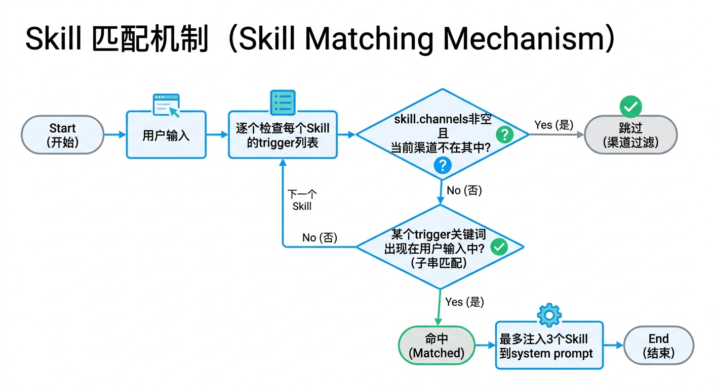
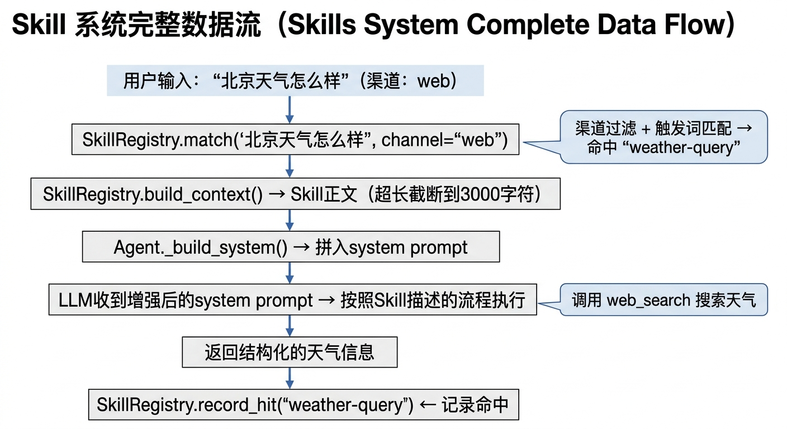

# Skill 系统设计文档

## 概述

Skill 是 Ethan 的知识模块，以 Markdown 文件形式存储，当用户输入匹配到某个 Skill 的触发词时，该 Skill 的内容会被自动注入到 LLM 的 system prompt 中，引导 agent 按照特定流程处理问题。

---

## 设计参考

- **OpenClaw**: 人工编写的 Markdown skill 文件，按需加载进 context
- **Hermes**: 自我进化 — agent 完成复杂任务后自动生成新 skill

Ethan 兼顾两者：支持手写 Skill + 从经验自动生成 + 用户纠正后自动更新。

---

## 加载来源

Skill 从 `~/.ethan/skills/` 加载。首次运行时，`config.py` 的 `_init_default_skills()` 会自动将包内 `ethan/defaults/skills/` 中的默认技能复制到该目录（只在目标不存在时复制，不覆盖用户已有文件）。

| 来源 | 路径 | 说明 |
|------|------|------|
| 默认技能 | `ethan/defaults/skills/<name>/`（包内） | 首次运行自动复制到用户目录 |
| 用户 skills | `~/.ethan/skills/<name>/` | 用户自定义或 Agent 生成，可覆盖同名默认 skill |

两种来源都支持两种存储格式：

- **目录格式**（推荐）：`<name>/SKILL.md` 主文件 + `<name>/references/` 子目录（存放参考文档）。命中时 `build_context` 会把 `references/*.md` 的文件名 + 一行摘要附在正文之后（pull-based：只列目录，不全量灌入），模型再用 `skill_read` 按需拉具体内容。
- **单文件格式**（兼容旧版）：`<name>.md`

---

## Skill 文件格式

```markdown
---
name: weather-query
trigger: 天气|weather|气温|temperature
description: 查询天气的标准流程
fast_path: false
channels:
  - web
  - lark
version: "1.0"
---

# 查询天气

当用户询问天气时，使用 web_search 工具搜索实时天气信息。

步骤：
1. 确认用户想查询的城市
2. 使用 web_search 搜索 "[城市] 天气 today"
3. 从结果中提取温度、天气状况、建议
```

### Frontmatter 字段

| 字段 | 必填 | 说明 |
|------|------|------|
| `name` | 是 | 唯一标识，kebab-case |
| `trigger` | 是 | 触发关键词，`\|` 分隔；也支持 YAML list 格式 |
| `description` | 否 | 一句话描述 |
| `fast_path` | 否 | `true` 表示命中 trigger 时直接走 fast 轨（默认 false） |
| `channels` | 否 | 限定渠道白名单（如 `[lark, web]`）。空列表 = 所有渠道可用 |
| `modes` | 否 | 限定对话模式白名单（如 `[法律]`）。空列表 = 所有模式可用。用于让垂类技能只在对应模式生效，不污染默认工作助手模式 |
| `version` | 否 | skill 版本号，用于追踪更新 |
| `metadata` | 否 | 任意 key-value 扩展字段 |

config.yaml 中可通过 `fast_skill_triggers` 手动指定额外的 fast 轨关键词（不需要对应 Skill 文件）。

---

## 匹配机制

文件：`ethan/skills/registry.py`


<!-- diagram-source
```
用户输入 → 逐个检查每个 Skill 的 trigger 列表
         → 渠道过滤：skill.channels 非空 且 当前渠道不在其中 → 跳过
         → 模式过滤：skill.modes 非空 且 当前对话模式不在其中 → 跳过
         → 如果某个 trigger 关键词出现在用户输入中（子串匹配）→ 命中
         → 最多注入 3 个 Skill 到 system prompt
```
-->

**渠道过滤**：`SkillRegistry.match(query, channel="")` 接收当前渠道标识（如 `"lark"`、`"web"` 或 `""`）。如果 Skill 的 `channels` 列表非空且当前渠道不在其中，该 Skill 不会被注入。这样可以为飞书、Web、CLI 分别准备专属 Skill，互不干扰。

**语义补召回**：关键词子串匹配保证 head 精度与强拒识，但对换了说法的表达会漏召回。可选的语义路由器（`ethan/skills/router.py`）在关键词之上补一个语义命中：用 BGE-small-zh INT8 ONNX 把用户输入编码成向量，过一层训练好的 LogisticRegression 头分类到对应 Skill，预测为 `others` / 低于阈值 / 不在已加载 Skill 中则不补。独立手写评测集（规避近重复泄漏）macro F1=0.851（对照早期锚点 max-cosine≈0.60、纯关键词召回≈0.24）。模型缺失或依赖未装时静默退回纯关键词匹配，不影响主流程。装依赖 `pip install 'ethan-agent[router]'`，模型首次由 `ethan router pull` 或首条消息自动下载。详见 [语义路由器深度剖析](semantic-router.md)。

**模式过滤**：`SkillRegistry.match(query, channel="", mode="")` 还接收当前对话模式（见 [modes.py](../ethan/core/modes.py)，规范英文 key，如 `"legal"`、`"companion"` 或默认 `""`）。如果 Skill 的 `modes` 列表非空且当前模式不在其中，该 Skill 不会被注入；`modes` 里写 key（`legal`）或中文别名（`法律`）都行，匹配时会归一化。这让垂类技能（如「法律专家模式」下的 `legal-assistant`）只在对应模式生效，正常工作模式下完全不进上下文，零污染。模式由 `Agent._mode` 经 `resolve_mode().key` 解析后传入。

---

## 注入方式

匹配到的 Skill 内容追加到 system prompt 尾部：

```
<relevant_skills>
[Skill: weather-query]
（skill 正文，超过 3000 字符时自动截断）

[Skill: another-skill]
…
</relevant_skills>
```

Agent Loop 本身不感知 Skill 的存在 — 它只看到一个更丰富的 system prompt。

---

## 内置 Skills

| Skill | 触发词 | 说明 |
|-------|--------|------|
| `lark-im` | 飞书\|lark\|feishu\|发消息\|IM\|群消息 | 飞书 IM 操作（发消息、查群、管理会话等）。加载后先执行 `lark-cli skills read lark-im` 按需拉取完整文档，避免大量文档常驻 context |
| `channels` | channel\|渠道\|频道\|通知 | 多渠道消息推送（与 `/channels` Web UI 页面联动） |
| `home-assistant` | 家居\|智能家居\|HA\|home assistant\|灯\|空调 | Home Assistant 集成，控制智能家居设备（`fast_path: true`） |
| `agent-browser` | 浏览器\|打开网页\|网页操作\|自动填表\|网页截图\|抓取网页\|browser\|screenshot | 默认浏览器能力。包装 `agent-browser`（零依赖 Rust CLI），`snapshot` 输出可交互元素的 `@ref` 引用，极省 token。适合「开页面→读紧凑结构→点/填」这类单步操作 |
| `dev-browser` | 复杂网页流程\|网页脚本\|playwright\|批量抓取\|多步网页操作\|循环抓取 | 进阶浏览器能力。包装 `dev-browser`，在 QuickJS WASM 沙箱里跑 JS 脚本，拿到完整 Playwright Page API。适合需要循环/条件/多页聚合的复杂流程 |
| `ppt-generate` | PPT\|pptx\|幻灯片\|演示文稿\|slides\|presentation | 生成原生可编辑的 .pptx。项目制逐页生成：先定大纲（含页间衔接设计）与本 deck 专属 design system（内联主题 + 字体配对），再每页一个 `pages/NN_*.json` 独立构思版式/内容/衔接，最后逐页复审单页返修。中间格式是瘦身版 PPTist schema（JSON：slideType/textType/imageType 语义 + 结构化 runs + 预设几何形状），`render_pptx.py` 渲染为 python-pptx 原生元素（文本/形状/图表/表格/OMML 公式均可二次编辑），`gen_image.py` 负责图片瀑布流（Pexels→Unsplash→AI 生图→占位）与 Iconify 图标；两个脚本都接受项目目录或单文件 deck.json。依赖（python-pptx 等纯 Python 包）首次运行自动 pip 安装 |

### 浏览器自动化：agent-browser vs dev-browser

两者都是「Skill 文档教 agent 怎么 shell 调一个外部 CLI」的模式（与 `lark-cli`、`deepwiki` 同构），**不进 `pyproject.toml` 依赖**——`pip install` 体积和启动速度不受影响。CLI 二进制由用户按需 `brew`/`npm` 安装，内置浏览器首次用时才下载（懒加载）。两个 SKILL.md 都写了「前置检查 → 缺 CLI 才装 → 缺浏览器才下载」的兜底引导。

选型分流（已写进各自 `description`，由匹配机制自动引导）：

| 维度 | `agent-browser` | `dev-browser` |
|------|-----------------|---------------|
| 形态 | 离散子命令（`open`/`click @e2`/`get text`） | 沙箱 JS 脚本（heredoc 喂入） |
| API | 自带精简语义命令 | 完整 Playwright Page API |
| token | `snapshot` 自动精简（~300 vs 全 DOM ~4000） | 靠脚本 `console.log` 自控，只回需要的 |
| 适用 | 简单单步操作（默认首选） | 复杂多步、循环、聚合成结构化结果 |
| 复用登录态 | `--profile` / `--session-name` / `--auto-connect` | `--connect` 连用户在跑的 Chrome（CDP） |

> 评估过 `browser-use/browser-harness`，因其内置 LLM agent loop（agent 套 agent、双倍模型成本、中间步骤黑盒、与 Ethan 自身 loop 重复），未采用——Ethan 需要的是「浏览器的手脚」，不是「另一个大脑」。

### 安装/使用其他 Lark 技能

内置 `lark-im` 是引导文件（bootstrap），完整的飞书操作通过 `lark-cli` 技能体系提供。
通过 `lark-cli skills list` 可查看 26 个额外 Lark 技能（日历、文档、多维表格、任务等）。

将某个技能安装到本地：

```bash
lark-cli skills read lark-calendar > ~/.ethan/skills/lark-calendar.md
```

---

## 命中追踪（SkillStats）

文件：`ethan/skills/stats.py`  
数据文件：`~/.ethan/skills/.stats.json`

每次 Skill 被匹配注入时，`SkillRegistry.record_hit(skill_name)` 记录一次命中，并更新 `last_hit` 时间戳。当用户对某次 Skill 驱动的回复给出纠正时，`record_correction(skill_name, correction)` 将纠正内容追加到该 Skill 的 `corrections` 列表。

数据结构：

```json
{
  "home-assistant": {
    "hit_count": 42,
    "last_hit": 1749744812.3,
    "corrections": ["设备名称应使用中文", "亮度范围是 0-255"]
  }
}
```

---

## 自动更新（Skill Updater）

文件：`ethan/skills/updater.py`

当某个 Skill 累积的 `corrections` 数量达到阈值（默认 **2 条**）时，`update_skills_from_corrections()` 自动触发更新：

```
1. 读取 Skill 当前内容
2. 调用廉价模型将纠正合并进 Skill 正文
3. 更新前先备份：<name>.md.bak
4. 写入更新后的 SKILL.md（保留原 frontmatter）
5. 清空已处理的 corrections，等待下一轮积累
```

只有存储在用户目录（`~/.ethan/skills/`）的 Skill 才会被自动更新；内置 Skill 不会被修改。

---

## 自动生成（Hermes 风格）

文件：`ethan/skills/generator.py`

触发条件：
- 当前 session 对话轮数 > 5
- 对话包含多步骤问题解决过程

流程：
1. 调用 LLM 分析对话："这是否包含一个值得提炼的可复用模式？"
2. 如果是 → 生成 Skill Markdown 文件 → 保存到 `~/.ethan/skills/`
3. 如果否 → 返回 NO_SKILL

---

## CLI 命令

```bash
ethan skill list                              # 列出所有 Skills（内置 + 用户）
ethan skill show weather-query                # 查看 Skill 内容
ethan skill create my-skill -t "k1|k2" -d "desc"  # 创建空 Skill 文件
```

---

## 数据流


<!-- diagram-source
```
用户输入: "北京天气怎么样"（渠道: web）
    │
    ▼
SkillRegistry.match("北京天气怎么样", channel="web")
    │ 渠道过滤 + 触发词匹配 → 命中 "weather-query"
    ▼
SkillRegistry.build_context() → Skill 正文（超长截断到 3000 字符）+ references 文件清单（pull-based，模型按需 skill_read 拉具体内容）
    │
    ▼
Agent._build_system() → 拼入 system prompt
    │
    ▼
LLM 收到增强后的 system prompt → 按照 Skill 描述的流程执行
    │ 调用 web_search 搜索天气
    ▼
返回结构化的天气信息
    │
    ▼
SkillRegistry.record_hit("weather-query")  ← 记录命中
```
-->
