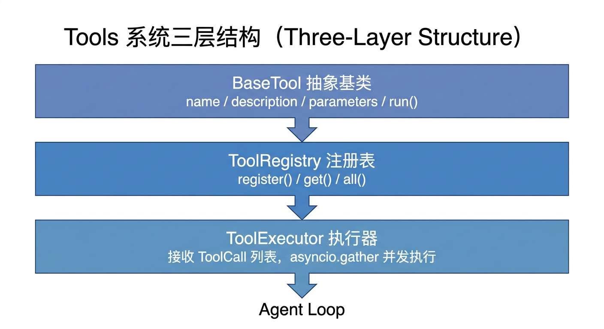

# 工具系统设计文档

## 概述

工具系统让 Agent 能够执行真实操作：运行命令、读写文件、搜索网页等。
LLM 通过 tool call 请求工具，工具系统负责执行并把结果回传给 LLM。

设计原则：**完全可插拔**。新增功能 = 新增一个 Tool 文件，Agent Loop 和 Provider 完全不需要改动。

---

## 三层结构


<!-- diagram-source
```
BaseTool（抽象）
    │  name / description / parameters / run()
    ▼
ToolRegistry（注册表）
    │  register() / get() / all()
    ▼
ToolExecutor（执行器）
    │  接收 ToolCall 列表，asyncio.gather 并发执行
    ▼
Agent Loop
```
-->

---

## BaseTool 接口（`ethan/tools/base.py`）

```python
class BaseTool(ABC):
    name: str           # LLM 用这个名字来调用
    description: str    # 告诉 LLM 这个工具干什么（影响调用决策）
    parameters: dict    # JSON Schema，定义入参
    fast_path: bool = False  # 是否在 fast path 模式下提供给 LLM

    async def run(self, **kwargs) -> str  # 执行逻辑，返回字符串
```

设计决策：
- `run()` 返回纯字符串而非结构化数据，因为最终是给 LLM 阅读的
- 异步接口，所有 I/O 都不阻塞 event loop
- `parameters` 用 JSON Schema 描述，直接传给 LLM 的 function/tool 定义
- `fast_path = True` 的工具会在 fast path 模式下随简化版 system prompt 一起传给 LLM；目前默认开启的有 `shell` 和 `file_read`

---

## ToolExecutor 并发执行

LLM 有时会在一次回复中请求多个 tool（如同时查文件和执行命令）。
`ToolExecutor` 用 `asyncio.gather()` 并发执行，减少延迟。

错误处理：工具不存在或执行抛异常 → 返回 `ToolResult(is_error=True)`，不崩溃整个 loop。
LLM 会看到错误信息并决定如何处理（重试或换个方式）。

---

## 内置工具一览

### ShellTool — `ethan/tools/builtin/shell.py`

执行 shell 命令。

```
shell(command="ls -la", timeout=30)
```

安全设计：
- 默认 30 秒超时
- 输出超 8000 字符自动截断
- `asyncio.create_subprocess_shell` 异步执行
- `side_effect=True` 且实现了 `consent_check`：执行前请求用户授权（见下文「授权机制」）

### WebSearchTool — `ethan/tools/builtin/web_search.py`

搜索互联网信息。默认使用 DuckDuckGo，无需 API Key；也支持切换到 Tavily（更精准的结构化结果）或 SearXNG（自建/隐私友好）。

```
web_search(query="今天科技新闻", max_results=5)
```

**切换 Tavily**：在 `~/.ethan/config.yaml` 中添加：

```yaml
tools:
  web_search:
    provider: tavily
    api_key: tvly-xxxxxxxxxxxxxxxx
```

**切换 SearXNG**（可选，免费、无需注册、可自建、隐私友好）：

```yaml
tools:
  web_search:
    provider: searxng
    base_url: http://localhost:8888   # 自建实例或现成的第三方实例地址
```

也可以用环境变量 `SEARXNG_BASE_URL` 配置（`config.yaml` 未显式设置 `base_url` 时生效，设置了会自动把 `provider` 切到 `searxng`）——docker-compose 场景更方便，见根目录 `docker-compose.searxng.yml`：

```bash
docker compose -f docker-compose.searxng.yml up -d   # 起一个自建 SearXNG 实例（监听 8888）
# 再给 ethan 容器/进程设置：SEARXNG_BASE_URL=http://searxng:8080（同网络容器间）
```

**必须开启 JSON 输出**：SearXNG 镜像默认只开 HTML 格式，直接调 `/search?format=json` 会 403。仓库自带的 `deploy/searxng/settings.yml` 已加上 `search.formats: [html, json]`，用 `docker-compose.searxng.yml` 起的实例会自动挂载这份配置；若你连接的是别处的现成实例，需要对方也开了 JSON 格式才能用。

设计决策：
- 默认 DuckDuckGo：免费、无需注册、无 rate limit
- Tavily：需要 API Key，结果更精准，适合研究型搜索任务
- SearXNG：自建可控、免 API Key、聚合多个搜索引擎，适合注重隐私或想摆脱第三方 API 限制的场景
- 配置热切换，无需重启服务

### WebFetchTool — `ethan/tools/builtin/web.py`

抓取网页并提取可读文本。

```
web_fetch(url="https://example.com/article")
```

设计决策：
- 用正则清理 HTML（移除 script/style/标签），保留纯文本
- 超过 8000 字符截断，防止 context 爆炸
- 没用 BeautifulSoup 或 readability，保持零额外依赖

> `web_fetch` 只抓静态 HTML 正文，不执行 JS、不能交互。需要操作页面（点击/填表/登录态）或抓 JS 渲染的内容时，走 Skill 系统的 `agent-browser` / `dev-browser`（见 [Skill 系统 · 浏览器自动化](./skills.md#浏览器自动化agent-browser-vs-dev-browser)）。

### FileReadTool — `ethan/tools/builtin/file.py`

读取本地文件。

```
file_read(path="~/config.yaml", max_lines=100)
```

安设计：
- 文件超过 1MB 拒绝读取，提示用 max_lines
- 输出超 8000 字符截断

### FileWriteTool — `ethan/tools/builtin/file.py`

写入本地文件。

```
file_write(path="/tmp/output.txt", content="...", append=False)
```

设计决策：
- 自动创建父目录
- 支持 append 模式
- `side_effect=True` 且实现了 `consent_check`：写文件前请求用户授权（见下文「授权机制」）

### FileListTool — `ethan/tools/builtin/file.py`

列出目录内容。

```
file_list(path="~/projects")
```

### RipgrepTool — `ethan/tools/builtin/rg_search.py`

基于 ripgrep，在文件内容中进行正则搜索。速度极快，自动遵守 `.gitignore` 规则。

```
rg_search(pattern="TODO", path="~/projects", case_sensitive=False, file_type="py", max_results=50)
```

参数：

| 参数 | 类型 | 说明 |
|------|------|------|
| `pattern` | string（必填）| 搜索的正则或字面字符串 |
| `path` | string | 搜索根目录，默认当前目录 |
| `case_sensitive` | bool | 是否区分大小写，默认 false |
| `file_type` | string | 限定文件类型（如 `py`、`js`、`md`） |
| `max_results` | int | 最多返回结果数，默认 50 |

设计决策：
- 直接调用系统 `rg` 命令，性能远超纯 Python 实现
- 自动跳过 `.git`、`node_modules` 等目录（`.gitignore` 支持）
- 适合在大型代码仓库中快速定位代码片段

### FdTool — `ethan/tools/builtin/fd_find.py`

基于 fd，按文件名/目录名模式查找文件。自动遵守 `.gitignore` 规则。

```
fd_find(pattern="config", path="~/projects", file_type="f", extension="yaml", max_results=20)
```

参数：

| 参数 | 类型 | 说明 |
|------|------|------|
| `pattern` | string（必填）| 文件名匹配模式（支持正则） |
| `path` | string | 搜索根目录，默认当前目录 |
| `file_type` | string | `f`（文件）、`d`（目录）、`l`（符号链接） |
| `extension` | string | 按扩展名过滤（如 `py`、`json`） |
| `max_results` | int | 最多返回结果数，默认 50 |

设计决策：
- 直接调用系统 `fd` 命令，比 `find` 更快、语法更简洁
- 自动跳过隐藏目录和 `.gitignore` 中忽略的路径
- 与 `rg_search` 形成互补：`fd_find` 找文件位置，`rg_search` 找文件内容

### ScheduleCreateTool — `ethan/tools/builtin/schedule.py`

创建定时任务，支持 cron 表达式或 interval 两种模式。任务持久化到 APScheduler SQLite，服务重启后自动恢复。

```
schedule_create(job_id="morning-reminder", prompt="提醒我喝水", interval_minutes=30)
schedule_create(job_id="daily-report", prompt="生成今日摘要", cron="0 9 * * *")
```

参数：

| 参数 | 类型 | 说明 |
|------|------|------|
| `job_id` | string（必填）| 唯一任务 ID |
| `prompt` | string（必填）| 任务触发时发给 Agent 的指令 |
| `cron` | string | 5 段 cron 表达式（分 时 日 月 周） |
| `interval_minutes` | int | 每 N 分钟执行一次 |

`cron` 和 `interval_minutes` 二选一。执行时会自动创建专属 Session，执行结果保存在该 Session 中，可在界面的"定时任务"菜单查看。

### ScheduleListTool — `ethan/tools/builtin/schedule.py`

列出当前所有定时任务及其状态。

```
schedule_list()
```

### ScheduleRemoveTool — `ethan/tools/builtin/schedule.py`

按 job_id 删除定时任务。

```
schedule_remove(job_id="morning-reminder")
```

### KnowledgeSearchTool — `ethan/tools/builtin/knowledge.py`

在个人知识库中语义搜索相关条目（返回标题/摘要列表，含 source 路径）。

```
knowledge_search(query="Python 异步编程", limit=5)
```

### KnowledgeReadTool — `ethan/tools/builtin/knowledge.py`

按 source 读取某一条的完整内容（标题/标签/正文全文）。search 只回摘要，需要看全文（或编辑前先读全文）时用它。

```
knowledge_read(source="/Users/x/.ethan/knowledge/xxx.md")
```

### KnowledgeAddTool — `ethan/tools/builtin/knowledge.py`

向个人知识库**新建**条目（文本片段、笔记、参考资料等）。

```
knowledge_add(content="...", title="笔记标题", tags=["python", "async"])
```

### KnowledgeEditTool — `ethan/tools/builtin/knowledge.py`

编辑**已有**条目而非新建：`mode=append`（默认，追加到正文末尾，保留原标题/标签）或 `mode=replace`（整篇替换正文，title/tags 不传则沿用原值）。source 用 search 结果的路径，不确定原文时先 `knowledge_read`。

```
knowledge_edit(source="...md", content="再补一条", mode="append")
knowledge_edit(source="...md", content="修订后的全文", mode="replace")
```

### Lark CLI 工具 — `ethan/tools/builtin/lark_tools.py`

把高频 `lark-cli` 命令包成带 schema 的工具，模型不用背命令格式。内部用 `asyncio.create_subprocess_exec` 调 `lark-cli`，解析 stdout JSON 后返回。三个工具：

- **LarkCalendarEventsTool**（`lark_calendar_events`）：`action=agenda` 查今日议程，`action=list` 配合 `start_time`/`end_time` 查时间范围。内部调 `lark-cli calendar +agenda` 或 `calendar events instance_view --params`。`no_compress=False`（议程是给模型读的散文）。
- **LarkChatMessagesTool**（`lark_chat_messages`）：拉群消息历史，`--as user` 身份（能看到群内全部消息，bot 身份只能读被 @ 的）。需要 user token 授权。`no_compress=False`。
- **LarkMessageSendTool**（`lark_message_send`）：发消息，`chat_id` 或 `user_id` 二选一，`as_user` 控制 user/bot 身份（默认 bot）。`side_effect=True` + `consent_check` 每次发消息前请求授权。`no_compress=True`（返回 `message_id`，模型可能要 verbatim 回传）。与 `send_lark_notification`（SDK bot 身份被动发）的区别：这个 tool 是给模型**主动调**的，模型决定发什么、发给谁。

设计决策：
- schema 用 JSON Schema 描述参数，模型填字段，**不暴露 `--params` JSON**——tool 内部把 schema 参数转成 lark-cli 命令
- 退出码非 0 或 stdout 非合法 JSON → 错误描述回给模型
- `--as user` 的工具未授权时 lark-cli 报错，tool 透传错误给模型

---

## 新增自定义工具

只需继承 `BaseTool` + 注册：

```python
class MyTool(BaseTool):
    name = "my_tool"
    description = "Does something useful"
    parameters = {"type": "object", "properties": {...}, "required": [...]}

    async def run(self, **kwargs) -> str:
        ...

# 注册
registry.register(MyTool())
```

LLM 会自动在 tool 列表中看到它。无需修改 Agent Loop、Provider 或任何其他代码。

---

## MCP 协议支持（计划中）

MCP（Model Context Protocol）让 Ethan 连接外部 MCP server（如数据库、浏览器等）。

实现思路：
- 用 `mcp` Python SDK 作为 client
- 连接到 MCP server 后，自动将其暴露的 tools 注册到 `ToolRegistry`
- 对 Agent Loop 完全透明

---

## 关于 Tool 数量对 LLM 的影响

当前 8 个内置工具。每增加一个 tool，LLM 的 system prompt 就多几百 token（tool 的 JSON Schema）。

经验法则：
- < 10 个工具：对 LLM 判断力无明显影响
- 10-20 个：需要更精确的 description 来帮助 LLM 区分
- > 20 个：考虑分组，按需加载（类似 Skill 的匹配机制）

---

## 工具注册范围

并非所有工具在所有接口中都注册。当前注册情况：

| 工具 | CLI | Web API (`/chat`) | Lark Bot | Fast Path |
|------|:---:|:---:|:---:|:---:|
| shell | ✓ | ✓ | ✓ | ✓ |
| file_read / file_write / file_list | ✓ | ✓ | ✓ | ✓ (read) |
| web_search / web_fetch | ✓ | ✓ | ✓ | — |
| rg_search / fd_find | ✓ | ✓ | ✓ | — |
| schedule_create / list / remove | ✓ | ✓ | ✓ | — |
| knowledge_search / knowledge_read / knowledge_add / knowledge_edit | ✓ | ✓ | ✓ | — |
| browser_session / browser_tab / browser_page | — | ✓ | ✓ | — |
| lark_calendar_events / lark_chat_messages / lark_message_send | ✓ | ✓ | ✓ | — |
| ui_card（结构化卡片：web→A2UI / lark→飞书卡片） | ✓ | ✓ | ✓ | — |
| computer_use（桌面截图/鼠标/键盘，需 cua-driver） | — | ✓ | ✓ | — |

---

## ui_card：A2UI 结构化卡片

`ui_card` 让 Agent 把结构化信息（对比 / 排行 / 统计 / 时间轴 / 自定义）
渲染成 [A2UI v0.9.1](https://a2ui.org/specification/v0.9.1-a2ui/) 卡片，比纯文字分点更直观。

**两条路径**：

1. **`card` 参数（推荐）—— 固定模板**：高频卡片（`compare` / `rank` / `stats` / `timeline`）
   由后端模板（`ethan/tools/builtin/ui_card_templates.py`）生成干净的 A2UI envelope，
   模型只填结构化数据，不用懂协议。样式由模板保证，规避了模型实时拼 JSON 反复出现的
   翻车（漏写 `root` 的 child → 空白卡、文本写成字面量 `\n` → 不换行、拿 `Card` 当序号
   徽章 → 样式乱）。排行序号、对比表格的行分隔线、序号徽章样式（前端 `rankBadge` variant）
   都由模板/catalog 固化。
2. **`messages` 参数（高级）—— 自定义**：仅当用户明确要更花哨/自定义布局时，手写 A2UI
   envelope。工具做校验：每条恰含一个 envelope 键、存在 `id:"root"`、**从 root 遍历做
   连通性检查**（发现 root 触达不到的孤儿组件直接报错退回，让模型修）；并把字面量 `\n`
   还原成真换行兜底。

**渠道感知渲染（同数据、分叉协议）**：`UiCardTool(channel=...)` 按渠道选择 `card` 路径的
渲染目标——`web`/`repl` 走 A2UI envelope（`ui_card_templates.py`），`lark` 走飞书 interactive
卡片 JSON（`ethan/tools/builtin/lark_card_templates.py`，schema 2.0：compare→markdown 表格、
rank→编号列表、stats→`column_set` 大数字、timeline→分节）。两端共享同一套结构化 `card` 数据，
只是末端协议不同。结果经 `ToolResult.ui` 透传：web 收 A2UI envelope，飞书收 `{"lark_card": {...}}`
并作为独立卡片补发（见 [interface.md](./interface.md#输出形态两条消息--增量卡片)）。飞书侧不支持
`messages`（裸 A2UI 与飞书卡片体系差异大，提示改用 `card`）。

- `fast_path=False`：默认不进 fast 档广播，按需经 `find_tools` 激活，避免膨胀 system prompt。
- 渲染：Web 用官方 `@a2ui/react`（`shadcnCatalog`，含 Timeline 扩展组件）；REPL/终端走
  `ethan/interface/a2ui_text.py` 的文本降级渲染（Panel + 邻接表还原）。
- 格式细节、模板字段、示例放在按需读取的 `ui-card` skill（`skill_read('ui-card')`），不常驻 prompt。

---

## 授权机制（consent）

敏感/副作用操作在执行前需要用户确认。授权检查发生在 **Agent 循环层**（`stream_chat`），而非工具内部——因为只有 generator 能向流注入授权事件并 await 用户响应。

### 工具如何声明需要授权

工具重写 `consent_check(**kwargs) -> str | None`：返回非空字符串表示需要授权（字符串是给用户看的操作说明），返回 `None` 放行。另可重写 `consent_scope(**kwargs) -> str` 决定**授权记忆的粒度**（默认工具名，文件类返回目录路径），以及 `consent_always(**kwargs) -> bool` 标记**高危调用每次都问**（绕过会话记忆，且不计入放行）。当前声明授权的工具：

| 工具 | 触发条件 | 授权记忆粒度（scope） |
|------|---------|----------------------|
| `shell` | 任意命令；**高危命令**（rm -rf / sudo / 管道执行 / dd / mkfs / 覆写系统文件 / fork bomb / 破坏性 git 等）`consent_always=True` 每次必问 | 工具名（普通命令授权一次，本会话其余普通命令放行；高危命令不计入放行） |
| `file_write` | 任意路径，但 `/tmp` 等临时目录**默认豁免** | **目录**（授权某目录后，其子目录/同目录文件免问） |
| `file_read` | 仅当路径在 `~/.ethan/.secrets/` 内 | **单文件**（每个密钥单独问一次，不目录放行） |
| `get_secret` | 任意密钥读取 | 工具名 |

### session 维度授权记忆 + 目录覆盖

授权按 `consent_scope` 粒度记到 session（`ethan/core/consent.py` 的 `_SESSION_GRANTS`，**内存态、不落盘、后端重启清空**）。`is_granted` 对路径型 scope 做**子树覆盖**：授权 `/a/b` 后，`/a/b` 及 `/a/b/c` 等子目录都放行；`/a/other` 仍单独问。`consent_always=True` 的调用（如 shell 高危命令）绕过这套记忆——每次都弹、批准也不记入放行，下次同类仍问。Web 与 TUI 均生效（TUI 在 REPL 主循环把当前 `session.id` 绑到 provider，`/new`、`/resume` 切换时同步）。会话删除时 `clear_session_grants` 清除记忆。

### 各渠道的授权 Provider（`ethan/core/consent.py`）

- **Web**（`WebConsentProvider`）：向 SSE 流注入 `consent_request` 事件，前端渲染授权卡片，await 用户点击。前端 `POST /api/consent/{request_id}` 解析 Future，流继续。
- **TUI/REPL**（`TuiConsentProvider`）：阻塞式 `y/N` 输入。
- **三方渠道**（`ChannelGuardProvider`，如飞书）：无交互 UI，认主人后非主人调用 `side_effect=True` 工具一律硬拒绝。
