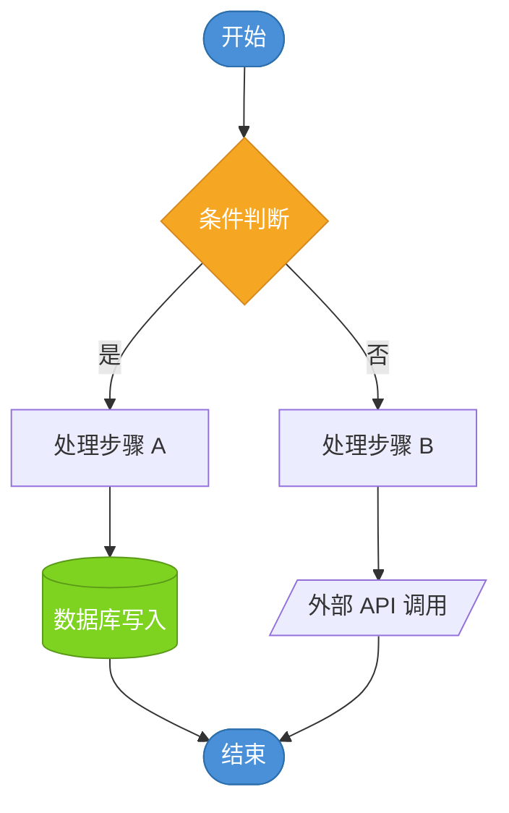
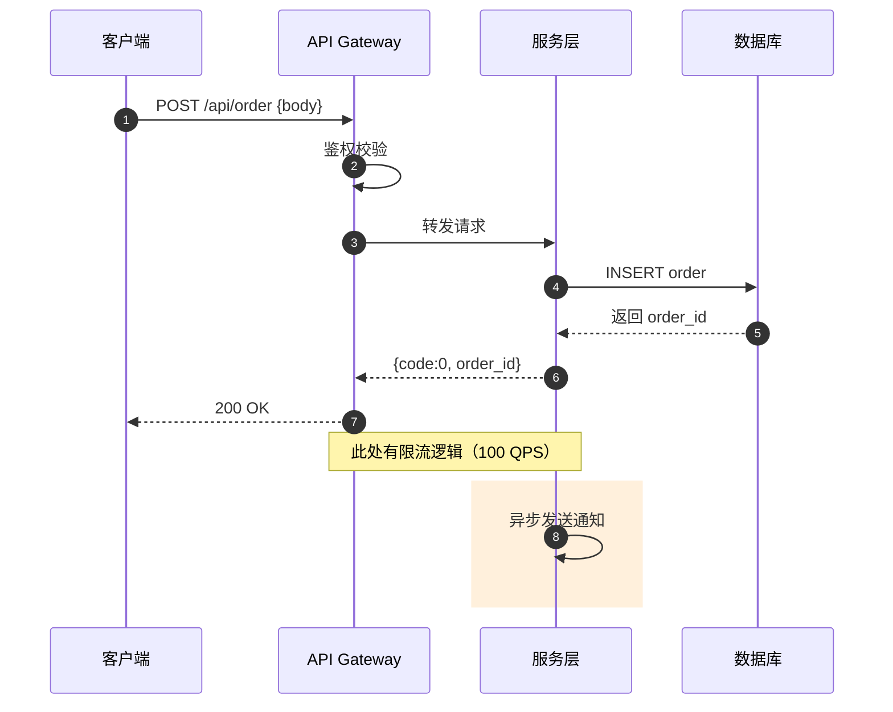
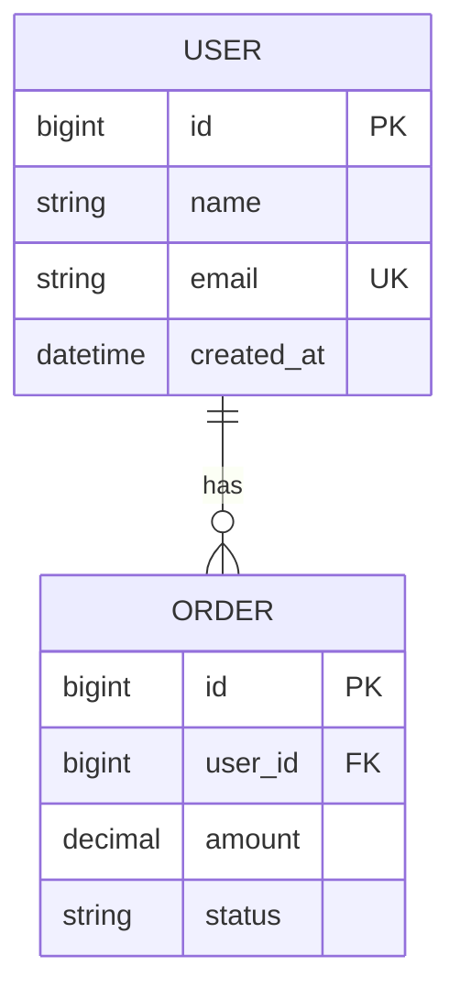
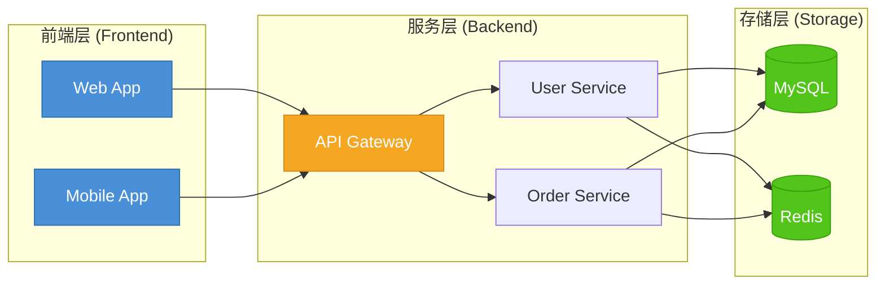

# Mermaid 图表模板库

> 本文件为 feishu-writer 的按需参考，主 SKILL.md 已内联核心规则。
> 来源：Aime 完整调研（2026-07-25）。

## 1. 节点形状语义表

| 形状 | 语法 | 语义 |
|------|------|------|
| 圆角矩形 | `([文字])` | 开始/结束 |
| 矩形 | `[文字]` | 普通步骤/处理 |
| 菱形 | `{文字}` | 判断/条件 |
| 圆柱 | `[(文字)]` | 数据库/存储 |
| 平行四边形 | `[/文字/]` | 外部输入/输出 |
| 六边形 | `{{文字}}` | 准备步骤/预处理 |

## 2. 流程图模板



## 3. 时序图模板



**规范**：
- `autonumber` 必加
- `participant` 别名用中文
- 用 `rect rgb()` 高亮关键流程段
- 用 `Note over` 标注重要约束

## 4. ER 图模板



## 5. 三层架构图完整示例



## 6. 配色应用速查

| 节点类型 | fill | stroke | color |
|----------|------|--------|-------|
| 核心服务（前端/主链路） | `#4A90D9` | `#2C6FAC` | `#fff` |
| 外部依赖（第三方） | `#7B68EE` | `#5A4FB8` | `#fff` |
| 数据存储（DB/Cache） | `#52C41A` | `#389E0D` | `#fff` |
| 异步流程（MQ/任务） | `#F5A623` | `#D4881E` | `#fff` |
| 错误处理（降级/失败） | `#FF4D4F` | `#D9363E` | `#fff` |
| 分组背景 | `#F0F5FF` | — | `#262626` |

**Mermaid style 行模板**：

```
style <node_id> fill:#4A90D9,stroke:#2C6FAC,color:#fff
```

## 7. 工具选型矩阵

| 工具 | 适合场景 | 优点 | 缺点 | 飞书嵌入方式 |
|------|----------|------|------|-------------|
| **Mermaid** | 流程图、时序图、ER图、Git图 | 代码即图、版本可控、纯文本 | 样式定制有限 | **飞书代码块原生渲染**（语言选 mermaid） |
| Draw.io | 架构图、网络拓扑、UML | 免费、功能强、本地可用 | 协作弱 | 导出 PNG/SVG 嵌入 |
| Excalidraw | 手绘风草图、快速示意图 | 风格亲切、上手快 | 不够正式 | 导出 PNG 嵌入 |
| Lucidchart | 企业级架构图 | 专业、模板多 | 收费 | 导出 PNG/SVG 嵌入 |
| 飞书内嵌白板 | 协作草图、头脑风暴 | 实时协作 | 样式粗糙 | 直接嵌入白板块 |
| PlantUML | 时序图、类图、用例图 | 代码驱动、精确 | 需渲染服务 | 需外部渲染后截图 |

**推荐优先级**：
1. 流程图/时序图 → **Mermaid**（飞书原生渲染，首选）
2. 系统架构图 → **Draw.io 导出 SVG**（保持矢量清晰度）
3. 快速草图/讨论稿 → **飞书白板**直接嵌入
